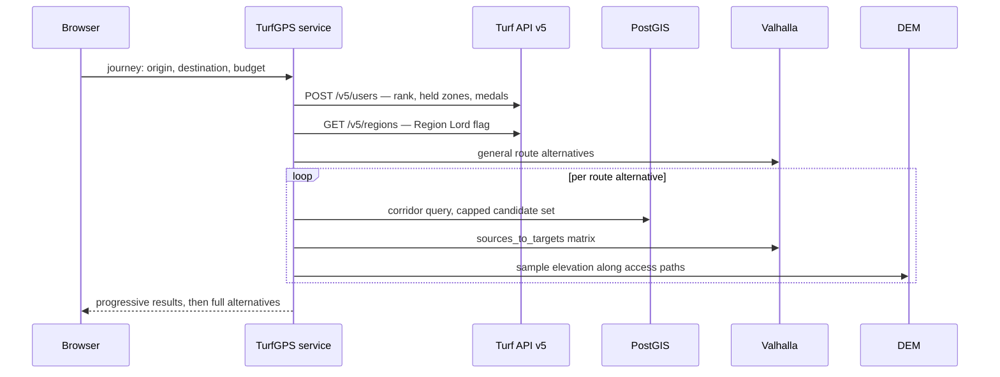

# Architecture

How TurfGPS will feasibly satisfy the behaviour defined in `SPECIFICATION.md`.

This document owns *how the system is built*, and the properties of the data it is built on. It does not restate what the system does, and it does not restate a formula or model — those are stated once, in `CalculationSpecification.md`, and copying one breaks the anti-duplication rule the documentation depends on.

Where a section of another document is referenced, the document is named. An unqualified italic name refers to a section of this one.

**Status: technology decisions recorded, structure incomplete.** The decisions in *Technology decisions* were taken on 31 July 2026 and are binding until revised. The content this document owed from `Concept.md` was moved in on the same date. What it still owes independently is listed under *Still owed by this document*.

---

## System context

TurfGPS is a single-tenant, account-free web application over a self-hosted geospatial data plane.

It consumes exactly one third-party service at runtime — the **Turf API** (`https://api.turfgame.com/v5`), for zone data, player rank, held zones, and region lordship. Everything else it needs is derived from open datasets it hosts itself: road and path geometry, elevation, and map tiles.

It integrates outward with **Google Maps** for stop-by-stop hand-off, per *The waypoint limit problem* in `SPECIFICATION.md`. It provides no navigation of its own.

---

## Response time and progressive results

The pipeline is compute-heavy. A long journey generates several route alternatives, each with a corridor containing many candidate zones, each requiring routing and access analysis.

This system is used in a **planning session**, not while driving. Players hunting a particular attribute sit down deliberately and plan at length to collect as much as they can. That user is willing to wait for a thorough answer, so **thoroughness should be preferred over speed** in the initial solve. The latency budget is generous — tens of seconds is acceptable where it buys better coverage.

Progressive results remain valuable, but as reassurance rather than as a hard deadline: a first usable answer, such as the baseline route with its directly road-accessible zones, gives the user something to look at while the rest continues. The interface must show that analysis is still in progress and what remains outstanding.

The strict latency requirement lies elsewhere. **Zone replacement during route review must feel immediate**, because that is an interactive loop the user drives one decision at a time — see *Consequences for the optimizer* in `SPECIFICATION.md`. A design that returns only a complete result set, or that cannot re-solve quickly from retained state, fails this requirement, and the difference is architectural in both cases.

---

## Technology decisions

Each decision below records what was chosen, why, and what it costs. A decision marked **Proposed** follows the repository convention in `docs/README.md`: it is a concrete position to argue against, not a measured result.

### D1 — Go for the backend pipeline

**Decided.** The optimizer, access analysis, solve-session server, and zone-sync worker are written in Go.

The determining requirement is not raw compute but **retained state**. *Consequences for the optimizer* in `SPECIFICATION.md` requires the candidate set, access classifications, and computed costs to survive the initial solve, and *Response time and progressive results* above requires re-solve to feel immediate by reusing that state rather than recomputing it. That is a long-lived stateful process, and it rules out any serverless deployment target regardless of language.

Given that shape, Go earns its place on three properties: a natural fit for a stateful service holding many concurrent solve sessions; bounded worker pools with `context` cancellation over the candidate fan-out, which is directly how progressive results gets implemented rather than simulated; and a single static binary, which keeps deployment simple as `DEPLOYMENT.md` will require.

**What it costs.** Go has the thinnest geospatial ecosystem of the candidates considered. The mitigation is deliberate and load-bearing: **push geometry into PostGIS** — corridor buffers, proximity filtering, and the nearest-neighbour query behind *The activity baseline* in `CalculationSpecification.md` are all SQL — and keep in-process geometry to the light work that `orb` covers. Raster sampling is the one area where Go is genuinely weaker, and it is addressed in D6.

Python was recommended and not chosen. The reasoning above is why the choice is defensible rather than merely accepted.

### D2 — Vite + React SPA for the frontend

**Decided.** The client is a static single-page application built with Vite and React, served as files, talking to the Go service over HTTP.

The product has no SEO surface and no server-rendering benefit: it is an authenticated-by-nothing, map-heavy, interactive planning tool. Server-side rendering would add a build and deployment layer serving no requirement.

It also removes a hazard. A framework whose default deployment target is serverless creates continuous pressure toward a topology that D1 has already established cannot work.

The zone-by-zone review under *Reviewing zones one at a time* in `DESIGN.md` is a map-and-single-card interaction and must be built mobile-first, per *Platform and mobile-first design* in `SPECIFICATION.md`. A wide table is a specification violation, not a styling choice.

### D3 — Valhalla as the default routing engine; openrouteservice as a registered adapter

**Decided.** Valhalla serves both car and pedestrian routing. openrouteservice is implemented behind the same port as a selectable alternative.

Valhalla is the default for four reasons that map directly onto stated requirements:

* **One instance serves both costing models.** Car and pedestrian routing come from the same tiles, where OSRM requires a separate process and graph per profile.
* **Grade-aware pedestrian costing is native**, not an add-on. *Accessibility scope for the first release* in `SPECIFICATION.md` ships elevation-aware walking in full, so this is a first-release requirement.
* **`sources_to_targets` batches the matrix**, which is the mechanism by which the call budget is satisfied — see *The call budget* below.
* **`locate` returns edge attributes** — road class, speed limit, drivability, `layer` — which is exactly what *Enforceable exclusions* in `SPECIFICATION.md` must test against when validating a stopping position.

**Why not split engines by need.** Using one engine for car routing and another for walking was considered and rejected. The stop model in *Elevation-aware walking time* in `CalculationSpecification.md` chains car → walk → car through a single stopping point. Two engines snap that point to their own graphs, so the two halves of one stop's cost would be computed against **different geometry** — and the failure is silent, because every stop still yields a plausible number. Against a product whose measure of success is that *no zone is classified confidently and wrongly*, a silent geometry mismatch is the worst available failure mode. One engine owns any geometry that must agree with itself.

**On openrouteservice specifically.** Its hosted free tier is not viable here and must not be treated as a fallback. Published quotas are on the order of thousands of directions and hundreds of matrix requests per day; the candidate counts in *Bounding the candidate set* in `CalculationSpecification.md` mean a single journey can exhaust a day's allowance. This is precisely the failure *The call budget* exists to prevent. Self-hosted openrouteservice is a legitimate alternative and is why the adapter exists; the hosted free tier is not.

The adapter seam makes this decision **measurable rather than permanent**. Once real corridors exist, both engines can be benchmarked on the same journeys and the default revisited on evidence.

### D4 — PostgreSQL with PostGIS as the single stateful store

**Decided.** One database holds synced zones, the OSM-derived feature data, and stored plans.

Zones need a spatial index for corridor resolution. The OSM data needs the attributes routing engines do not expose — barriers, `layer`/`bridge`/`tunnel` relationships, parking areas, access restrictions, `maxspeed`. Plans need ordinary transactional storage keyed by a short code. These are one problem, and splitting them across engines would mean joining across process boundaries for queries that are naturally a single statement.

This also replaces the MongoDB of the removed prototype. That store was never reachable from the design: it indexed zone coordinates as `[latitude, longitude]` under a `2dsphere` index, which GeoJSON specifies as `[longitude, latitude]`, so every spatial query it could have served would have been wrong.

### D5 — Primary-markets data extract for the first release

**Decided.** The first release builds its data plane from an OSM extract covering **Sweden, the United Kingdom, Germany, Norway, Denmark, and Finland** — the markets named in *Geographic scope* in `SPECIFICATION.md`.

The point that makes this safe: **this is a data decision, not an architectural one.** The same stack runs on a six-country extract or on the planet. Widening is a longer import against unchanged code, not a rewrite.

It does **not** answer the question of self-hosting versus metered APIs at global scope, set out under *The cost consequence*. It defers the cost commitment while keeping the architecture that makes either answer reachable. The question stays open and stays owned by this document.

### D6 — Elevation sampled from Copernicus GLO-30 — *Proposed*

Global 30-metre elevation as the baseline everywhere, with national high-resolution models added later as adapters under *Global data first, local data as enhancement*.

Two distinct consumers must not be conflated:

* **Walking speed by gradient** is handled inside the routing engine, from elevation baked into its tiles.
* **Barrier and feasibility detection** under *Elevation and feasibility rules* in `SPECIFICATION.md` — cliffs, embankments, retaining walls — requires sampling the raster directly along the candidate access path. A routing engine that has already declined to route somewhere cannot tell you why.

**Proposed mechanism**, and the weakest decision here: sample Cloud-Optimized GeoTIFFs via `godal`, accepting a cgo dependency. The no-cgo alternative is PostGIS raster with `ST_Value`, which keeps the toolchain pure at some cost in bulk-sampling throughput. This should be settled by measurement against real access paths, not by preference.

**Confidence note.** A 30-metre global model is coarse relative to the barriers being detected — a retaining wall is narrower than one cell. This is a known limitation, it is exactly why *Terrain confidence* in `SPECIFICATION.md` exists, and stops analysed at this resolution must carry lower confidence than stops analysed against a national model. It must not be presented as though it resolved the question.

### D7 — Self-hosted vector tiles and geocoding — *Proposed*

Map tiles are rendered from the same OSM extract and served as static files; the client uses MapLibre GL JS. Geocoding for address and place search runs against the same data, per *Locations* in `DESIGN.md`, which requires it not be a metered external dependency. Zone-name search needs no external lookup at all — the synced zone table already holds every name.

### D8 — The Go service in `service/`, as one peer directory among several

**Decided.** The Go service occupies **`service/`** and declares its own module, **`github.com/Caisesiume/TurfGPS/service`**. The client of *§ D2* occupies **`web/`**. `docs/` and `.claude/` sit alongside them as peers. **There is no module at the repository root.**

The reason is what this repository actually holds. Its primary artifact is documentation — the four specification documents, the requirements corpus, and the agent library — and the Go service is the newest thing beside it. (Live sizes are in `docs/Requirements/INDEX.md`, the agent directory, and the tree itself; this decision turns on the balance, not on a count, and does not restate one.) A module at the root would make the Go service the repository's *subject*, and it is not the subject; it is one peer among several, and the largest of them is prose. Layout is the first thing a reader infers structure from, and a root module would have them infer the wrong one.

**This premise was written against no code at all, and that is no longer the state.** `service/` landed with the first executable, so what was an absence is now a balance — narrowed, not reversed, as of 22 August 2026. The decision does not rest on prose staying the largest: it rests on this repository holding several peers, of which the service is one. What would reopen it is the service becoming the repository's subject, and that is a judgement about what the repository is for rather than a threshold in a count.

It also gives each deployable its own directory. *§ D2* builds the client as static files served independently of the service, and sibling directories make that separation structural rather than conventional — one build, one deployment unit, one directory each.

**What it costs.** The Go toolchain assumes the module sits at the repository root, and here it does not — so every Go command resolves against the directory it was run from, and **that directory, not the repository, is what decides which tree the command measured**. The cost is therefore permanent and it is carried per invocation: every command line, every `Makefile` recipe, and every CI job that reaches the Go toolchain sets its working directory explicitly, and a result reported without one says nothing about this repository. The gate commands and what each of them reports from the wrong directory are **not restated here** — *local-gates § Backend (Go)* is their one home, and the `Makefile` is where each recipe's directory is encoded.

**One stated cost is withdrawn, on 22 August 2026.** This section previously recorded the failure mode as a *vacuous pass*: that a Go gate run from the repository root finds no Go files rather than no faults, exits zero, and reports success either way. **That was measured false and is retracted.** It is recorded here rather than deleted because twelve statements elsewhere cited this section for it, and a claim removed in silence leaves its citations pointing at a heading that no longer says what they came for. The correction survives its retracted reason, and is the paragraph above: the directory is load-bearing because it decides what was measured, not because the wrong one is quiet about it.

---

## Runtime topology


Three properties of this shape are requirements rather than preferences:

**The service is stateful and long-lived.** Solve sessions live in it. This is not a scale-out-behind-a-load-balancer design without deliberate session affinity, and `DEPLOYMENT.md` must account for that.

**The zone sync is never on a request path.** *Retrieving zones* below records `GET /v5/zones/all` as **rate-limited to one request per 30 minutes** — which is the binding constraint, and holds regardless of how quickly the response transfers. It is a scheduled worker writing to PostGIS, and the pipeline must tolerate the sync being mid-refresh or up to an hour stale.

**Nothing in a stored plan depends on the Turf API.** This is what makes *Never gate stored plans on the wizard* in `DESIGN.md` implementable: an outage degrades the volatile overlay and nothing else.

---

## Data sources and constraints

The Turf API is the sole source of zone and player data. The following was verified directly against the live API and supersedes any assumption made elsewhere in the documentation set.

**The general rate limit is one request per second per resource**, and it governs the whole API — `POST /v5/users` and `GET /v5/regions` no less than the zone endpoints. Where one endpoint is held more tightly than that, its own limit is recorded with it; `GET /v5/zones/all` is the only one that is, and that limit is the constraint the zone sync is designed around.

Two facts about zone data are product facts rather than integration ones and are stated in `SPECIFICATION.md` instead: *The coordinate is the target*, which is the modelling decision the API's silence about zone extent forces, and *Rounds*, which governs what ownership data means.

### API version

Version 5 is the current API and the version this system targets. Version 4 is deprecated and must not be used for new work.

**`GET /v5` is self-documenting, but only in HTML.** Requested with `Accept: application/json` it returns **406 Not Acceptable**; its index of endpoints is a web page, not a machine-readable descriptor. A client that sets a JSON `Accept` header globally across the base URL will fail on this path alone while every data endpoint under it succeeds — worth knowing before that 406 is read as an outage or an auth fault. Observed 3 August 2026.

### Zone geometry

The API returns a zone as a **single centre coordinate**. It exposes no radius, boundary, or extent of any kind.

A zone is nominally an area of about **25 × 25 metres**, sized to absorb ordinary GPS error. That figure is a guideline rather than a guarantee: zone shapes and sizes **vary considerably**, because each zone is adjusted to fit the place it is put. The API exposes nothing about the shape or size of any individual zone.

### Distance between zones

Zone placement guidelines call for at least **200 metres between zones**. This is a guideline applied when zones are created, not an invariant the system may rely on, and it has known exceptions.

Water zones are the clearest case: they are commonly closer together than 200 metres, and often considerably closer.

The system must therefore treat inter-zone distance as something to measure per pair, never as a value that can be assumed to exceed a threshold. Any logic that would break if two zones were fifty metres apart is incorrect.

The guideline remains useful as a rough expectation for candidate density in ordinary terrain. It must not become an assumption in the cost model.

### Retrieving zones

Two endpoints return zones.

`GET /v5/zones/all` returns every zone in the game, refreshed at least hourly, limited to **one request per 30 minutes**. This is the primary source for candidate discovery. The system maintains its own periodically-synced copy with a spatial index, and resolves route corridors against that local copy.

The following properties of this endpoint shape the architecture. Except where noted, each was counted across the **complete** response of 3 August 2026 — every one of its 154,845 records, not a sample, and deliberately not taken from the bounding-box endpoint, which returns a strict superset and would not answer the question.

**It omits ownership entirely.** `currentOwner` and `dateLastTaken` are absent from every record — confirmed across all 154,845, not sampled. It carries the stable data and nothing round-scoped. The local copy therefore answers *which zones exist and what they are*, but never *who holds them*. Ownership does not come from the sync. For the user's *own* holdings — all the first release needs — it comes from the `zones` array returned by `POST /v5/users`, per *The user's held zones are already known*. `POST /v5/zones` returns per-zone ownership should it ever be needed, but the first release does not require it.

**Which fields it carries, and which are optional.** These ten are the whole of it; no other key appears on any record.

| Field | Present | Note |
|---|---|---|
| `id` | 100.00% | the zone's primary key |
| `name` | 100.00% | |
| `latitude`, `longitude` | 100.00% | two scalars, not a coordinate pair |
| `dateCreated` | 100.00% | required by *Takeover rate* in `CalculationSpecification.md` |
| `totalTakeovers`, `takeoverPoints`, `pointsPerHour` | 100.00% | |
| `region` | 100.00% | an object; its own subkeys are not uniform, below |
| `type` | **15.91%** | 24,643 zones; absent from the other **84.09%** |

That this list contains no radius, boundary, or extent field is the measured basis for *Zone geometry* above.

**`type` is optional, and this is the field a schema gets wrong.** It is present on fewer than one zone in six. A column declared `NOT NULL` fails on 130,202 of 154,845 records. Nothing may treat an absent `type` as an anomaly or a sync defect; absence is the ordinary case.

**`region` is an object whose subkeys are also not uniform.** `region.name` and `region.id` are on 100.00% of records, but `region.country` is on **97.00%** and `region.area` on **96.66%**. Where `country` is missing — 4,638 zones — the country's name is carried in `region.name` instead, and `area` is usually missing too: Ireland (478 zones), Spain (372), Australia (300), Italy (248) and France (232) head a list that has neither subkey. **A group-by on `region.country` silently drops those 4,638 zones rather than failing**, which is the failure mode to design against: the aggregate looks complete and is not.

**`dateCreated` is near-immutable, but it is not immutable.** Of the **138,830** zone ids present in both the January 2025 and August 2026 dumps, **exactly one** changed its `dateCreated` across nineteen months: id `660960`, which moved from `2024-04-28` to `2025-10-30` while its coordinates shifted slightly and its `totalTakeovers` continued upward from 7 to 10 — a zone evidently re-sited and re-dated under the same id rather than replaced with a new one.

One record in 138,830 is not a reason to re-fetch, but it is a reason not to model the field as write-once-forever. A row inserted once and never updated keeps a `dateCreated` the API has since revised, and any rate derived from it is then computed against the wrong denominator — for id `660960`, ten takeovers over nine months rather than over twenty-seven, inflating its derived rate roughly threefold. **The sync must therefore update `dateCreated` on existing ids, not only insert it with new ones**, and an upsert keyed on `id` that refreshes the mutable columns is sufficient. No detection mechanism is required; the ordinary refresh carries it, provided the write path is not written to skip fields it assumes are constant.

**It is large, and the rate limit — not the download — is what keeps it off the request path.** On **3 August 2026** the complete response returned **154,845 zones in 43,260,217 bytes (43.26 MB) in under 20 seconds**, well-formed and complete, uncompressed and without gzip even being requested — which the API itself recommends and which would reduce it further. That is **279.4 bytes per zone**, near-exact against the ~278 recorded earlier.

An earlier note in this section described a partial download reaching ~82,000 zones and 23 MB before timing out at five minutes. **That observation no longer reproduces and has been replaced by the measurement above.** Extrapolated to the full corpus it implied about **9.5 minutes** for a transfer that now completes in **under 20 seconds** — so anyone sizing the sync against it would budget for something close to thirty times the time actually required, and would design around a timeout problem that no longer exists.

**The architectural conclusion is unchanged, because it never rested on the download being slow.** The sync must be a background job on a schedule, never anything that happens on a request path, and the pipeline must tolerate the sync being mid-refresh or stale by up to an hour — and that follows from the **one request per 30 minutes** limit alone. A response that arrives in 20 seconds is still a response the system may only ask for twice an hour, so freshness is bounded by the limit no matter how fast the transfer is.

`POST /v5/zones` returns zones by name, by id, or within a bounding box, and accepts several areas in one request body. This is the fallback and the means of refreshing volatile per-zone fields. Its area constraint is a **product, not a per-axis limit**: a request is rejected when

```text
(northEast.latitude − southWest.latitude)
    × (northEast.longitude − southWest.longitude) > 0.05
```

Tiling logic must respect the product. Splitting a corridor into tiles far below the permitted area multiplies request count for no benefit.

### Player data

`POST /v5/users` accepts a username and returns the player's `rank`, `blocktime` in seconds, `pointsPerHour`, `uniqueZonesTaken` as a count, `medals` as an array of ids, and `zones` as an array of currently-held zone ids.

`blocktime` is **not** takeover duration. It is the period a zone stays locked after a player has taken it, before it can be taken again. It is returned per player because it varies by rank. It must not be used as a component of stop time — see *Takeover time* in `CalculationSpecification.md`. Takeover duration is not exposed by the API at all.

#### The user's held zones are already known

`POST /v5/users` returns a `zones` array containing **exactly the zone ids the user currently holds**. This is verified: six sampled ids each matched the corresponding zone's `currentOwner`.

The ownership indicator shown during review is therefore a **set-membership test against data already in hand**, not a lookup. The list is fetched once at the start of a review session — in the same call that supplies rank — and every zone shown during that review is checked against it locally.

No per-zone request is made, and **no cache is required**. One call answers the question for every zone in the route.

This is possible because the indicator answers only *do I own this zone*. It deliberately says nothing about who else might hold a zone, which would require querying each zone individually. That information has no use in the first release: the user is deciding whether a zone is worth their time, and another player's ownership does not change that.

Staleness is bounded by the age of that single fetch, and refreshing it means repeating one call, not many. How the age is surfaced is defined under *Zones the user already owns* in `DESIGN.md`.

### Region lords

`GET /v5/regions` returns every region together with its current `regionLord` in a single response — 344 regions, of which 158 currently have a lord. `POST /v5/regions` returns the same for specific region ids.

The only use this system has for the data is determining whether the user holds a region lordship *anywhere*, because the Region Lord takeover bonus applies globally rather than per region. That is a scan of one response for the user's id, not a per-zone join. See *Bonuses that reduce takeover time* in `CalculationSpecification.md`.

Region lordship changes hands during play and is volatile data.

Consequently, rank, medal progress, and current zone ownership are all **available** from a single call. Only the *list* of zones a player has previously taken is unavailable; the API exposes a count alone. Anything in the specification that treats ownership or medals as inaccessible is constrained by product choice, not by data availability.

### Volatile and optional fields

Every zone carries `takeoverPoints`, `pointsPerHour`, and `totalTakeovers`. `currentOwner` and `dateLastTaken` are sometimes **absent**, and must be treated as optional rather than assumed present.

Their absence does **not** mean the zone has never been taken. Both fields are **round-scoped**: they describe the current round only, and are absent for a zone nobody has taken since it began.

`currentOwner` resetting at each round boundary is confirmed. `dateLastTaken` is strongly indicated by sampling: across roughly 1,150 zones, every recorded value fell within a single continuous window with a hard floor and nothing before it, while 39 zones reported no date at all despite carrying between 19 and 318 lifetime takeovers. A lifetime field would not behave that way. The floor also reveals the current round's start date, which is useful in its own right — the system can derive it from the data rather than tracking a calendar.

The absence of `currentOwner` is therefore a useful positive signal rather than missing data: it identifies a zone nobody holds this round.

Ownership and point values change continuously. Any locally cached copy is a snapshot, and a recommendation's confidence should reflect the age of the data it was built from.

---

## Data strategy

### Global data first, local data as enhancement

The design prefers **globally-available data sources** — worldwide map, routing, and elevation data — as the baseline everywhere, rather than assembling a set of national datasets and thereby defining a boundary the product has no reason to have. The requirement this serves is *Geographic scope* in `SPECIFICATION.md`: the product must not be a system that only works in certain countries.

Where better country-specific data exists, it is added as an **enhancement** rather than a prerequisite. National elevation models, cadastral data, official road attributes, and pedestrian-path datasets are all richer than the global equivalents in the countries that publish them, and using them where available is how the primary markets get better results.

### Ports and adapters

This implies a specific architectural shape: data sources sit behind **adapters against a common interface**, and the pipeline consumes the interface rather than any particular provider.

Adding a country's dataset is then implementing an adapter and registering it, not modifying the optimizer. Several adapters may contribute to the same journey, with the best available source used for each kind of data in each place, and the global provider serving as the fallback that guarantees an answer everywhere.

The ports:

| Port | Responsibility | First implementation |
|------|----------------|---------------------|
| `RoutingProvider` | Car and pedestrian routes, matrices, edge attributes at a point | Valhalla; openrouteservice registered alongside |
| `ElevationProvider` | Point and profile sampling | Copernicus GLO-30 |
| `ZoneRepository` | Zone lookup, corridor queries, activity baseline | PostGIS |
| `TurfClient` | Player rank, held zones, region lords, zone sync | Turf API v5 |
| `PlanStore` | Short-code plan persistence and expiry | PostGIS |
| `Geocoder` | Address, place, and zone-name resolution | Self-hosted; zone names local |
| `ZoneSyncStore` | The synced zone copy's write path: staging, the staging assertions, the merge, and the run record | PostGIS |
| `ZoneSyncLock` | The exclusive lock one refresh holds for its duration, and that a migration touching `zone` takes | PostgreSQL advisory lock |

**The last two are the zone sync's, and they are separate from `ZoneRepository` on purpose.** `ZoneRepository` is the read side, which a request may reach; the write side sits behind ports of its own so that no package reachable from the request surface reaches the sync worker at all. They arrived with the scheduled sync as `zonesync.Store` and `zonesync.Locker`, declared by the worker rather than by either adapter, and what each of them must do is *§ The sync write path* and *§ Migrating against a running sync* rather than anything stated here.

The requirement this places on the rest of the system is that **every consumer of external data must tolerate varying quality**, because coverage differs between one part of a route and another. That is already true of the confidence model under *Terrain confidence* in `SPECIFICATION.md`, which extends naturally to provenance: a stop analysed against a two-metre national elevation model is more confident than one analysed with a global thirty-metre model, and the recommendation must say so.

The purpose is a platform that improves by adding sources rather than by being rewritten, and that never has to tell a user their country is unsupported.

---

## The call budget

The naive pipeline — one routing call per candidate stop, per route alternative, per journey — reaches thousands of external calls for a single query. Against a metered routing provider this is prohibitive, and against any provider it is slow.

The per-journey external call volume must therefore be **bounded and known**. Two mechanisms bound it, and they compose.

**Self-hosting changes the unit.** Against a metered provider, a routing request is a cost. Against a local Valhalla, it is a function call over a warm tile cache. The constraint becomes latency and CPU, not money. This is why self-hosting the routing and elevation services is the primary path and commercial APIs are the fallback rather than the other way round.

**Matrix batching bounds the count.** `sources_to_targets` collapses each alternative's candidate set into a small number of matrix calls. The cap in *Bounding the candidate set* in `CalculationSpecification.md` — 300 candidates per alternative — is what makes the matrix a fixed, known size.

**Turf API calls per journey are already bounded and small:** one `POST /v5/users` for rank, held zones, and medals; one `GET /v5/regions` for the Region Lord flag. Zone data comes from the local sync, which removes zone fetching from the per-journey cost entirely. None of these scales with candidate count.



**The concrete figures are not yet computed** and this section is incomplete until they are. They depend on the corridor arithmetic in *Bounding the candidate set* in `CalculationSpecification.md`, and stating a number here before doing that arithmetic would produce exactly the invented constant the repository's conventions forbid.

### The cost consequence

Serving every country where Turf has zones makes this decision larger, not smaller, and it must be taken with the full picture in view.

Self-hosting a global routing and elevation stack is a substantially heavier undertaking than self-hosting one country's. Metered global APIs avoid that but reintroduce the per-journey cost problem the pipeline cannot afford. The adapter pattern makes the choice **replaceable** rather than permanent, which is its real value here — but it does not answer it, and this document must.

---

## Persistence and cross-device transfer

*Route persistence* in `SPECIFICATION.md` requires confirmed routes to survive an arbitrary interval, complete with the candidate set and computed costs behind them. *No accounts* there records the consequence: **a route planned on a computer cannot appear on a phone.**

Three options close that gap without introducing accounts:

* **A shareable link that encodes the plan**, letting the user move it between devices themselves. Simple, but the full stored state is far too large to fit in a URL — only the confirmed plan could travel this way.
* **File export and import**, which has the same property and no size limit, but is clumsy on mobile.
* **Anonymous server-side storage keyed by a short code**, where the user is given a code or link that retrieves the plan elsewhere. This carries no login, no personal data, and no identity — but it does mean routes live on a server, which is a step toward the thing being avoided.

**The proposed resolution is anonymous server-side storage keyed by a short code.**

It is the only one of the three that can carry the full stored state; a plan complete with its candidate set and cost model will not fit in a URL. The others would force a reduced stored route, losing the ability to re-solve without rerunning the pipeline.

It is not an account. There is no email address, no password, no login, and no identity — only an opaque key that retrieves a plan. The code is held in local storage automatically, so the usual case never requires the user to see or type it, and it can be shown or shared when they want the plan on another device.

Two obligations come with it:

* **Expiry.** Stored plans should expire — ninety days is a reasonable default — so that storage is bounded and abandoned plans do not accumulate indefinitely. Reopening a plan restarts the clock, per *DESIGN.md § Returning to a stored plan*. **The reset needs a ceiling above it, proposed at twelve months from creation.** The ninety-day clock bounds an *abandoned* plan and only that: a plan reopened every eighty-ninth day is retained forever, and by the obligation below, what it retains is a dwelling coordinate. A plan should therefore be deleted at most **twelve months after it was created**, however often it has been opened. The two are independent — reopening extends the ninety days exactly as `DESIGN.md` specifies, and nothing extends the ceiling.

  Twelve months is **a proposed default, not a measured result** — a concrete number to argue against. It is longer than any plausible reuse cycle for a single journey: a route still being opened after a full year of Turf rounds has had its value, and re-planning it costs the user one search. It is short enough that the store never holds a dwelling coordinate indefinitely on the strength of habit alone. And it is the only bound that makes the store's worst case computable — one year of plan creation, independent of how users open things — which the ninety-day rule by itself does not give. It bounds **the life of a stored plan** and nothing else; the twelve months appearing under *CalculationSpecification.md § Proposed adjustment* bounds a **zone's age** and is an unrelated figure that happens to share a value. Neither constrains the other, and either may move without the other moving.

  **One consequence belongs in `DESIGN.md` rather than here, and was reflected there on 6 August 2026.** *DESIGN.md § Returning to a stored plan* had stated that a route in active use is never lost to a timer; a ceiling makes that conditional, because at twelve months an actively used plan is deleted. That section now names the two clocks separately and carries the deletion through the expired-code path it already specifies, so the assurance it gives is the one the ceiling allows.
* **Personal data.** **A plan holding only coordinates and zone identifiers is not free of personal data**, and treating it as though it were understates what is stored. A plan carries an **origin the user typed**, and for many journeys that origin is their home. A precise dwelling coordinate, held under a stable identifier alongside the date it was planned, is personal data in substance whatever it is called. It **cannot be designed out** — the product cannot plan a route from an origin it does not know — so the controls that matter are retention and access, not omission. The user's Turf username is the separable part: either keep it out of the stored object, or state its retention explicitly. The first is simpler and is the recommendation.

This keeps the no-accounts decision intact while closing the cross-device gap that would otherwise undermine the persistence requirement.

---

## The schema

This is the schema *§ Still owed by this document* has owed since the document was written: the synced zone table, the plan store behind `PlanStore`, and the bookkeeping the sync needs to be auditable. It is a **proposal**. No DDL has been applied anywhere, because there is no database yet — and that is the reason to settle the design now rather than later, when every choice below costs a migration against a live table instead of a paragraph.

Every figure in this section was measured against the complete zone response of 3 August 2026 — all 154,845 records — unless it says otherwise. Where a figure depends on when the corpus was read, the instant is stated with it. **The reference instant is `2026-08-03T10:10:09Z`**, the moment the dump was retrieved. It is stated rather than implied because an age-dependent figure without its clock cannot be re-derived, and the first draft of this section was wrong by two hours for exactly that reason: the retrieval time was read off a local Stockholm wall clock and recorded as though it were UTC.

### The queries the schema exists to serve

The schema is derived from these five queries and from nothing else. Each is written before the table it reads, because the index falls out of the query and never out of the entity diagram.

**Q1 — corridor containment.** Given a route as a line and a half-width in metres, return every zone inside it with the columns the cost model consumes. This is the query on the request path, and the one whose latency is the product.

```sql
SELECT id, name, latitude, longitude, date_created, total_takeovers,
       takeover_points, points_per_hour, type_id
FROM   zone
WHERE  ST_DWithin(geom, $1::geography, $2);
```

Measured result sizes, over five representative routes:

| Route | 1 km half-width | 5 km | 15 km |
|---|---:|---:|---:|
| Within Stockholm (~9 km) | 156 | 1,061 | 4,089 |
| Stockholm → Uppsala (~65 km) | 610 | 2,861 | 5,935 |
| London → Manchester (~260 km) | 387 | 2,048 | 6,468 |
| Östersund → Umeå (~350 km, rural) | 189 | 805 | 1,186 |
| Stockholm → Göteborg (~400 km) | 819 | 3,857 | 8,874 |

**Q2 — the activity baseline.** For a candidate zone, the nearest 100 zones bounded to 25 km, whichever limit binds first, per *CalculationSpecification.md § The activity baseline*. This runs once per candidate, so it is written as a lateral join over the corridor result rather than as one query repeated thousands of times.

```sql
SELECT c.id, n.id AS neighbour_id, n.total_takeovers, n.date_created
FROM   candidate c
CROSS  JOIN LATERAL (
         SELECT z.id, z.total_takeovers, z.date_created
         FROM   zone z
         WHERE  ST_DWithin(z.geom, c.geom, 25000)
           AND  z.id <> c.id
         ORDER  BY z.geom <-> c.geom
         LIMIT  100
       ) n;
```

The distance bound sits in the `WHERE` clause and not in a filter applied after the ordering, because only there can the index use it. Measured over 1,200 random zones, the number of zones within 25 km is **p50 = 575, p90 = 2,831, p99 = 5,621, max = 5,914** — so the inner scan typically discards several hundred rows to keep a hundred, and **85.75%** of the time the count binds before the radius does. In the remaining **14.25%** the radius binds, and in **5.25%** of cases fewer than 20 zones lie within it, which is the guard *CalculationSpecification.md § Proposed adjustment* already specifies firing.

**Q3 — plan lookup by code.** One row by primary key, with expiry enforced in the predicate rather than in application code, so that an expired plan is unreadable even if the sweep has not yet run.

```sql
SELECT payload, schema_version
FROM   plan
WHERE  code = $1 AND expires_at > now();
```

**Q4 — the expiry sweep.** A scheduled delete, discussed under *§ The plan table*.

**Q5 — the sync merge.** 154,845 staged rows reconciled against the table, in one transaction. Discussed under *§ The sync write path*.

Nothing else queries the zone table. In particular **no query in the pipeline filters or groups by region, area, country, or type** — those columns are projected out of a result set Q1 has already selected. That fact decides several indexes below, by deciding that they are not created.

### The zone table

Seventeen columns. Nine come from the API directly, five are the flattened `region` and `type` objects, one is derived, and two are bookkeeping.

```sql
CREATE TABLE IF NOT EXISTS zone (
    id               integer      PRIMARY KEY,
    name             text         NOT NULL,
    latitude         double precision NOT NULL,
    longitude        double precision NOT NULL,
    geom             geography(Point, 4326)
                     GENERATED ALWAYS AS (
                       ST_SetSRID(ST_MakePoint(longitude, latitude), 4326)::geography
                     ) STORED,
    date_created     timestamptz  NOT NULL,
    total_takeovers  integer      NOT NULL,
    takeover_points  smallint     NOT NULL,
    points_per_hour  smallint     NOT NULL,
    type_id          smallint,
    region_id        smallint     NOT NULL,
    region_name      text         NOT NULL,
    region_country   text,
    area_id          integer,
    area_name        text,
    first_seen_at    timestamptz  NOT NULL,
    last_changed_at  timestamptz  NOT NULL,

    CONSTRAINT zone_lat_range        CHECK (latitude  BETWEEN  -90 AND  90),
    CONSTRAINT zone_lon_range        CHECK (longitude BETWEEN -180 AND 180),
    CONSTRAINT zone_takeovers_nonneg CHECK (total_takeovers >= 0)
);
```

The widths are measured, not guessed. `id` runs 71 to 811,670 and fits `integer`. `total_takeovers` reaches **84,321**, which does **not** fit `smallint` — a plausible-looking choice that fails on real data. `takeover_points` runs 65 to 185 and `points_per_hour` runs 1 to 9, both comfortably `smallint`. `region_id` runs 95 to 469, `area_id` runs 1,797 to 4,682, `type_id` runs 3 to 23. Every one is a non-negative integer on every record, and none is ever fractional.

**`latitude` and `longitude` are stored as scalars even though `geom` is derived from them, and that redundancy is the point.** If only the point were stored there would be nothing left to check the axis order *against* — the swap becomes unfalsifiable the moment the row is written. Keeping the source scalars is what makes the guard under *§ Geometry, SRID, and the coordinate guard* possible at all. The API returns two scalars rather than a coordinate pair, per *§ Retrieving zones*, so this stores what the API actually sends and derives the pair once, in DDL.

**`type_name` is not stored.** Across 154,845 records the `type` object holds **eleven** ids, each with exactly one name and no disagreement anywhere: `3` Water Zone, `6` Winner Zone, `8` Bridge, `9` Holy, `13` Train Station, `14` Castle/Fort, `15` World Heritage, `16` Ruins/Ancient Remains, `21` Monument, `22` National Park, `23` Summit. Storing the name repeats eleven strings across 24,643 rows and carries nothing the id does not. The sync counts any id outside that set and reports it rather than inventing a label for it.

**`type_id` is nullable, and this is the field a schema gets wrong** — as *§ Retrieving zones* already records, `NOT NULL` fails on **130,202** of 154,845 records. `region_country`, `area_id` and `area_name` are nullable for reasons the next section gives.

### The two absences, and the test that keeps them absent

`currentOwner` and `dateLastTaken` are absent from every one of the 154,845 records. There are therefore **no columns for them**, and there must never be: they are round-scoped, per *§ Volatile and optional fields*, and a synced table that acquires a round-scoped column acquires a rollover problem it currently does not have.

Documenting that is not enough, because the failure is an *addition* made later by someone who has not read this paragraph. The mechanism is a **set-equality test** over the live catalogue, against a migrated copy:

```sql
SELECT array_agg(column_name ORDER BY column_name)
FROM   information_schema.columns
WHERE  table_schema = 'public' AND table_name = 'zone';
```

asserted **equal, as a set**, to the seventeen literal names:

```text
area_id, area_name, date_created, first_seen_at, geom, id, last_changed_at,
latitude, longitude, name, points_per_hour, region_country, region_id,
region_name, takeover_points, total_takeovers, type_id
```

Equality in **both** directions is the whole design, and the direction that matters is the unusual one. A test asserting *these columns exist* cannot fail when a column is added, and a column being added is precisely the event being guarded against. A test asserting *no more than these exist* fails the moment `current_owner` appears, with a message naming it. The other direction catches the opposite drift: a field the sync writes that has quietly lost its column.

That is also why the column list above is worth reading carefully. It is not documentation of the table; it is the assertion, and the table is checked against it.

**The test exists and nothing runs it automatically**, which corrects what this paragraph claimed until 29 August 2026. It is part A of `migrations/0001_zone_store.verify.sql`, run by an operator against a migrated copy per *migrations/README.md § Applying one*. There is no pipeline in this repository to run it in: *DEPLOYMENT.md § Still owed by this document* owes the one that must, and naming CI before that exists named nothing.

### The region hierarchy is not a tree

The obvious normalisation — a `country` table, a `region` table keyed to it, an `area` table keyed to the region — cannot be built from this feed. Three measured facts kill it, and they are recorded here because the normalisation is the attractive answer and will be proposed again.

**First, `region.country` is not the country of a zone.** It carries **eleven** values, all two lowercase letters: `se` (56,508 zones), `gb` (49,444), `de` (18,047), `dk` (7,691), `fi` (6,188), `no` (4,830), `nl` (2,104), `us` (1,984), `kr` (1,884), `jp` (1,362), `is` (165). Those eleven are the countries Turf has subdivided into regions. **Every other country is itself a region**: 181 region ids whose `region.name` *is* a country name — Ireland, Spain, Australia, Italy, France, Greece, Switzerland, Poland and 173 more — carry no `country` subkey at all, and account for the 4,638 zones *§ Retrieving zones* warns a group-by silently drops. So the country of a Swedish zone is the code `se` in one field, and the country of an Irish zone is the string `Ireland` in a different field, in a different vocabulary. A `country` dimension would need a name-to-code mapping the sync cannot derive, for 181 values, maintained by hand.

**Second, area is absent in two unrelated ways.** All 4,638 country-less zones also lack an area — that correlation is exact, not approximate. But a further **538** zones do carry a country and still have no area: 531 in `kr`, 6 in `no`, 1 in `us`. So `area_id` is nullable for two different reasons and `NOT NULL` would fail on 5,176 records.

**Third, and decisively, area does not nest inside region.** Two area ids sit under two different region ids each: area `3157` (Gyeongsangnam) under regions `169` and `171`, four zones; area `3068` (Hendrik-Ido-Ambacht) under regions `118` and `169`, two zones. Six zones out of 154,845 — 0.004% — and enough. A table `area(id PRIMARY KEY, region_id NOT NULL REFERENCES region)` **fails its precondition audit against real data**, today, before it is ever written. Nor is this a transient defect: both straddles are present in the January 2025 dump as well, and across the 18.92 months between the two dumps **no area id changed its parent region set at all**.

So region and area are stored **denormalised on the zone row**: `region_id`, `region_name`, `region_country`, `area_id`, `area_name`. It costs roughly 30 bytes a row and removes two joins from Q1, which is the query on the request path. What would have been foreign keys become assertions the sync checks and reports: across the corpus, **zero** region ids carry more than one name and **zero** area ids carry more than one name, and the sync counts violations rather than refusing the response.

Two related facts, recorded so nobody keys on the wrong thing. Region *names* are not unique — `Georgia` is both region `323` and region `432`, the country and the US state. Area names are worse: **25 area names are shared by more than one area id**, including several Korean district names used by three or four cities each. The id is the key; the name is a label. And the zone table sees only **335** of the 344 regions `GET /v5/regions` returns, per *§ Region lords* — nine regions have no zones — so a region table built from this feed would be incomplete as well as mis-shapen.

### What becomes a constraint

A property measured true today is not thereby a constraint. The test is not *is it true* but *should a violation abort the sync* — because that is what a constraint does: it takes the whole 154,845-row transaction down and leaves the table an hour stale, with the next attempt thirty minutes away.

| Property | Measured on the corpus | Enforced? |
|---|---|---|
| `id` unique | 154,845 of 154,845 | **Yes** — `PRIMARY KEY`. It is the upsert's conflict target; without it the write path has no meaning. |
| `latitude` within [−90, 90], `longitude` within [−180, 180] | holds; observed −54.499085 to 78.654199 and −178.412541 to 178.834506 | **Yes** — `CHECK`. Cheap, and the only declarative thing between a swapped write and a valid-looking row. Its reach is small; see the next section. |
| `total_takeovers >= 0` | min 0, max 84,321, zero negatives | **Yes** — `CHECK`. |
| `region_id` present | 154,845 of 154,845 | **Yes** — `NOT NULL`. |
| `name` unique | 154,845 distinct names, zero collisions | **No.** Nothing documents uniqueness as a guarantee, Turf may permit a collision tomorrow, and a `UNIQUE` index would abort an entire sync over a cosmetic property. Counted and reported instead. |
| `total_takeovers` never decreases | zero decreases across 138,830 ids over 18.92 months | **No.** A `CHECK` cannot express it; it needs a trigger, and a trigger's only power here is to abort a sync carrying real upstream data. Counted and reported. |
| `takeover_points` within [65, 185], `points_per_hour` within [1, 9] | holds today | **No.** Both moved on **25,949** rows — 18.69% — between the two dumps, and always together, which reads as Turf recalibrating scoring. Freezing today's observed range would abort the sync the next time that happens. The `smallint` width carries the only constraint worth having. |
| `date_created <= now()` | zero future-dated records at the reference instant | **Cannot be a constraint.** PostgreSQL rejects a `CHECK` containing a non-immutable function, and `now()` is not immutable. This is a real gap rather than a stylistic one: *CalculationSpecification.md § Takeover rate* has no guard for a negative divisor. It becomes a **staging-table assertion** in the sync, checked before the merge. |
| `type_id` present | fails on 130,202 | **No.** |
| `region_country` present | fails on 4,638 | **No.** |
| `area_id` present | fails on 5,176 | **No.** |
| `area_id` nests within one `region_id` | **fails on 2 area ids, 6 zones** | **No, and it cannot be.** See the previous section. |

The pattern is worth naming. Four properties are enforced and six are merely true. The difference is not confidence — the six are as well measured as the four — but consequence: **enforcing a property whose violation is Turf's decision to make converts an upstream data change into a local outage.**

### Geometry, SRID, and the coordinate guard

The type is `geography(Point, 4326)`, and the SRID is written explicitly everywhere it could be defaulted.

`geography` rather than `geometry` because the distances the pipeline computes are metres on the ellipsoid at every scale from **28.93 m** — the closest pair of zones found in an 11,690-zone sample — to 800 km, and because the corpus spans latitudes −54.50 to +78.65 and longitudes −178.41 to +178.83, with **125 zones east of 170°E and 3 west of 170°W**. No single projected SRID covers that, and `geometry` in 4326 would measure in degrees, which are not a unit of distance. `geography` also crosses the antimeridian correctly with no special case, which a planar type does not.

**`geom` is a generated column, and that is the primary defence.** The **point's** axis order is declared exactly once, in DDL, inside `ST_SetSRID(ST_MakePoint(longitude, latitude), 4326)`. `ST_MakePoint` takes X then Y — longitude then latitude — which is the exact inversion the deleted prototype got wrong when it indexed `[latitude, longitude]` under a convention specifying `[longitude, latitude]`. A generated column means **the write path never supplies the point and therefore cannot invert it**. Moving the mistake out of code that runs thousands of times and into the one line reviewers actually read is worth more than any test.

**That is the point's construction, and it is not the whole of the axis question** — the binding of a value to an axis is decided a second time, in the write path, and *§ What the DDL cannot reach* at the end of this section is where that half is answered. This paragraph is the sentence most likely to stop a reviewer looking there, so it says so itself.

The test exists anyway, because the one line may be wrong.

**A range check is not that test, and the corpus says why.** Under a table-wide swap, `CHECK (latitude BETWEEN -90 AND 90)` fires only on rows whose true longitude exceeds 90°. That is **5,982 rows — 3.86%** of the corpus, and all of them are in Korea (1,884), the United States (1,744), Japan (1,362), Australia (299), Thailand (163), New Zealand (152), China (87) and Canada (56). **In all six primary markets of *§ D5* — Sweden, the UK, Germany, Norway, Denmark and Finland — the number of rows a latitude range check would catch is zero.** Swedish longitudes run 10.99° to 24.17°; British, 0.00° to 8.57°. A developer writing a fixture from Nordic data — which is what a Turf developer writes, and what the prototype used — gets a check that cannot fail. For **96.14%** of the corpus a swapped coordinate is still a coordinate PostGIS accepts without complaint.

**The guard is three assertions, against a migrated copy.** It uses two real zones from the corpus, with the expected distances computed independently by Vincenty on the WGS84 spheroid.

*Assertion 1 — a known distance.* Zone `8240` **VonScheeles** (59.346932, 18.021527) and zone `119704` **StGravkoret** (59.354872, 18.029727) are **1000.0006 m** apart. `ST_Distance(a.geom, b.geom)` must equal that to within 1 mm. The pair was chosen for being almost exactly a kilometre apart, because a fixture whose expected value is memorable is a fixture someone will notice has changed.

*Assertion 2 — the axis order, named.* For every row, `ST_Y(geom::geometry) = latitude` and `ST_X(geom::geometry) = longitude`. This is what makes storing the raw scalars worthwhile: the assertion compares the derived point against the source values, so its failure message says *which axis*, rather than reporting a distance wrong by some factor and leaving the reader to work out why.

*Assertion 3 — the fixture is capable of failing.* Swapping the fixture's own coordinates must change the computed distance by more than the tolerance. For the pair above the swap gives **1237.1695 m**, a factor of **1.2372**. Without this assertion the guard can be silently defanged by someone substituting a better-looking pair — and the corpus contains **27 zones whose latitude and longitude are within one degree of each other**, any of which would make assertions 1 and 2 pass under a swap. A test that does not check it can fail is a test that reports success either way.

Two further things that fixture pins, both silent failures otherwise. That 1.2372 factor is the danger expressed as one number: **a coordinate swap in Stockholm produces a distance 24% too large — not an absurdity, a plausible figure.** Nothing in a log would look wrong. And `ST_Distance(geography, geography)` defaults to the spheroid; passing `false` for `use_spheroid` selects a sphere and returns **997.7710 m** for the same pair, off by 2.23 m or 0.223%. On the long leg — zone `8226` **Riksgatan** to zone `346` **QueensPark**, **398,139.0284 m** — the sphere is off by 1,264 m, 0.318%. A millimetre tolerance means the fixture pins the spheroid setting too, at no extra cost.

**All three exist and nothing runs them automatically**, on the same correction the section above carries and for the same reason. They are part C of `migrations/0001_zone_store.verify.sql`, with part D applying assertion 2 to every row actually stored, and an operator runs them per *migrations/README.md § Applying one*.

#### What the DDL cannot reach

**The generated column removes the ability to build the point wrongly. It does not remove the ability to fill the two columns wrongly.** The write path never supplies `geom`, but it still decides which scalar lands in `latitude` and which in `longitude`: `zoneColumns` in `service/internal/syncstore/syncstore.go` pairs each column name with the field it is loaded from, and that pairing is a second declaration of the axis order, in Go, on a line no reviewer reading the DDL will pass.

**A crossed pair there is invisible to every assertion above**, and assertion 2 is the one worth being explicit about. If the write path fills `latitude` from the longitude field and `longitude` from the latitude field, the DDL derives the point faithfully from what it was given: `ST_X(geom)` still equals the `longitude` column and `ST_Y(geom)` still equals the `latitude` column, because both were filled from the same crossed source. The expression is correct, the two numbers are not, and the assertion compares them against each other. It passes. Part D applies that same assertion to every stored row and passes for the same reason — it can detect a wrong generation expression and cannot detect a wrong binding.

**What does detect it is `TestEveryColumnIsLoadedFromItsOwnField`**, in `service/internal/syncstore/columns_test.go`, which asserts every entry of `zoneColumns` against the field it claims to read. It is database-free, so unlike the three assertions above it runs today, on a store whose SQL has never been executed. On this surface that inverts the usual order: the guard on the half the DDL cannot reach is the only one currently executed, and the guard on the half the DDL does reach is the one waiting on a database.

### The indexes

Two on `zone`, two on `plan`, three on the sync log. That is all of them.

```sql
-- zone
zone_pkey                     btree (id)          -- implicit, from PRIMARY KEY
CREATE INDEX CONCURRENTLY IF NOT EXISTS zone_geom_gist ON zone USING gist (geom);

-- plan
plan_pkey                     btree (code)        -- implicit, from PRIMARY KEY
CREATE INDEX CONCURRENTLY IF NOT EXISTS plan_expires_at_idx ON plan (expires_at);

-- sync_run
sync_run_pkey                 btree (id)          -- implicit
CREATE INDEX IF NOT EXISTS sync_run_completed_at_ok
    ON sync_run (completed_at DESC) WHERE outcome = 'ok';
CREATE INDEX IF NOT EXISTS sync_run_started_at
    ON sync_run (started_at DESC);
```

`zone_pkey` serves the upsert's conflict target in Q5 and the resolution of zone ids held in a stored plan. `zone_geom_gist` serves **both** Q1 and Q2 — the `ST_DWithin` containment and the `<->` nearest-neighbour ordering come off one index, which is a property of GiST on geography and not a coincidence to be relied on silently. `plan_expires_at_idx` serves Q3's predicate and Q4's sweep. The two on `sync_run` serve the worker rather than a request: one the currency read, one the rate limit's gate, and the argument for each — including why the second is not partial where the first is — is on the index in `migrations/0001_zone_store.sql` and is not repeated here.

**Four indexes are deliberately not created**, and the reasoning is recorded because each looks obviously useful:

* **No index on `region_id`, `area_id`, `region_country` or `type_id`.** No query shape reads them as a predicate. `type_id` is the tempting one, since the cost model consumes it — but it consumes it for rows Q1 has already selected, which makes it a projection. An unused index is not free: it is paid for on every one of the roughly 1,840 rows a sync writes, forty-eight times a day, forever.
* **No index on `total_takeovers` or `date_created`.** The takeover rate is computed across a corridor result set, never looked up by rate.
* **No BRIN.** BRIN requires physical correlation between value and page order. The sync writes in the API's response order, which is neither spatial nor temporal, and updated rows land wherever there is free space. BRIN would not fail; it would degrade to a full scan while still appearing in `EXPLAIN`, which is the worse outcome.
* **No SP-GiST.** Its point opclasses cover `geometry`, not `geography`. Adopting it means adopting a planar type and reintroducing the projection problem the previous section rejected.

**The index with no cell size.** GiST over `geography(Point, 4326)` has no grid resolution, no cell size, no precision or bits parameter. It derives its bounding boxes from the geometries themselves; there is nothing to tune and therefore nothing to tune wrongly. That is not a minor convenience on this surface, it is a selection criterion. The deleted prototype's `2dsphere` index carried a version parameter, and MongoDB's legacy `2d` index carries `bits` — a precision knob whose wrong value degrades results rather than raising. The ad-hoc grid used to produce the measurements *in this very section* needed a cell size of 0.02° chosen by hand, and chosen badly it would have returned wrong neighbour counts without complaining once. BRIN carries `pages_per_range`. **On a surface that has already produced one silent geospatial defect, prefer the component with the fewest settings that can be quietly wrong** — the same argument that made `geom` a generated column.

**None of this is proved.** `CREATE INDEX` succeeding proves nothing; only `EXPLAIN` on the real query shape counts, and there is no database to run it against. See *§ What is unproven*, item 1. It is the most important admission in this section.

### The sync write path

The sync is a scheduled worker, never anything on a request path, for the reason *§ Retrieving zones* gives: the limit of one request per 30 minutes bounds freshness regardless of how fast the transfer is. What follows is how it writes.

**Stage, assert, merge — in that order, with one transaction for the merge.**

```sql
CREATE UNLOGGED TABLE IF NOT EXISTS zone_incoming (
    id integer, name text, latitude double precision, longitude double precision,
    date_created timestamptz, total_takeovers integer,
    takeover_points smallint, points_per_hour smallint, type_id smallint,
    region_id smallint, region_name text, region_country text,
    area_id integer, area_name text
);
```

`UNLOGGED` because the staging table is rebuilt from the API on every run: 154,845 rows loaded by binary `COPY` generate no WAL, and losing the table to a crash costs nothing. It is truncated, loaded, and then asserted against **before** anything touches `zone`:

* the row count is within a floor of the current table's count — a truncated response must not be merged at all;
* no duplicate ids;
* every latitude within [−90, 90] and every longitude within [−180, 180];
* **no `date_created` later than the sync's own start instant** — the constraint that could not be a `CHECK`, checked here instead, where it can be.

Then the merge:

```sql
INSERT INTO zone (id, name, latitude, longitude, date_created, total_takeovers,
                  takeover_points, points_per_hour, type_id, region_id,
                  region_name, region_country, area_id, area_name,
                  first_seen_at, last_changed_at)
SELECT i.*, $ts, $ts FROM zone_incoming i
ON CONFLICT (id) DO UPDATE SET
       name            = excluded.name,
       latitude        = excluded.latitude,
       longitude       = excluded.longitude,
       date_created    = excluded.date_created,
       total_takeovers = excluded.total_takeovers,
       takeover_points = excluded.takeover_points,
       points_per_hour = excluded.points_per_hour,
       type_id         = excluded.type_id,
       region_id       = excluded.region_id,
       region_name     = excluded.region_name,
       region_country  = excluded.region_country,
       area_id         = excluded.area_id,
       area_name       = excluded.area_name,
       last_changed_at = excluded.last_changed_at
WHERE  zone.name            IS DISTINCT FROM excluded.name
   OR  zone.latitude        IS DISTINCT FROM excluded.latitude
   OR  zone.longitude       IS DISTINCT FROM excluded.longitude
   OR  zone.date_created    IS DISTINCT FROM excluded.date_created
   OR  zone.total_takeovers IS DISTINCT FROM excluded.total_takeovers
   OR  zone.takeover_points IS DISTINCT FROM excluded.takeover_points
   OR  zone.points_per_hour IS DISTINCT FROM excluded.points_per_hour
   OR  zone.type_id         IS DISTINCT FROM excluded.type_id
   OR  zone.region_id       IS DISTINCT FROM excluded.region_id
   OR  zone.region_name     IS DISTINCT FROM excluded.region_name
   OR  zone.region_country  IS DISTINCT FROM excluded.region_country
   OR  zone.area_id         IS DISTINCT FROM excluded.area_id
   OR  zone.area_name       IS DISTINCT FROM excluded.area_name;
```

Four properties of that statement are load-bearing.

**`first_seen_at` is absent from the `SET` list.** It is written on insert and never again. It is not the same thing as `date_created`, which is Turf's and — as *§ Retrieving zones* records — mutable.

**Every field is refreshed, including the ones that look constant.** *§ Retrieving zones* establishes this for `date_created`, mutated on exactly one id in 138,830 over nineteen months. The measurement extends further: over the same 18.92 months, **1,034 zones changed coordinates** (0.745%), of which 1,008 moved more than a metre, 267 more than 100 m, 23 more than a kilometre — and one, id `564254` (`HyrcanianWood`), **moved 809 km under the same id**. `name` changed on 521, `type` appeared or vanished on 206, `area_id` changed on 11, `type_id` on 6, `region_id` on 1. A write path that skips fields it assumes constant carries all of these as silent staleness, and the coordinate ones as silent spatial error.

**`IS DISTINCT FROM` rather than `<>`, and this is not pedantry.** `type_id`, `region_country`, `area_id` and `area_name` are nullable, and `<>` yields `NULL` — not true — when either side is `NULL`, so an update that should fire silently does not. The measurement says what that costs: `type` **appeared or vanished on 206 ids** in nineteen months. With `<>`, every one of those 206 rows keeps a stale `type_id` forever.

**The `WHERE` on the `DO UPDATE` is what keeps the sync small.** At the reference instant the corpus sustains 1,406,301 takeovers per month, about 1,926 an hour. Modelled as independent arrivals, the expected number of *distinct* zones whose `totalTakeovers` changes is **941 in thirty minutes (0.61% of the table)** and **1,840 in an hour (1.19%)**; over 24 hours it is 24,242 (15.66%), and over the full nineteen months between dumps 92.61% of common ids changed. Writing only changed rows makes a sync write on the order of a thousand rows. Writing every row makes it 154,845 — a hundredfold difference, forty-eight times a day.

**A single transaction is also the whole answer to tolerating a mid-refresh read.** Under MVCC no reader can observe a partial merge: Q1 and Q2 see either the state before the sync or the state after it, never a mixture. The merge takes `ROW EXCLUSIVE`, which does not block readers. Staleness of up to an hour remains — that is a product fact, forced by the rate limit — but *partial* state is not something a query has to defend against, provided the sync never splits its merge into batches. It must not.

**Sync bookkeeping** is a table rather than log lines, because the questions asked of it are queries:

```sql
CREATE TABLE IF NOT EXISTS sync_run (
    id             bigserial   PRIMARY KEY,
    started_at     timestamptz NOT NULL,
    completed_at   timestamptz,
    outcome        text        NOT NULL,   -- running | ok | http_error | assertion_failed | aborted
    http_status    smallint,
    response_bytes bigint,
    zones_received integer,
    rows_inserted  integer,
    rows_updated   integer,
    rows_unchanged integer,
    absent_count   integer,
    absent_ids     integer[]
);
```

`completed_at` is what `last_changed_at` on a zone row is stamped with, so every changed row is attributable to a run. Two figures are worth watching from the first day: `rows_updated` far above the modelled ~1,840 means the change-detection `WHERE` has stopped discriminating, and `zones_received` falling means a truncated response — the failure the staging assertions exist to catch.

**`running` is not a terminal outcome, and it is in the vocabulary because a crashed worker writes nothing.** The row is inserted when the run starts, carrying `started_at` and `running`, and updated once at whatever end the run reaches. A worker killed between those two writes leaves a row stuck at `running`, which says *a run started here and died*; a schema that only ever wrote the row at the end would leave no row at all, and a run that died would be indistinguishable from a run that never happened. The four terminal values divide the ends a worker can reach and report: `ok`, merged; `http_error`, the response was unusable, with `http_status` and `response_bytes` separating a refused request from a body that would not parse; `assertion_failed`, the staging assertions rejected it and nothing was merged; `aborted`, anything else, including a database error during the merge and a run cancelled at shutdown. Only `started_at` and `outcome` are `NOT NULL`, which is what keeps a run that failed before it received anything recordable at all.

**Telling a row left at `running` from a run still in flight is the advisory lock's job, and it costs nothing to ask.** A run holds the lock *§ Migrating against a running sync* requires of it at session level for the whole of its duration, and PostgreSQL releases a session-level advisory lock when the backend holding it dies — so `pg_locks` answers *is any run in flight*, with no heartbeat column, no lease, and no timeout for anyone to choose. **The negative is the half that holds unconditionally: with no holder, every row reading `running` is a run that died.** That is what `pg_locks` answers on its own, and it is the answer an operator most often needs.

**With a holder, the newest `running` row is the live run only if the holder is attributable to it**, and the lock does not attribute. Three cases separate *a run is in flight* from *this row is that run*. The lock is taken *before* the run's row exists — `attempt` acquires it, re-reads the due-gate, and only then does `runOnce` insert — so a holder may not have inserted its row yet, and a holder that finds the copy already refreshed returns at the due-gate having inserted none at all. And on the shutdown path the process that gives up waiting for its sync leaves without closing the pool, deliberately, so the backend holding the lock outlives the decision to abandon the run it belongs to. In all three the lock is held while the newest `running` row is a dead run.

So the lock bounds the answer rather than giving it: at most one run is in flight, and which row is that run's needs the holding backend tied to the row — which nothing in this schema records. `running` still needs nothing beside it in the table, because the question an operator asks first is the negative one and the disambiguator for that was already there, taken for a different reason. Naming the live row when a holder exists is not something it does alone, and this section previously said it was.

There is deliberately **no `last_seen_at` column on the zone row.** Writing it would rewrite all 154,845 rows every thirty minutes — roughly 23 MB of dead tuples per run, forty-eight runs a day, against a 22 MB table — to record a fact true of essentially every row. Absence is recorded on the run instead, which is the next section.

### Absence is recorded and never acted on

An id present in the table and missing from the response is computed on every run, recorded in `sync_run.absent_ids`, and **nothing is deleted on the strength of it.**

The measurement is the argument. Of the **138,830** ids in the January 2025 dump, **zero** are missing from the August 2026 response; 16,015 ids were added. **Zone deletion has never been observed in nineteen months.** Against that, the cost of getting it wrong is unbounded in one direction: *§ Retrieving zones* records an earlier observation of a download that stopped at roughly 82,000 zones. Under a delete-on-absence rule, merging that response removes about 47% of the table in one transaction — and the next opportunity to repair it is thirty minutes away, because the rate limit does not care that the last response was broken.

The asymmetry decides it. The condition a delete rule handles has never occurred; the condition it creates is a half-empty zone table on a request path. Absence is a **signal to a human**, surfaced through `sync_run.absent_count`, and never an instruction to the write path. If deletion is one day observed, `absent_ids` is the evidence that says so, and the rule can be revisited with data rather than with caution.

### Migrating against a running sync

Once the table is live, the sync holds a write transaction over it every thirty minutes and a migration has to be written around that. `postgis-migration-protocol` governs; four points are specific to this table.

**Take a `lock_timeout` before any `ALTER TABLE`.** `ALTER TABLE` needs `ACCESS EXCLUSIVE`, and a *queued* `ACCESS EXCLUSIVE` request blocks every reader behind it — including Q1 on the request path. Waiting behind a sync therefore stalls the product, not merely the migration. `SET lock_timeout = '2s'` and retry; never wait.

**Better than timing it, serialise against it.** The sync's schedule is the system's own, so both the sync and the migration take a `pg_advisory_lock` on a well-known key. That turns *hope it is idle* into a guarantee, and it costs one line in each.

**`CREATE INDEX CONCURRENTLY`, always, and name the failure in the rollback.** It cannot run inside a transaction block, so each index is its own migration step; and a failed concurrent build leaves an `INVALID` index behind that must be dropped explicitly. That drop belongs in the documented rollback, not in the operator's memory.

**Adding a `CHECK` is two steps.** `ADD CONSTRAINT ... NOT VALID`, then `VALIDATE CONSTRAINT` in a separate transaction — validation takes only `SHARE UPDATE EXCLUSIVE` and does not block the sync's writes.

And the one that argues for settling all of this now: **adding a `STORED` generated column rewrites the whole table under `ACCESS EXCLUSIVE`.** On 154,845 rows that is seconds rather than minutes, but it is a full rewrite holding the strongest lock in the system, scheduled against a job that runs forty-eight times a day. In migration 001 there is no data, no sync, and no lock to contend with. Getting `geom` right in the first migration costs nothing; adding it in the fourth costs a rewrite and a maintenance window.

### The plan table

```sql
CREATE TABLE IF NOT EXISTS plan (
    code            text        PRIMARY KEY,
    created_at      timestamptz NOT NULL DEFAULT now(),
    last_opened_at  timestamptz NOT NULL DEFAULT now(),
    expires_at      timestamptz NOT NULL,
    hard_expires_at timestamptz NOT NULL,
    schema_version  integer     NOT NULL,
    payload         jsonb       NOT NULL,

    CONSTRAINT plan_ceiling_binds CHECK (expires_at <= hard_expires_at),
    CONSTRAINT plan_no_username   CHECK (
            NOT jsonb_exists(payload, 'username')
        AND NOT jsonb_exists(payload, 'turfUsername')
    )
);
```

The two clocks in *§ Persistence and cross-device transfer* map onto two columns. `expires_at` is the rolling ninety days, reset on every open per *DESIGN.md § Returning to a stored plan*. `hard_expires_at` is the **ratified twelve-month ceiling from creation**, and nothing resets it.

**`CHECK (expires_at <= hard_expires_at)` is what makes the ceiling unforgettable**, and it has a pleasant side effect: because `expires_at` can never exceed the ceiling, the sweep needs one predicate rather than two.

```sql
DELETE FROM plan WHERE expires_at <= now();
```

A reopen computes `expires_at = LEAST(now() + interval '90 days', hard_expires_at)`, and the constraint rejects it if it does not.

**The ceiling cannot be a generated column, and this is worth recording because it is the first thing anyone will try.** `timestamptz + interval` is `STABLE`, not `IMMUTABLE` — month and day arithmetic on a `timestamptz` depends on the session time zone — so neither `GENERATED ALWAYS AS (created_at + interval '12 months') STORED` nor a `CHECK` phrased in those terms is legal. The enforcement is therefore **column-level privileges**:

```sql
REVOKE UPDATE (created_at, hard_expires_at) ON plan FROM app_role;
GRANT  UPDATE (last_opened_at, expires_at)  ON plan TO   app_role;
```

The reopen path only ever needs to write those two columns. The ceiling is then enforced by the grant rather than by application discipline, which is the only version of it that survives a refactor.

**`payload` is `jsonb` rather than a compressed `bytea`,** and the trade is real. Nothing queries inside the payload, so `bytea` would be smaller and faster. `jsonb` is chosen because the format *will* change within a plan's own lifetime, and `schema_version` plus a store that can read its own rows makes a format migration a query. TOAST compresses it in any case. The ceiling bounds the problem to twelve months of format history, which is exactly the amount of backward compatibility the store must carry.

Sizing is estimated rather than measured, because the plan format does not exist. The candidate counts are measured: 156 for a short city plan at 1 km half-width, 8,874 for Stockholm → Göteborg at 15 km. At 200–400 bytes of stored classification and cost per candidate that is **0.03 MB to 3.39 MB uncompressed per plan**, before TOAST. The figure that matters operationally is that multiplied by a year of plan creation, and it is why the twelve-month ceiling has a storage argument as well as a privacy one.

### Personal data

*§ Persistence and cross-device transfer* now states that a plan holding coordinates and zone identifiers is **not** free of personal data, and this section agrees with it rather than re-arguing it. The origin the user typed is frequently their home; it cannot be designed out, because the product cannot plan a route from an origin it does not know. What the schema can do is three things.

**Bound retention, and make the bound unbypassable.** Ninety days rolling and twelve months absolute, enforced by `plan_ceiling_binds` and the column grant above rather than by a code path someone can forget.

**Keep the separable part out.** The Turf username is the one piece of identity that need not be stored, and *§ Persistence and cross-device transfer* recommends omitting it. There is no column for it, and `plan_no_username` refuses a payload carrying it at the top level. That constraint's limit is stated honestly: `jsonb_exists` tests top-level keys only, so a nested `username` passes it. It is a tripwire against the obvious mistake, not a proof of absence, and it should be described that way rather than relied upon.

**Name the part the schema does not decide.** The code is a plan's only credential, and a plan holds a dwelling coordinate. Length, alphabet and entropy are a security decision rather than a schema one — the schema records only that the column is `text`, and that the decision is outstanding and belongs to review. A short code that is both memorable and the sole access control is an enumeration target, and rate limiting on Q3 is part of the same answer.

### Round rollover

**For the zone table, round rollover is a non-event — and that is a property to preserve deliberately, not a happy accident.** It holds because nothing round-scoped is stored: `GET /v5/zones/all` carries neither `currentOwner` nor `dateLastTaken` on any of the 154,845 records, no column exists for either, and the set-equality test fails if one appears. Round boundaries therefore need no invalidation, no cache flush, and no rollover job on this surface.

The user's held-zone list is round-scoped and is deliberately **not** in the database at all: *§ The user's held zones are already known* establishes that one call to `POST /v5/users` answers the ownership question for every zone in a route, and that no cache is required. Nothing to expire.

**The one place a rollover bug could still be introduced is the stored plan,** and it is worth saying before someone does. A plan that recorded *you own this zone* would be true for one round and wrong afterwards. Plans are long-lived by design — ninety days rolling, twelve months absolute — and Turf rounds are far shorter, so a plan near its ceiling spans on the order of a dozen rounds and anything round-scoped inside it is wrong for most of its life. **The plan payload therefore stores no ownership**, and the indicator is recomputed at review time from the live `zones` array on every open.

*§ Volatile and optional fields* notes that the floor of `dateLastTaken` reveals the current round's start date, derivable from the data rather than from a calendar. The sync cannot supply it — neither field is in the response — so if the round start is ever needed it comes from `POST /v5/zones`, and it is not stored by this schema.

### Volume

Volume is not a risk on the zone surface, and the figures are worth having so that nobody designs as though it were.

**The zone table today.** 154,845 rows. The wire form is 43,260,217 bytes, 279.4 bytes per zone, per *§ Retrieving zones*. Estimated on disk from column widths: roughly **150 bytes a heap row, about 23 MB**; the GiST index on geography at typical overhead, **6–9 MB**; the primary key, about **3.5 MB**. **Order 35 MB in total** — small enough to sit entirely in shared buffers on any machine that would run this at all, which is what makes Q1's cost a question about index selectivity rather than about I/O.

**Growth.** 16,015 ids were added between 4 January 2025 and the reference instant — 18.92 months, about **846 a month**, roughly 10,000 a year. Yearly creation across the corpus's history runs from 1,091 in 2010 to 23,239 in 2021, so the rate varies by a factor of twenty; but even at the historical peak the table takes years to double. Nothing here needs partitioning.

**Churn and vacuum.** With change-only writes, roughly 941 row versions per thirty-minute run, on the order of 45,000 a day against a 154,845-row table. Autovacuum's default scale factor triggers at about 31,000 dead tuples, so the table wants vacuuming a small number of times a day and gets it. Coordinate changes are rare enough — 1,034 in nineteen months — that almost every update leaves the indexed column untouched and is HOT-eligible given free space on the page, which argues for a `fillfactor` below 100. No value has been chosen; see *§ What is unproven*, item 8.

**Plans are the surface where volume could actually hurt**, and it is unknowable today because usage is unknown. What *is* knowable is the bound: with the ceiling, the store holds at most twelve months of plan creation regardless of how often anything is opened. At 0.03–3.39 MB a plan uncompressed, ten thousand plans a year is single-digit gigabytes at the low end and tens of gigabytes at the high end. That range is wide because the per-candidate size is invented, and narrowing it is a measurement to take as soon as the plan format exists.

### What is unproven

Ten things. The first is the one that matters most, and it disqualifies this section from being anything but a proposal.

1. **No `EXPLAIN` evidence exists for anything here.** There is no database. Every index claim above is a prediction, and the rule this project works to is that `CREATE INDEX` succeeding proves nothing — only `EXPLAIN` on the real query shape counts. **The first migration's acceptance must include `EXPLAIN (ANALYZE, BUFFERS)` output for Q1, Q2 and Q3 against a loaded copy**, and until it does, the index set is unverified. A corridor query falling back to a sequential scan over 154,845 rows is the difference between a product and a timeout, and nothing here rules it out.
2. **The generated column's expression may not be accepted as `STORED`.** PostgreSQL requires it be `IMMUTABLE`, and `ST_SetSRID(ST_MakePoint(...), 4326)::geography` composes three PostGIS functions plus a cast. PostGIS marks them immutable, but this has not been run. If it is rejected, the axis order moves back into the write path and the three-assertion guard stops being a backstop and becomes the only defence.
3. **KNN ordering on `geography` is assumed exact.** `ORDER BY geom <-> $point` returns true distance ordering on geography in PostGIS 2.2 and later; on older versions `<->` returns a bounding-box measure, and *the nearest 100* would be nearest-ish — silently, and plausibly. The PostGIS version is not chosen anywhere in this document, and Q2's correctness depends on it.
4. **The plan payload size is estimated, not measured.** The candidate counts are real — 156 to 8,874 across the measured routes — but the bytes per candidate are invented, because the plan format does not exist. Every storage figure for plans moves linearly with that guess.
5. **Sync churn is modelled, not observed.** The 941-per-half-hour and 1,840-per-hour figures are Poisson expectations derived from lifetime rates, which assume takeovers arrive uniformly in time. They do not — Turf is played in daylight and at weekends. The peak exceeds the mean by an unmeasured factor, and the write path must be sized against the peak rather than against these numbers.
6. **Whether a 25 km neighbourhood is ever entirely zero-activity remains inferred.** *CalculationSpecification.md § The activity baseline* records this and the schema inherits it. The query that would settle it is Q2, which needs the database that does not exist.
7. **The corridor half-width is not chosen anywhere.** Measured results span 156 to 8,874 rows, a factor of 57. The index's usefulness does not depend on the choice; the row counts the rest of the pipeline must absorb depend on it entirely, and no document sets it.
8. **The row-size and index-size estimates are arithmetic, not `pg_total_relation_size`.** About 150 bytes a row and about 35 MB in total are computed from column widths and typical GiST overhead. Real figures depend on alignment, fillfactor and TOAST decisions that have not been tested — and no `fillfactor` has been chosen for `zone`, though the HOT-update argument above says one below 100 is wanted.
9. **No autovacuum settings have been tested against this write pattern.** The vacuum estimate assumes defaults and the modelled churn, and both may be wrong. A table that bloats under a writer running forty-eight times a day fails slowly and quietly, which is the hardest kind to notice.
10. **The plan code's entropy is unspecified, and the store is the only thing behind it.** The code is the sole credential for an object containing a dwelling coordinate. Choosing its length and alphabet is a security decision that belongs to review rather than to this section; it is recorded here so that it is an open item and not an oversight.

### What this section does not cover

**OSM-derived features are absent, deliberately.** They are the third data surface — barriers, `layer`/`bridge`/`tunnel` relationships, parking, access restrictions, `maxspeed` — and the enforceable exclusions in access classification depend on them entirely, which makes their correctness a safety concern rather than a modelling one. They get their own design and their own review, not a paragraph appended here. What this section fixes on their behalf is the convention every later spatial table must share: `geography`, SRID 4326 written explicitly, and the same three-assertion coordinate guard.

Also outside it: the elevation surface, which cannot be designed until *§ D6* settles between `godal` and PostGIS raster; solve-session residency, which is an open question this document already carries and which decides whether unconfirmed sessions touch the database at all; connection pooling, and any role beyond the single `app_role` named above; and backup, restore and retention of the database itself as distinct from the plans inside it.

And finally, this is a design and not a migration. **The DDL is no longer owed: it was written as its own reviewable item and it exists** — `migrations/0001_zone_store.sql`, idempotent, with a documented rollback beside it and a verify script that makes it falsifiable. It has still been applied by nobody, and against a database that still does not exist; what that leaves unmet is `migrations/README.md`'s to state, under *migrations/README.md § State of proof*, and is not restated here.

---

## Still owed by this document

Sections this document owes independently of the content moved into it: **failure handling**, **observability**, and **security architecture**.

The **deployment model** left this list on 14 August 2026, having been handed to `DEPLOYMENT.md` as this section always said it would be. That document now exists and carries it: the runtime target, where the deployment configuration lives, and how it accounts for the statefulness *§ Runtime topology* above requires it account for. What it still owes — host sizing and the pipeline among it — is listed in *DEPLOYMENT.md § Still owed by this document* and is owed there rather than here.

The **schema** left this list on 6 August 2026, and only for the two tables *§ The schema* proposes — the synced zone table and the plan store behind `PlanStore`. The **OSM-derived feature tables** of *§ D4* are still owed and sit deliberately outside that section: they carry the enforceable exclusions in access classification, which makes them a safety surface owed its own design and its own review rather than an appendix to this one. What else that section leaves open is listed in *§ What this section does not cover*.

---

## Open questions owned by this document

* **Self-hosting versus metered APIs at global scope.** The largest cost risk in the project, stated under *The cost consequence*. D5 defers it; the adapter pattern makes it replaceable. It is not answered.
* **The DEM sampling mechanism** — `godal` with cgo, or PostGIS raster. Settle by measurement, per D6.
* **Solve-session lifetime and residency.** Tied to the lifetime-of-an-unconfirmed-route entry under *Open questions owned by this document* in `SPECIFICATION.md`: whether sessions are in-memory only, and therefore lost on restart, or persisted. The product question and the architectural one must be answered together.
* **Concrete per-journey call and latency figures**, per *The call budget*.
* **Cross-device transfer** — anonymous server-side storage keyed by a short code, per *Persistence and cross-device transfer*. Proposed, and open to revision.
