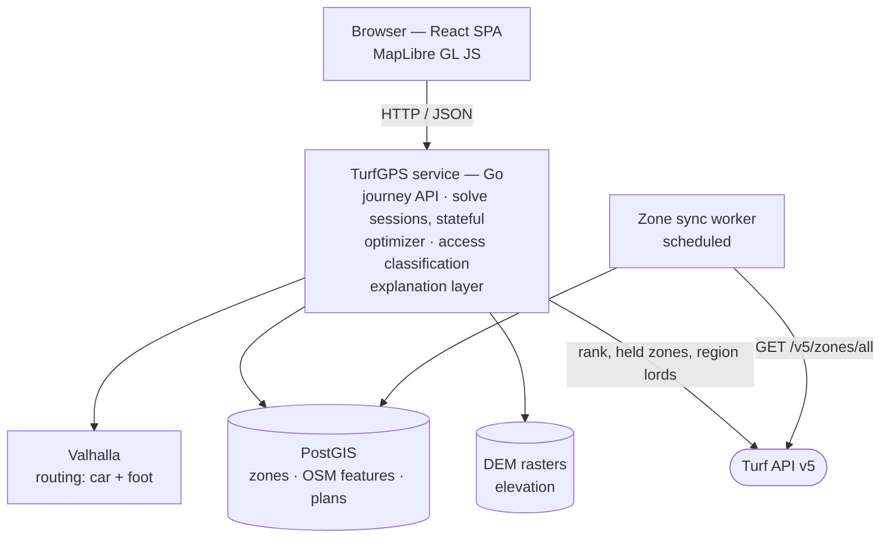
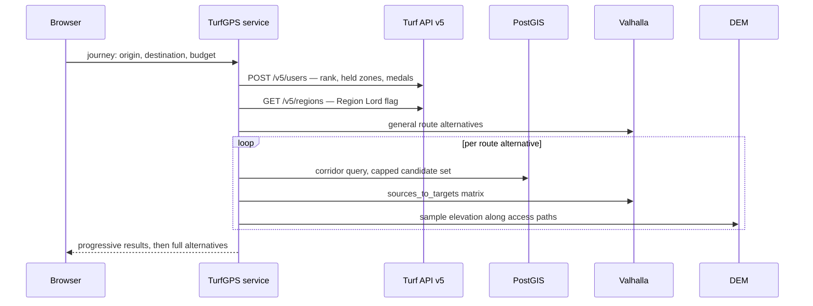

# Architecture

How TurfGPS will feasibly satisfy the behaviour defined in `SPECIFICATION.md`.

This document owns *how the system is built*, and the properties of the data it is built on. It does not restate what the system does, and it does not restate a formula or model — those are stated once, in `CalculationSpecification.md`, and copying one breaks the anti-duplication rule the documentation depends on.

Where a section of another document is referenced, the document is named. An unqualified italic name refers to a section of this one.

**Status: technology decisions recorded, structure incomplete.** The decisions in *Technology decisions* were taken on 31 July 2026 and are binding until revised. The content this document owed from `Concept.md` was moved in on the same date. What it still owes independently is listed under *Still owed by this document*.

---

## System context

TurfGPS is a single-tenant, account-free web application over a self-hosted geospatial data plane.

It consumes exactly one third-party service at runtime — the **Turf API** (`https://api.turfgame.com/v5`), for zone data, player rank, held zones, and region lordship. Everything else it needs is derived from open datasets it hosts itself: road and path geometry, elevation, and map tiles.

It integrates outward with **Google Maps** for stop-by-stop hand-off, per *The waypoint limit problem* in `SPECIFICATION.md`. It provides no navigation of its own.

---

## Response time and progressive results

The pipeline is compute-heavy. A long journey generates several route alternatives, each with a corridor containing many candidate zones, each requiring routing and access analysis.

This system is used in a **planning session**, not while driving. Players hunting a particular attribute sit down deliberately and plan at length to collect as much as they can. That user is willing to wait for a thorough answer, so **thoroughness should be preferred over speed** in the initial solve. The latency budget is generous — tens of seconds is acceptable where it buys better coverage.

Progressive results remain valuable, but as reassurance rather than as a hard deadline: a first usable answer, such as the baseline route with its directly road-accessible zones, gives the user something to look at while the rest continues. The interface must show that analysis is still in progress and what remains outstanding.

The strict latency requirement lies elsewhere. **Zone replacement during route review must feel immediate**, because that is an interactive loop the user drives one decision at a time — see *Consequences for the optimizer* in `SPECIFICATION.md`. A design that returns only a complete result set, or that cannot re-solve quickly from retained state, fails this requirement, and the difference is architectural in both cases.

---

## Technology decisions

Each decision below records what was chosen, why, and what it costs. A decision marked **Proposed** follows the repository convention in `docs/README.md`: it is a concrete position to argue against, not a measured result.

### D1 — Go for the backend pipeline

**Decided.** The optimizer, access analysis, solve-session server, and zone-sync worker are written in Go.

The determining requirement is not raw compute but **retained state**. *Consequences for the optimizer* in `SPECIFICATION.md` requires the candidate set, access classifications, and computed costs to survive the initial solve, and *Response time and progressive results* above requires re-solve to feel immediate by reusing that state rather than recomputing it. That is a long-lived stateful process, and it rules out any serverless deployment target regardless of language.

Given that shape, Go earns its place on three properties: a natural fit for a stateful service holding many concurrent solve sessions; bounded worker pools with `context` cancellation over the candidate fan-out, which is directly how progressive results gets implemented rather than simulated; and a single static binary, which keeps deployment simple as `DEPLOYMENT.md` will require.

**What it costs.** Go has the thinnest geospatial ecosystem of the candidates considered. The mitigation is deliberate and load-bearing: **push geometry into PostGIS** — corridor buffers, proximity filtering, and the nearest-neighbour query behind *The activity baseline* in `CalculationSpecification.md` are all SQL — and keep in-process geometry to the light work that `orb` covers. Raster sampling is the one area where Go is genuinely weaker, and it is addressed in D6.

Python was recommended and not chosen. The reasoning above is why the choice is defensible rather than merely accepted.

### D2 — Vite + React SPA for the frontend

**Decided.** The client is a static single-page application built with Vite and React, served as files, talking to the Go service over HTTP.

The product has no SEO surface and no server-rendering benefit: it is an authenticated-by-nothing, map-heavy, interactive planning tool. Server-side rendering would add a build and deployment layer serving no requirement.

It also removes a hazard. A framework whose default deployment target is serverless creates continuous pressure toward a topology that D1 has already established cannot work.

The zone-by-zone review under *Reviewing zones one at a time* in `DESIGN.md` is a map-and-single-card interaction and must be built mobile-first, per *Platform and mobile-first design* in `SPECIFICATION.md`. A wide table is a specification violation, not a styling choice.

### D3 — Valhalla as the default routing engine; openrouteservice as a registered adapter

**Decided.** Valhalla serves both car and pedestrian routing. openrouteservice is implemented behind the same port as a selectable alternative.

Valhalla is the default for four reasons that map directly onto stated requirements:

* **One instance serves both costing models.** Car and pedestrian routing come from the same tiles, where OSRM requires a separate process and graph per profile.
* **Grade-aware pedestrian costing is native**, not an add-on. *Accessibility scope for the first release* in `SPECIFICATION.md` ships elevation-aware walking in full, so this is a first-release requirement.
* **`sources_to_targets` batches the matrix**, which is the mechanism by which the call budget is satisfied — see *The call budget* below.
* **`locate` returns edge attributes** — road class, speed limit, drivability, `layer` — which is exactly what *Enforceable exclusions* in `SPECIFICATION.md` must test against when validating a stopping position.

**Why not split engines by need.** Using one engine for car routing and another for walking was considered and rejected. The stop model in *Elevation-aware walking time* in `CalculationSpecification.md` chains car → walk → car through a single stopping point. Two engines snap that point to their own graphs, so the two halves of one stop's cost would be computed against **different geometry** — and the failure is silent, because every stop still yields a plausible number. Against a product whose measure of success is that *no zone is classified confidently and wrongly*, a silent geometry mismatch is the worst available failure mode. One engine owns any geometry that must agree with itself.

**On openrouteservice specifically.** Its hosted free tier is not viable here and must not be treated as a fallback. Published quotas are on the order of thousands of directions and hundreds of matrix requests per day; the candidate counts in *Bounding the candidate set* in `CalculationSpecification.md` mean a single journey can exhaust a day's allowance. This is precisely the failure *The call budget* exists to prevent. Self-hosted openrouteservice is a legitimate alternative and is why the adapter exists; the hosted free tier is not.

The adapter seam makes this decision **measurable rather than permanent**. Once real corridors exist, both engines can be benchmarked on the same journeys and the default revisited on evidence.

### D4 — PostgreSQL with PostGIS as the single stateful store

**Decided.** One database holds synced zones, the OSM-derived feature data, and stored plans.

Zones need a spatial index for corridor resolution. The OSM data needs the attributes routing engines do not expose — barriers, `layer`/`bridge`/`tunnel` relationships, parking areas, access restrictions, `maxspeed`. Plans need ordinary transactional storage keyed by a short code. These are one problem, and splitting them across engines would mean joining across process boundaries for queries that are naturally a single statement.

This also replaces the MongoDB of the removed prototype. That store was never reachable from the design: it indexed zone coordinates as `[latitude, longitude]` under a `2dsphere` index, which GeoJSON specifies as `[longitude, latitude]`, so every spatial query it could have served would have been wrong.

### D5 — Primary-markets data extract for the first release

**Decided.** The first release builds its data plane from an OSM extract covering **Sweden, the United Kingdom, Germany, Norway, Denmark, and Finland** — the markets named in *Geographic scope* in `SPECIFICATION.md`.

The point that makes this safe: **this is a data decision, not an architectural one.** The same stack runs on a six-country extract or on the planet. Widening is a longer import against unchanged code, not a rewrite.

It does **not** answer the question of self-hosting versus metered APIs at global scope, set out under *The cost consequence*. It defers the cost commitment while keeping the architecture that makes either answer reachable. The question stays open and stays owned by this document.

### D6 — Elevation sampled from Copernicus GLO-30 — *Proposed*

Global 30-metre elevation as the baseline everywhere, with national high-resolution models added later as adapters under *Global data first, local data as enhancement*.

Two distinct consumers must not be conflated:

* **Walking speed by gradient** is handled inside the routing engine, from elevation baked into its tiles.
* **Barrier and feasibility detection** under *Elevation and feasibility rules* in `SPECIFICATION.md` — cliffs, embankments, retaining walls — requires sampling the raster directly along the candidate access path. A routing engine that has already declined to route somewhere cannot tell you why.

**Proposed mechanism**, and the weakest decision here: sample Cloud-Optimized GeoTIFFs via `godal`, accepting a cgo dependency. The no-cgo alternative is PostGIS raster with `ST_Value`, which keeps the toolchain pure at some cost in bulk-sampling throughput. This should be settled by measurement against real access paths, not by preference.

**Confidence note.** A 30-metre global model is coarse relative to the barriers being detected — a retaining wall is narrower than one cell. This is a known limitation, it is exactly why *Terrain confidence* in `SPECIFICATION.md` exists, and stops analysed at this resolution must carry lower confidence than stops analysed against a national model. It must not be presented as though it resolved the question.

### D7 — Self-hosted vector tiles and geocoding — *Proposed*

Map tiles are rendered from the same OSM extract and served as static files; the client uses MapLibre GL JS. Geocoding for address and place search runs against the same data, per *Locations* in `DESIGN.md`, which requires it not be a metered external dependency. Zone-name search needs no external lookup at all — the synced zone table already holds every name.

### D8 — The Go service in `service/`, as one peer directory among several

**Decided.** The Go service occupies **`service/`** and declares its own module, **`github.com/Caisesiume/TurfGPS/service`**. The client of *§ D2* occupies **`web/`**. `docs/` and `.claude/` sit alongside them as peers. **There is no module at the repository root.**

The reason is what this repository actually holds. Its primary artifact today is documentation — the four specification documents, the requirements corpus, and the agent library, against no code at all. (Their live sizes are in `docs/Requirements/INDEX.md` and the agent directory itself; this decision turns on the balance, not on a count, and does not restate one.) A module at the root would make the Go service the repository's *subject*, and it is not the subject; it is one peer among several, and the largest of them is prose. Layout is the first thing a reader infers structure from, and a root module would have them infer the wrong one.

It also gives each deployable its own directory. *§ D2* builds the client as static files served independently of the service, and sibling directories make that separation structural rather than conventional — one build, one deployment unit, one directory each.

**What it costs.** Every Go tool, linter, and CI action assumes the module sits at the repository root. `gofmt -l .`, `go vet ./...`, `go build ./...`, and `golangci-lint run` all resolve against the working directory, so every one of them must be run from `service/` and every CI job needs its working directory set explicitly. The failure mode this creates is worse than the inconvenience: a Go gate run from the repository root **passes vacuously** — it finds no Go files rather than finding no faults, and reports success either way. That is a false pass on a quality gate, and it is bought with this layout. Every command and workflow that invokes the Go toolchain carries the correction, permanently.

---

## Runtime topology



Three properties of this shape are requirements rather than preferences:

**The service is stateful and long-lived.** Solve sessions live in it. This is not a scale-out-behind-a-load-balancer design without deliberate session affinity, and `DEPLOYMENT.md` must account for that.

**The zone sync is never on a request path.** *Retrieving zones* below records `GET /v5/zones/all` as **rate-limited to one request per 30 minutes** — which is the binding constraint, and holds regardless of how quickly the response transfers. It is a scheduled worker writing to PostGIS, and the pipeline must tolerate the sync being mid-refresh or up to an hour stale.

**Nothing in a stored plan depends on the Turf API.** This is what makes *Never gate stored plans on the wizard* in `DESIGN.md` implementable: an outage degrades the volatile overlay and nothing else.

---

## Data sources and constraints

The Turf API is the sole source of zone and player data. The following was verified directly against the live API and supersedes any assumption made elsewhere in the documentation set.

**The general rate limit is one request per second per resource**, and it governs the whole API — `POST /v5/users` and `GET /v5/regions` no less than the zone endpoints. Where one endpoint is held more tightly than that, its own limit is recorded with it; `GET /v5/zones/all` is the only one that is, and that limit is the constraint the zone sync is designed around.

Two facts about zone data are product facts rather than integration ones and are stated in `SPECIFICATION.md` instead: *The coordinate is the target*, which is the modelling decision the API's silence about zone extent forces, and *Rounds*, which governs what ownership data means.

### API version

Version 5 is the current API and the version this system targets. Version 4 is deprecated and must not be used for new work.

**`GET /v5` is self-documenting, but only in HTML.** Requested with `Accept: application/json` it returns **406 Not Acceptable**; its index of endpoints is a web page, not a machine-readable descriptor. A client that sets a JSON `Accept` header globally across the base URL will fail on this path alone while every data endpoint under it succeeds — worth knowing before that 406 is read as an outage or an auth fault. Observed 3 August 2026.

### Zone geometry

The API returns a zone as a **single centre coordinate**. It exposes no radius, boundary, or extent of any kind.

A zone is nominally an area of about **25 × 25 metres**, sized to absorb ordinary GPS error. That figure is a guideline rather than a guarantee: zone shapes and sizes **vary considerably**, because each zone is adjusted to fit the place it is put. The API exposes nothing about the shape or size of any individual zone.

### Distance between zones

Zone placement guidelines call for at least **200 metres between zones**. This is a guideline applied when zones are created, not an invariant the system may rely on, and it has known exceptions.

Water zones are the clearest case: they are commonly closer together than 200 metres, and often considerably closer.

The system must therefore treat inter-zone distance as something to measure per pair, never as a value that can be assumed to exceed a threshold. Any logic that would break if two zones were fifty metres apart is incorrect.

The guideline remains useful as a rough expectation for candidate density in ordinary terrain. It must not become an assumption in the cost model.

### Retrieving zones

Two endpoints return zones.

`GET /v5/zones/all` returns every zone in the game, refreshed at least hourly, limited to **one request per 30 minutes**. This is the primary source for candidate discovery. The system maintains its own periodically-synced copy with a spatial index, and resolves route corridors against that local copy.

The following properties of this endpoint shape the architecture. Except where noted, each was counted across the **complete** response of 3 August 2026 — every one of its 154,845 records, not a sample, and deliberately not taken from the bounding-box endpoint, which returns a strict superset and would not answer the question.

**It omits ownership entirely.** `currentOwner` and `dateLastTaken` are absent from every record — confirmed across all 154,845, not sampled. It carries the stable data and nothing round-scoped. The local copy therefore answers *which zones exist and what they are*, but never *who holds them*. Ownership does not come from the sync. For the user's *own* holdings — all the first release needs — it comes from the `zones` array returned by `POST /v5/users`, per *The user's held zones are already known*. `POST /v5/zones` returns per-zone ownership should it ever be needed, but the first release does not require it.

**Which fields it carries, and which are optional.** These ten are the whole of it; no other key appears on any record.

| Field | Present | Note |
|---|---|---|
| `id` | 100.00% | the zone's primary key |
| `name` | 100.00% | |
| `latitude`, `longitude` | 100.00% | two scalars, not a coordinate pair |
| `dateCreated` | 100.00% | required by *Takeover rate* in `CalculationSpecification.md` |
| `totalTakeovers`, `takeoverPoints`, `pointsPerHour` | 100.00% | |
| `region` | 100.00% | an object; its own subkeys are not uniform, below |
| `type` | **15.91%** | 24,643 zones; absent from the other **84.09%** |

That this list contains no radius, boundary, or extent field is the measured basis for *Zone geometry* above.

**`type` is optional, and this is the field a schema gets wrong.** It is present on fewer than one zone in six. A column declared `NOT NULL` fails on 130,202 of 154,845 records. Nothing may treat an absent `type` as an anomaly or a sync defect; absence is the ordinary case.

**`region` is an object whose subkeys are also not uniform.** `region.name` and `region.id` are on 100.00% of records, but `region.country` is on **97.00%** and `region.area` on **96.66%**. Where `country` is missing — 4,638 zones — the country's name is carried in `region.name` instead, and `area` is usually missing too: Ireland (478 zones), Spain (372), Australia (300), Italy (248) and France (232) head a list that has neither subkey. **A group-by on `region.country` silently drops those 4,638 zones rather than failing**, which is the failure mode to design against: the aggregate looks complete and is not.

**`dateCreated` is near-immutable, but it is not immutable.** Of the **138,830** zone ids present in both the January 2025 and August 2026 dumps, **exactly one** changed its `dateCreated` across nineteen months: id `660960`, which moved from `2024-04-28` to `2025-10-30` while its coordinates shifted slightly and its `totalTakeovers` continued upward from 7 to 10 — a zone evidently re-sited and re-dated under the same id rather than replaced with a new one.

One record in 138,830 is not a reason to re-fetch, but it is a reason not to model the field as write-once-forever. A row inserted once and never updated keeps a `dateCreated` the API has since revised, and any rate derived from it is then computed against the wrong denominator — for id `660960`, ten takeovers over nine months rather than over twenty-seven, inflating its derived rate roughly threefold. **The sync must therefore update `dateCreated` on existing ids, not only insert it with new ones**, and an upsert keyed on `id` that refreshes the mutable columns is sufficient. No detection mechanism is required; the ordinary refresh carries it, provided the write path is not written to skip fields it assumes are constant.

**It is large, and the rate limit — not the download — is what keeps it off the request path.** On **3 August 2026** the complete response returned **154,845 zones in 43,260,217 bytes (43.26 MB) in under 20 seconds**, well-formed and complete, uncompressed and without gzip even being requested — which the API itself recommends and which would reduce it further. That is **279.4 bytes per zone**, near-exact against the ~278 recorded earlier.

An earlier note in this section described a partial download reaching ~82,000 zones and 23 MB before timing out at five minutes. **That observation no longer reproduces and has been replaced by the measurement above.** Extrapolated to the full corpus it implied about **9.5 minutes** for a transfer that now completes in **under 20 seconds** — so anyone sizing the sync against it would budget for something close to thirty times the time actually required, and would design around a timeout problem that no longer exists.

**The architectural conclusion is unchanged, because it never rested on the download being slow.** The sync must be a background job on a schedule, never anything that happens on a request path, and the pipeline must tolerate the sync being mid-refresh or stale by up to an hour — and that follows from the **one request per 30 minutes** limit alone. A response that arrives in 20 seconds is still a response the system may only ask for twice an hour, so freshness is bounded by the limit no matter how fast the transfer is.

`POST /v5/zones` returns zones by name, by id, or within a bounding box, and accepts several areas in one request body. This is the fallback and the means of refreshing volatile per-zone fields. Its area constraint is a **product, not a per-axis limit**: a request is rejected when

```text
(northEast.latitude − southWest.latitude)
    × (northEast.longitude − southWest.longitude) > 0.05
```

Tiling logic must respect the product. Splitting a corridor into tiles far below the permitted area multiplies request count for no benefit.

### Player data

`POST /v5/users` accepts a username and returns the player's `rank`, `blocktime` in seconds, `pointsPerHour`, `uniqueZonesTaken` as a count, `medals` as an array of ids, and `zones` as an array of currently-held zone ids.

`blocktime` is **not** takeover duration. It is the period a zone stays locked after a player has taken it, before it can be taken again. It is returned per player because it varies by rank. It must not be used as a component of stop time — see *Takeover time* in `CalculationSpecification.md`. Takeover duration is not exposed by the API at all.

#### The user's held zones are already known

`POST /v5/users` returns a `zones` array containing **exactly the zone ids the user currently holds**. This is verified: six sampled ids each matched the corresponding zone's `currentOwner`.

The ownership indicator shown during review is therefore a **set-membership test against data already in hand**, not a lookup. The list is fetched once at the start of a review session — in the same call that supplies rank — and every zone shown during that review is checked against it locally.

No per-zone request is made, and **no cache is required**. One call answers the question for every zone in the route.

This is possible because the indicator answers only *do I own this zone*. It deliberately says nothing about who else might hold a zone, which would require querying each zone individually. That information has no use in the first release: the user is deciding whether a zone is worth their time, and another player's ownership does not change that.

Staleness is bounded by the age of that single fetch, and refreshing it means repeating one call, not many. How the age is surfaced is defined under *Zones the user already owns* in `DESIGN.md`.

### Region lords

`GET /v5/regions` returns every region together with its current `regionLord` in a single response — 344 regions, of which 158 currently have a lord. `POST /v5/regions` returns the same for specific region ids.

The only use this system has for the data is determining whether the user holds a region lordship *anywhere*, because the Region Lord takeover bonus applies globally rather than per region. That is a scan of one response for the user's id, not a per-zone join. See *Bonuses that reduce takeover time* in `CalculationSpecification.md`.

Region lordship changes hands during play and is volatile data.

Consequently, rank, medal progress, and current zone ownership are all **available** from a single call. Only the *list* of zones a player has previously taken is unavailable; the API exposes a count alone. Anything in the specification that treats ownership or medals as inaccessible is constrained by product choice, not by data availability.

### Volatile and optional fields

Every zone carries `takeoverPoints`, `pointsPerHour`, and `totalTakeovers`. `currentOwner` and `dateLastTaken` are sometimes **absent**, and must be treated as optional rather than assumed present.

Their absence does **not** mean the zone has never been taken. Both fields are **round-scoped**: they describe the current round only, and are absent for a zone nobody has taken since it began.

`currentOwner` resetting at each round boundary is confirmed. `dateLastTaken` is strongly indicated by sampling: across roughly 1,150 zones, every recorded value fell within a single continuous window with a hard floor and nothing before it, while 39 zones reported no date at all despite carrying between 19 and 318 lifetime takeovers. A lifetime field would not behave that way. The floor also reveals the current round's start date, which is useful in its own right — the system can derive it from the data rather than tracking a calendar.

The absence of `currentOwner` is therefore a useful positive signal rather than missing data: it identifies a zone nobody holds this round.

Ownership and point values change continuously. Any locally cached copy is a snapshot, and a recommendation's confidence should reflect the age of the data it was built from.

---

## Data strategy

### Global data first, local data as enhancement

The design prefers **globally-available data sources** — worldwide map, routing, and elevation data — as the baseline everywhere, rather than assembling a set of national datasets and thereby defining a boundary the product has no reason to have. The requirement this serves is *Geographic scope* in `SPECIFICATION.md`: the product must not be a system that only works in certain countries.

Where better country-specific data exists, it is added as an **enhancement** rather than a prerequisite. National elevation models, cadastral data, official road attributes, and pedestrian-path datasets are all richer than the global equivalents in the countries that publish them, and using them where available is how the primary markets get better results.

### Ports and adapters

This implies a specific architectural shape: data sources sit behind **adapters against a common interface**, and the pipeline consumes the interface rather than any particular provider.

Adding a country's dataset is then implementing an adapter and registering it, not modifying the optimizer. Several adapters may contribute to the same journey, with the best available source used for each kind of data in each place, and the global provider serving as the fallback that guarantees an answer everywhere.

The ports:

| Port | Responsibility | First implementation |
|------|----------------|---------------------|
| `RoutingProvider` | Car and pedestrian routes, matrices, edge attributes at a point | Valhalla; openrouteservice registered alongside |
| `ElevationProvider` | Point and profile sampling | Copernicus GLO-30 |
| `ZoneRepository` | Zone lookup, corridor queries, activity baseline | PostGIS |
| `TurfClient` | Player rank, held zones, region lords, zone sync | Turf API v5 |
| `PlanStore` | Short-code plan persistence and expiry | PostGIS |
| `Geocoder` | Address, place, and zone-name resolution | Self-hosted; zone names local |

The requirement this places on the rest of the system is that **every consumer of external data must tolerate varying quality**, because coverage differs between one part of a route and another. That is already true of the confidence model under *Terrain confidence* in `SPECIFICATION.md`, which extends naturally to provenance: a stop analysed against a two-metre national elevation model is more confident than one analysed with a global thirty-metre model, and the recommendation must say so.

The purpose is a platform that improves by adding sources rather than by being rewritten, and that never has to tell a user their country is unsupported.

---

## The call budget

The naive pipeline — one routing call per candidate stop, per route alternative, per journey — reaches thousands of external calls for a single query. Against a metered routing provider this is prohibitive, and against any provider it is slow.

The per-journey external call volume must therefore be **bounded and known**. Two mechanisms bound it, and they compose.

**Self-hosting changes the unit.** Against a metered provider, a routing request is a cost. Against a local Valhalla, it is a function call over a warm tile cache. The constraint becomes latency and CPU, not money. This is why self-hosting the routing and elevation services is the primary path and commercial APIs are the fallback rather than the other way round.

**Matrix batching bounds the count.** `sources_to_targets` collapses each alternative's candidate set into a small number of matrix calls. The cap in *Bounding the candidate set* in `CalculationSpecification.md` — 300 candidates per alternative — is what makes the matrix a fixed, known size.

**Turf API calls per journey are already bounded and small:** one `POST /v5/users` for rank, held zones, and medals; one `GET /v5/regions` for the Region Lord flag. Zone data comes from the local sync, which removes zone fetching from the per-journey cost entirely. None of these scales with candidate count.



**The concrete figures are not yet computed** and this section is incomplete until they are. They depend on the corridor arithmetic in *Bounding the candidate set* in `CalculationSpecification.md`, and stating a number here before doing that arithmetic would produce exactly the invented constant the repository's conventions forbid.

### The cost consequence

Serving every country where Turf has zones makes this decision larger, not smaller, and it must be taken with the full picture in view.

Self-hosting a global routing and elevation stack is a substantially heavier undertaking than self-hosting one country's. Metered global APIs avoid that but reintroduce the per-journey cost problem the pipeline cannot afford. The adapter pattern makes the choice **replaceable** rather than permanent, which is its real value here — but it does not answer it, and this document must.

---

## Persistence and cross-device transfer

*Route persistence* in `SPECIFICATION.md` requires confirmed routes to survive an arbitrary interval, complete with the candidate set and computed costs behind them. *No accounts* there records the consequence: **a route planned on a computer cannot appear on a phone.**

Three options close that gap without introducing accounts:

* **A shareable link that encodes the plan**, letting the user move it between devices themselves. Simple, but the full stored state is far too large to fit in a URL — only the confirmed plan could travel this way.
* **File export and import**, which has the same property and no size limit, but is clumsy on mobile.
* **Anonymous server-side storage keyed by a short code**, where the user is given a code or link that retrieves the plan elsewhere. This carries no login, no personal data, and no identity — but it does mean routes live on a server, which is a step toward the thing being avoided.

**The proposed resolution is anonymous server-side storage keyed by a short code.**

It is the only one of the three that can carry the full stored state; a plan complete with its candidate set and cost model will not fit in a URL. The others would force a reduced stored route, losing the ability to re-solve without rerunning the pipeline.

It is not an account. There is no email address, no password, no login, and no identity — only an opaque key that retrieves a plan. The code is held in local storage automatically, so the usual case never requires the user to see or type it, and it can be shown or shared when they want the plan on another device.

Two obligations come with it:

* **Expiry.** Stored plans should expire — ninety days is a reasonable default — so that storage is bounded and abandoned plans do not accumulate indefinitely. Reopening a plan restarts the clock, per *Returning to a stored plan* in `DESIGN.md`. **The reset needs a ceiling above it, proposed at twelve months from creation.** The ninety-day clock bounds an *abandoned* plan and only that: a plan reopened every eighty-ninth day is retained forever, and by the obligation below, what it retains is a dwelling coordinate. A plan should therefore be deleted at most **twelve months after it was created**, however often it has been opened. The two are independent — reopening extends the ninety days exactly as `DESIGN.md` specifies, and nothing extends the ceiling.

  Twelve months is **a proposed default, not a measured result** — a concrete number to argue against. It is longer than any plausible reuse cycle for a single journey: a route still being opened after a full year of Turf rounds has had its value, and re-planning it costs the user one search. It is short enough that the store never holds a dwelling coordinate indefinitely on the strength of habit alone. And it is the only bound that makes the store's worst case computable — one year of plan creation, independent of how users open things — which the ninety-day rule by itself does not give. It bounds **the life of a stored plan** and nothing else; the twelve months appearing under *Proposed adjustment* in `CalculationSpecification.md` bounds a **zone's age** and is an unrelated figure that happens to share a value. Neither constrains the other, and either may move without the other moving.

  **One consequence belongs in `DESIGN.md` rather than here, and is not yet reflected there.** *Returning to a stored plan* in `DESIGN.md` states that a route in active use is never lost to a timer; a ceiling makes that conditional, because at twelve months an actively used plan is deleted. The expired-code path that document already specifies is the right carrier for it, but its assurance is stated more strongly than the ceiling allows and needs amending to match.
* **Personal data.** **A plan holding only coordinates and zone identifiers is not free of personal data**, and treating it as though it were understates what is stored. A plan carries an **origin the user typed**, and for many journeys that origin is their home. A precise dwelling coordinate, held under a stable identifier alongside the date it was planned, is personal data in substance whatever it is called. It **cannot be designed out** — the product cannot plan a route from an origin it does not know — so the controls that matter are retention and access, not omission. The user's Turf username is the separable part: either keep it out of the stored object, or state its retention explicitly. The first is simpler and is the recommendation.

This keeps the no-accounts decision intact while closing the cross-device gap that would otherwise undermine the persistence requirement.

---

## Still owed by this document

Sections this document owes independently of the content moved into it: **failure handling**, **observability**, **security architecture**, the **schema** behind `PlanStore` and the synced zone table, and the deployment model handed to `DEPLOYMENT.md`.

---

## Open questions owned by this document

* **Self-hosting versus metered APIs at global scope.** The largest cost risk in the project, stated under *The cost consequence*. D5 defers it; the adapter pattern makes it replaceable. It is not answered.
* **The DEM sampling mechanism** — `godal` with cgo, or PostGIS raster. Settle by measurement, per D6.
* **Solve-session lifetime and residency.** Tied to the lifetime-of-an-unconfirmed-route entry under *Open questions owned by this document* in `SPECIFICATION.md`: whether sessions are in-memory only, and therefore lost on restart, or persisted. The product question and the architectural one must be answered together.
* **Concrete per-journey call and latency figures**, per *The call budget*.
* **Cross-device transfer** — anonymous server-side storage keyed by a short code, per *Persistence and cross-device transfer*. Proposed, and open to revision.
