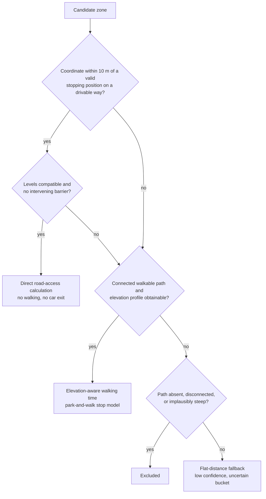
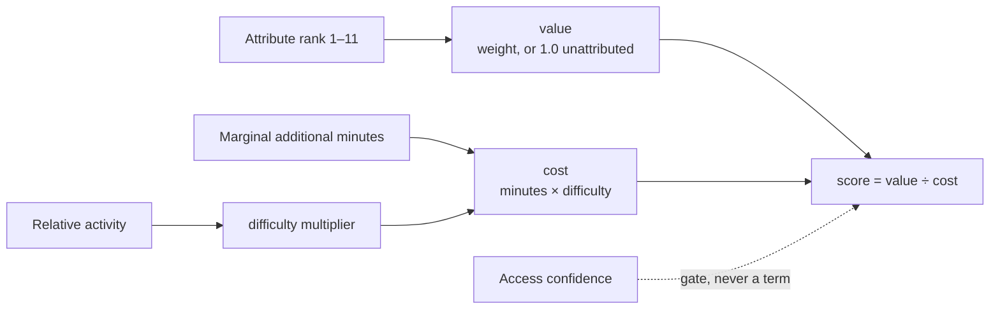

# Calculation specification

Every formula, constant, and threshold behind the numbers TurfGPS puts in front of a user.

This document owns *how the system computes*. It does not restate what the system does or argue why it should — `SPECIFICATION.md` owns that, and the reasoning that justifies these models lives there. Conversely, a model stated here is stated **only** here. Nothing else in the documentation set may restate one, because a second statement of a model is a second thing to keep correct, and the two will diverge.

Where a section of another document is referenced, the document is named. An unqualified italic name refers to a section of this one.

**Status: moved out of `Concept.md` on 31 July 2026, complete for the first release.** The models below are finished and carry proposed defaults throughout. The domain glossary this document also owes is listed under *Still owed by this document*.

---

## Conventions

**Numeric constants are proposals unless stated otherwise**, per `docs/README.md`. A proposed default exists so that work begins with a concrete number to argue against rather than a blank to fill. None of the proposals here is a measured value, and none may be quoted to a user as though it were.

**Every constant is configurable and carries a documented origin**, never embedded as an unexplained literal, per *Estimate accuracy and calibration* in `SPECIFICATION.md`. For an uncalibrated constant that origin is the assumption made and why; for a settled one it is the source and the date it was checked.

**Modelling constants and enforcement constants are not configurable in the same way.** The rule above was written for constants where being wrong degrades the quality of an answer. It does not fit constants where being wrong puts a driver somewhere they did not agree to be, and applying it unchanged to one of those turns a safety limit into a deployment knob.

* A **modelling constant** — the direct-access tolerance, the candidate cap, the corridor width, the placeholder timings — fails in the direction of a worse recommendation. It remains configurable in both directions under the rule above.
* An **enforcement constant** fails in the direction of an outcome the user did not agree to. It is **configurable downward only**: a deployment may tighten it and may never loosen it, and its documented value is the maximum permitted rather than a midpoint to tune around. It must be **named as an enforcement constant at its own definition site**, so the property travels with the constant instead of depending on a reader recalling this section.

The test is not how important a constant looks but **which way its failure runs**: if raising it can produce an outcome the user did not agree to, it is an enforcement constant. Anything feeding the enforceable exclusions or the absolute ceiling in `SPECIFICATION.md` is presumed enforcement unless argued otherwise.

The reason for stating this as a general distinction rather than a carve-out is that an enforcement constant filed here silently inherits "every constant is configurable". Every ceiling check would still pass against a loosened value, and every test asserting compliance would still return green, while the user was routed past what they agreed to.

---

## Bounding the candidate set

"Reasonable spatial limits", in *Candidate zone identification* in `SPECIFICATION.md`, must be a number, or the requirement that per-journey call volume be bounded has nothing bounding it. Two mechanisms apply together, and both are **proposed defaults**.

**A corridor scaled to the time budget.** How far a zone can lie from the route and remain worth considering depends on how much extra time the user has allowed. The corridor half-width is derived from the per-leg time allowance — roughly the distance drivable in half the remaining allowance — then **floored at 1 km and capped at 15 km**.

The floor keeps a corridor usable even for a very small budget. The cap is generous on purpose: a highly ranked attribute is rare enough, per *Attribute rarity* in `SPECIFICATION.md`, that a genuinely valuable zone may sit well off the main road, and a tight corridor would never see it.

**A hard cap on candidates promoted to routing.** Corridor membership is cheap; routing and access analysis are not. Zones inside the corridor are scored on straight-line proximity and estimated value, and only the best **300 per route alternative** proceed to full evaluation.

This is the point at which the pipeline's cost becomes bounded and predictable, and it is what makes the wide corridor affordable. Both figures are configuration, and the arithmetic connecting them to the per-journey call volume belongs under *The call budget* in `Architecture.md`.

Where the cap binds, it must not do so silently. If a corridor contains more qualifying candidates than the cap admits, that fact should be recorded, because a user in a dense area is receiving a result shaped by a limit rather than by their preferences.

---

## Direct-access tolerance

*Directly road-accessible zones* in `SPECIFICATION.md` covers two situations: a zone sitting directly **on** a drivable road, and a zone sitting **beside** one, close enough that a stopped car is already within it.

The second case needs a stated tolerance, because *The coordinate is the target* deliberately refuses to model the capture area. That rule governs how far a player must **travel**, and it is right to be conservative there. Direct access asks a different question — whether a stopped vehicle is already inside the zone — and answering it requires admitting that the zone has some extent.

The proposed rule is that a zone qualifies as directly road-accessible when its coordinate lies within **10 metres** of a valid stopping position on a drivable way. Against a nominal 25-metre zone, whose half-extent is about 12.5 metres, a car stopped within 10 metres of the coordinate is very likely inside it.

Beyond that distance the zone becomes a park-and-walk stop with a short priced walk, rather than being lost. The classification decides which cost model applies, not whether the zone survives.

This 10-metre figure is a proposal and is exactly the kind of threshold worth checking against real captures early, since it sits directly on the boundary between the two cost models.

---

## Additional journey time

The cost metric is additional journey time. The system must estimate more than the additional driving duration returned by a routing service. It must also account for slowing down, parking, leaving the car, walking, taking the zone, returning to the car, and rejoining traffic.

The route provider calculates the baseline driving time and the driving time of any rerouted journey. The Turf optimizer then adds stop-specific service time that an ordinary routing provider does not include.

For every route alternative:

```text
additional journey time =
    Turf-enhanced journey duration
    − baseline journey duration
```

The Turf-enhanced journey duration consists of:

```text
rerouted driving time
+ all zone stop times
```

This distinction prevents the system from double-counting the time spent driving to a zone. The routing provider accounts for the changed road route, while the Turf stop model accounts for actions performed after or during the stop.

Detour cost is obtained by routing and never inferred from geometry, per *Detour cost must always be routed, never inferred* in `SPECIFICATION.md`. A consequence for every formula below is that a stop's cost is meaningful only for one journey travelled in one direction, and must not be cached or reused across journeys as though it were a property of the zone.

---

## The absolute additional-time ceiling

**This is an enforcement constant, and it is configurable downward only.**

The ceiling is **115% of the user's stated additional-time limit** — an allowance of 15% above the figure the user gave. A deployment may lower this multiplier; it may never raise it. 115% is the maximum permitted value, not a default to be tuned in both directions, and a configuration that sets it higher is invalid rather than merely unusual.

The model this constant serves — soft target, hard ceiling, and the clearly-labelled stretch band between them — is stated under *User time constraints* in `SPECIFICATION.md` and is not restated here.

**The base is the additional time, never the journey duration.** The multiplier applies to the additional time the user permitted, not to the total duration of the journey. This is the misreading the constant exists to foreclose, because it fails in the direction that puts a driver somewhere they did not agree to be: on a six-hour drive with a twenty-minute budget, the ceiling is **23 minutes of additional time**. Read against journey duration it would be 54 minutes — 2.3 times what the driver agreed to, while every ceiling check still reported compliance.

**The ceiling is journey-level, never per-leg.** Where a journey has several legs, the quantity the ceiling tests is the sum of additional time across all of them, per *Journeys with several legs* in `SPECIFICATION.md`. Applied per leg instead, four legs at 115% each would compound far past the promise made to the user.

**Two properties, both binding.** The 15% figure is a **proposed default**: nothing measured establishes it, and it may not be quoted to a user as though something did. Revising it is a change to this specification, ratified here — it is not a deployment setting. The ceiling's **enforcement is not a proposal**: whatever value the constant holds, no recommendation may exceed it, for any reason, however valuable the zone. A statement carrying only the first property leaves the constraint tunable; one carrying only the second falsely claims a measured figure. Both are stated because either alone is wrong.

This ceiling is **unrelated to the 15 km corridor cap** under *Bounding the candidate set*, which shares no more than a numeral with it. That cap bounds where candidates may be looked for, and being wrong costs result quality; this ceiling bounds what may be recommended, and being wrong routes a driver off their journey.

---

## Stop time

Which model prices a stop follows from its access classification:



Takeover time is a separate component of every one of these models and is defined under *Takeover time* below. It applies to park-and-walk zones and directly road-accessible zones alike.

### Elevation-aware walking time

Walking time is calculated from the actual access path and its elevation profile rather than from horizontal distance alone. Walking distance is measured along a routed walkable path to the zone's coordinate, and the path-based, elevation-aware calculation is the default whenever pedestrian-path and elevation data are available.

The basic flat-ground calculation is:

```text
flat walking time =
    walking distance ÷ configured walking speed
```

The walking speed is a configurable average adult walking speed unless the user provides a personal value in advanced settings.

For elevation-aware routing, the path is divided into segments. The effective walking speed of each segment is adjusted according to its gradient and, when available, its surface or path type.

Conceptually:

```text
walking time =
    sum of time required for each path segment
```

```text
segment time =
    segment distance ÷ grade-adjusted walking speed
```

Uphill and downhill travel must not be assumed to require the same amount of time. A steep ascent normally reduces walking speed, while a steep descent may also be slower because of footing and safety. The return journey is therefore calculated from the reversed elevation profile rather than by doubling the outbound time.

A stop may serve one zone or several — the common case rather than the exceptional one, per *Stops serving several zones* in `SPECIFICATION.md` — so the model is expressed over the set of zones taken from it:

```text
park-and-walk stop time =
    slowdown and parking time
    + exit and lock time
    + terrain-adjusted walking time along the route that visits
      each selected zone's coordinate and returns to the car
    + takeover time × number of zones taken
    + unlock and enter time
    + time to rejoin the road and accelerate
```

Where a stop serves a single zone, that walking route is simply an out-and-back to one zone coordinate, computed from the outbound profile and its reverse.

The access cost therefore reflects both horizontal movement and vertical effort.

This is the canonical park-and-walk stop-time model. It is stated only here, and the distances feeding it are measured along the routed path to each zone coordinate. The flat calculation above is the per-segment building block, not an alternative to the model. The only permitted departure is the explicitly degraded estimate under *Flat-distance fallback*.

### Flat-distance fallback

Where no connected path or elevation profile can be obtained, the system may fall back to a symmetric straight-line estimate:

```text
total walking distance =
    straight-line distance from stopping point to the zone coordinate × 2
```

```text
walking time =
    total walking distance ÷ walking speed
```

This fallback is explicitly a degraded estimate. It ignores terrain, gradient, and barriers, and it assumes the outbound and return journeys take equal time — an assumption *Elevation-aware walking time* rejects wherever real data exists. Any candidate priced with this fallback must be marked low-confidence and is subject to the exclusion rules under *Elevation and feasibility rules* in `SPECIFICATION.md`. It must never be used to justify a recommendation presented as reliable.

### Direct road-access calculation

For a zone that can be captured directly from a legally and safely stoppable road position, the model becomes:

```text
direct road stop time =
    slowdown and safe stopping time
    + takeover time
    + time to rejoin traffic and accelerate
```

No walking, parking, car-exit, or car-entry time is required.

The system must not assume that the player can capture a zone while driving. The vehicle is expected to stop.

Unlike the park-and-walk model, this one is deliberately single-zone. A stopping position from which two zones are simultaneously capturable is possible where zones sit unusually close — see *Distance between zones* in `Architecture.md` — but it is rare enough that the general case is one zone per stopping position. Two zones taken from two positions are two stops, each priced separately.

Where a stop does turn out to serve two zones from the car, the correct treatment is the same as above with takeover time counted once per zone. It must not be modelled as a park-and-walk stop with zero walking distance, because the parking and car-exit components do not apply.

### Speed and manoeuvre calculations

Road speed affects the time required to slow down, stop, and return to normal traffic. However, speed multiplied by a deceleration time produces a distance, not a time. The stop model therefore uses time-based functions or lookup tables.

Conceptually:

```text
slowdown and parking time =
    function of speed limit, road type, stopping location, and parking type
```

```text
rejoin and acceleration time =
    function of speed limit, road type, traffic context, and stopping location
```

This will likely produce more reliable estimates than attempting to derive every manoeuvre from idealized vehicle acceleration and deceleration physics.

### Proposed placeholder timings

These values are **uncalibrated estimates**. They exist so the system can run and produce plausible output before anyone has driven the measurements, and they are the single largest source of error in the time model. Every one must be replaced by measurement, and none may be quoted to a user as though it were established.

| Stopping context | Slow down and stop | Rejoin and accelerate |
|------------------|--------------------|-----------------------|
| Parking area or rest area | 45 s | 30 s |
| Urban roadside, 30–50 km/h | 25 s | 20 s |
| Regional roadside, 70 km/h | 40 s | 35 s |
| Exit and re-entry via intersection | 60 s | 60 s |

A further **15-second buffer** applies per stop, covering the small unpredictable delays described below.

Roads above 90 km/h do not appear in this table because stopping on them is excluded outright under *Enforceable exclusions* in `SPECIFICATION.md`. Where such a zone is reachable from an adjacent rest area or service road, the relevant row is the one describing that stopping place, not the road the zone sits beside.

The timing model also includes small configurable buffers because real-world actions are not perfectly deterministic. Parking availability, traffic, road crossings, GPS delay, and the exact zone geometry can all affect the actual duration.

---

## Takeover time

The time required to capture a Turf zone varies by player rank. The optimizer must include takeover duration because it directly affects the true cost of every recommended stop.

Rank is available from `POST /v5/users` by username, so this path is supported by real data rather than aspirational. The API does **not** expose takeover duration itself, so that value must be held by this system.

### Rank-to-takeover-time table

Takeover time is not an unknown requiring measurement. It follows a documented linear rule over the rank range 0 to 60:

```text
base takeover time (seconds) =
    30 − (0.2 × rank)
```

This gives 30 seconds at rank 0 and 18 seconds at rank 60.

The system carries this as a maintained, hard-coded table of rank to seconds, generated from the rule above rather than transcribed by hand. A table is preferred over evaluating the formula at runtime because it is directly auditable against the source, and because the rule is a published game constant that may be revised without notice.

Because the table is a copy of external information, it must carry its provenance in the source file: where the values came from, the date they were checked, and the formula they were generated from. A silent drift between the game's real takeover time and this table would corrupt every stop estimate in the system while leaving no visible symptom.

The authoritative sources are the Turf wiki's *Takeover time* page and the game's own information pages. Neither publishes a machine-readable form, so this remains a manual synchronization point and should be re-checked periodically.

### Bonuses that reduce takeover time

Rank alone does not determine takeover time. Two bonuses each reduce it by five seconds, and they stack, with the documented floor being eight seconds for a rank-60 player holding both.

**Region Lord** applies globally, not regionally. A player who holds the title in *any* region receives the bonus on *every* takeover, anywhere. Being Region Lord of Zuid-Holland shortens takeovers in Nordnorge by the same five seconds.

The bonus is therefore a single property of the player, not of the zone. It resolves to one boolean per journey: does this user hold a region lordship anywhere? If so, five seconds comes off the base time for every stop on the route.

This is computable, and cheaply — the single call that answers it is recorded under *Region lords* in `Architecture.md`. There is no need to join zones to regions for this purpose, and no need to vary takeover time from stop to stop.

Region lordship changes hands during play, so the flag is volatile and is resolved per journey rather than cached indefinitely.

**GPS bonus** also reduces takeover time by five seconds, but it is **permanently excluded from this model** rather than deferred.

It is earned by keeping Turf's GPS on and remaining visible to other players while travelling between zones. That is a choice each player makes, it cannot be controlled or predicted by this system, and it must not be assumed of every player. There is no version of this system that could reliably know whether the bonus applies.

Excluding it biases estimates conservative, which is the right direction for an error of this kind: a stop may prove faster than promised, never slower.

### Default when rank is unknown

A username is always present, because initialization requires one before the planner opens — see *First-run initialization* in `DESIGN.md`. The default below therefore covers only the case where a known username fails to resolve to a rank at request time: an API outage, a renamed account, or a transient failure. It is a fallback, not the normal path.

The rule above makes this default derivable rather than arbitrary. The mean over ranks 0 to 60 is the value at the midpoint rank of 30:

```text
default takeover time =
    30 − (0.2 × 30) = 24 seconds
```

That derivation must be recorded alongside the constant. The requirement that the default be transparent is met by showing this calculation, not by asserting a number.

No bonus is assumed for an unknown player.

### Zone lock time

Because `blocktime` governs when a zone becomes takeable again, it only affects a journey that would take the same zone twice. The model excludes it, and the exclusion rests on one invariant: that a planned journey **takes each zone at most once**. While that holds, zone lock time has no bearing on any cost in the model and does not appear in it.

That invariant is an assumption, not a guaranteed property — nothing in the requirements corpus currently obliges a plan to take each zone at most once. It is named here so that the exclusion has a stated condition to fail: if a plan can ever take one zone twice, this exclusion must be revisited rather than inherited.

The journey's shape does not settle it. A round trip is in scope, per *Genuinely out of reach or out of scope* in `SPECIFICATION.md`, and a journey of any shape may pass the same zone twice — an out-and-back over one road does so however its endpoints are named. What keeps lock time out of the model is the plan taking each zone at most once, not the journey running from an origin to a different destination.

Should the invariant not hold, the documented behaviour is that lock time rises with rank, from ten minutes at rank 0 to twenty-five minutes at rank 60, and that a revisit is locked for a static five minutes regardless of rank.

The units are confirmed: `blocktime` is **in seconds**. A live query for a rank-60 player returned 1500, which is exactly the twenty-five minutes the published maximum describes. The API's own example response showing 30 is stale documentation and should be disregarded.

`blocktime` is otherwise **out of scope**. It plays no part in the first release.

---

## Zone value

Value is carried by the zone's attribute, ranked 1 to 11 by the user during initialization, per *Attribute preference* in `SPECIFICATION.md`. That ranking is ordinal and the optimizer needs a number. The curve below is the translation.

### Proposed rank-to-weight curve

The following is the **proposed default**. The numbers are a starting position to argue with, not measured values, and the anchors are configurable.

An ordinary zone without an attribute has a base value of **1.0**. Weights decay geometrically from rank 1, each rank worth roughly 57% of the one above:

| Rank | 1 | 2 | 3 | 4 | 5 | 6 | 7 | 8 | 9 | 10 | 11 |
|------|---|---|---|---|---|---|---|---|---|----|----|
| Weight | 500 | 288 | 166 | 95 | 55 | 32 | 18 | 10 | 6 | 3.5 | 2 |

The curve is anchored at rank 1 = 500 and rank 11 = 2, with the intermediate values following from the constant ratio.

Three properties make this shape a reasonable default:

* **Rank 1 clears the stated bar with headroom.** At 500 to 1, one top-ranked attribute zone outweighs any plausible number of ordinary zones in a single journey — which is the design target set out under *The weighting is extreme* in `SPECIFICATION.md`.
* **Adjacent ranks stay comparable.** Rank 1 beats rank 3 by roughly three to one, so a nearby rank-3 zone can still beat a distant rank-1 zone. The ranking expresses preference without becoming an absolute lexicographic order between adjacent attributes.
* **The lowest-ranked attribute still matters.** At 2.0 it remains worth two ordinary zones, which reflects that ranking an attribute eleventh is not the same as having no interest in it.

Attributed zones add value according to this ranking, and a highly ranked attribute justifies a far larger walk or deviation than any quantity of ordinary zones.

---

## Access difficulty

Difficulty is derived from how often a zone is actually taken, relative to its neighbours. The reasoning behind that signal, and the sampling supporting it, are in *Zone activity as a difficulty and hold-time signal* in `SPECIFICATION.md`. The arithmetic is here.

### Takeover rate

Every zone reports `totalTakeovers` and `dateCreated`. Together these give a **takeover rate**:

```text
takes per month =
    totalTakeovers ÷ months since dateCreated
```

### The activity baseline

Activity is judged relative to its neighbourhood, never against a global figure. The system computes a local activity baseline — the typical takeover rate across the surrounding zones — and scores each zone against that baseline rather than against an absolute number.

What matters is the ratio:

```text
relative activity =
    zone takes per month ÷ local baseline takes per month
```

The neighbourhood is proposed as the **nearest 100 zones bounded to a 25 km radius**, whichever limit binds first.

One caution in construction: a fixed count of nearest zones spans a very large area in sparse terrain, and may reach into a distant town whose activity has no bearing on the local one. The neighbourhood must be bounded by distance as well as by count, so the baseline stays genuinely local.

### Proposed adjustment

The following is a **proposed default**, not a measured relationship. It feeds the difficulty multiplier in *Proposed form: value per minute*:

```text
difficulty multiplier =
    1 + 0.6 × max(0, 1 − relative activity)      capped at 1.6
```

The behaviour this produces:

| Relative activity | Multiplier | Reading |
|-------------------|-----------|---------|
| 1.0 or above | 1.00 | At or above local normal — no penalty |
| 0.5 | 1.30 | Half the local rate |
| 0.25 | 1.45 | A quarter of the local rate |
| approaching 0 | 1.60 | Capped |

The penalty is deliberately mild and strictly bounded. A quiet zone becomes less attractive but never disqualified, which matches the strength of the evidence: low activity is a hint about difficulty, not a measurement of it.

Three guards apply, and in each case the adjustment is simply not applied:

* Fewer than **20 zones** within the neighbourhood radius, so no meaningful baseline exists.
* A zone younger than **12 months**, where the takeover rate is too unstable to trust.
* A neighbourhood spanning more than **25 km**, beyond which "local" stops meaning anything.

---

## The objective function

### Proposed form: value per minute

The proposed structure keeps **value and cost separate** and scores candidates by their ratio:

```text
value = attribute weight, or 1.0 for an unattributed zone

cost  = marginal additional minutes × difficulty multiplier

score = value ÷ cost
```



A ratio is preferred over a subtractive form such as `value − λ × cost`. The subtractive form requires λ — an exchange rate between value and minutes — which is one more invented constant with no natural anchor. The ratio needs no such constant and states something directly explainable to the user: *this zone gives you the most value per minute spent*.

Two structural rules follow from this shape:

* **Difficulty inflates cost; it never reduces value.** A `Monument` zone up a steep path is still a `Monument` zone — it simply costs more to reach. Keeping difficulty on the cost side preserves the meaning of both quantities and keeps the units clean.
* **Confidence is a gate, not a term.** Access confidence decides whether a zone is eligible at all, per *Handling the uncertain bucket* in `SPECIFICATION.md`. It does not adjust the score of a zone that qualifies. Blending confidence into the score would let a well-understood mediocre zone and a poorly-understood excellent one become indistinguishable.

The minutes on the cost side are **marginal**, not an isolated round-trip detour: the cost of adding this zone to a sequence that already exists. Where a walk or a driving deviation is shared with another zone, only the increment counts, per *Individual zones rather than local collection routes* in `SPECIFICATION.md`.

At route level the problem is then to maximize total value subject to the time budget. Selecting greedily by this ratio and improving the result with local search is sufficient at the candidate counts involved; exact methods are not warranted.

Where the **Points** objective is selected, points move from being one factor among several to being the criterion that ranks candidates, and expected hold time — the inverse of activity — gains substantial weight. Points is not in the first release, per *Points is deferred* in `SPECIFICATION.md`.

---

## Bounds the interaction layer depends on

The figures below are constants that happen to surface in an interface. They are recorded here rather than in `DESIGN.md` because they are numbers the optimizer tests, not layout.

### A conservative upper bound for an uncertain stop

An uncertain zone accepted during review carries no time estimate, which would leave the check against *The absolute additional-time ceiling* with nothing to evaluate, per *Reconciling this with the absolute ceiling* in `SPECIFICATION.md`.

The resolution is a **conservative upper bound** on the uncertain stop's cost — the worst plausible case given what little is known about its access. It is used for two purposes only: the ceiling check, and the upper end of the widened range shown to the user.

It is used for nothing else. It never enters scoring, never affects ranking, and never makes an uncertain zone comparable to a priced one. The rule that uncertain zones stay out of the cost model is unchanged; this bound exists solely so that an absolute constraint has a number to test.

A useful property falls out of this, and it holds independently of where the ceiling's own multiplier is defined: what the user sees as the widened upper total and what the ceiling tests are **the same number**, so the constraint and the display can never disagree.

### Review-interaction thresholds

Rejections cluster, so per-zone replacement stops working after a few attempts in the same place, per *Replacement and escalating scope* in `DESIGN.md`. Two proposed constants govern the escalation:

* Coarser replacement controls appear after **three rejections within 2 km** of one another, which is the point at which per-zone replacement has demonstrably stopped working.
* The coarsest of those controls offers a zone at least **20% of the remaining journey length** further along.

---

## Still owed by this document

A **domain glossary** formalizing the terms these formulas operate on, so that each has one definition rather than an implied one: route, route alternative, route leg, mandatory waypoint, zone, zone attribute, candidate zone, stop location, direct road-access zone, park-and-walk zone, access path, attribute preference, time budget, stretch alternative, accessibility confidence, takeover duration, terrain cost, and route score.

---

## Open questions owned by this document

* **The rank-to-weight curve** — geometric decay anchored at 500 and 2, per *Proposed rank-to-weight curve*. The anchors and the ratio are all configurable.
* **The core scoring function** — value divided by cost, with difficulty inflating cost and confidence acting as a gate, per *Proposed form: value per minute*.
* **The activity adjustment** — a mild capped multiplier over a neighbourhood-relative ratio, per *Proposed adjustment*, including the neighbourhood size, its distance bound, and the three guards.
* **The base value of an ordinary zone**, proposed as 1.0.
* **The 10-metre direct-access tolerance**, which sits exactly on the boundary between two cost models and is worth validating early.
* **Manoeuvre timings.** The placeholders under *Proposed placeholder timings* let the system run, but they are guesses, and they are the largest single source of error in the time model. This is the one thing in the system that requires someone to drive the manoeuvres with a stopwatch.
* The **rank-to-takeover-time table** is a standing obligation rather than a question: it is synchronized manually against the Turf wiki, and is subject to change without notice.
