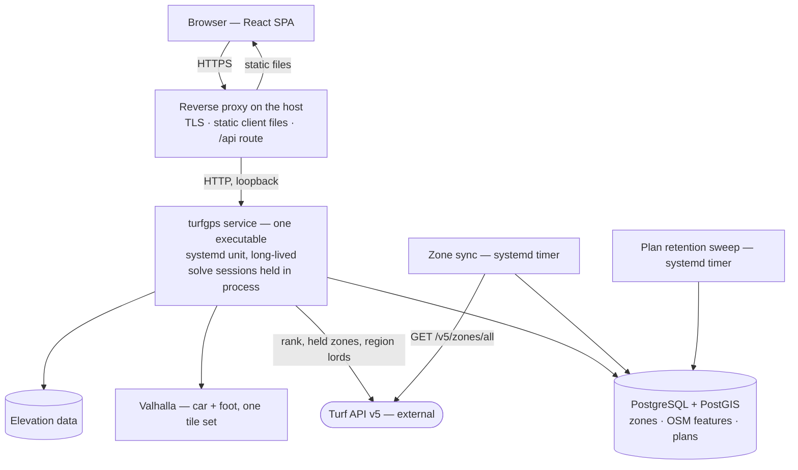

# Deployment

How TurfGPS should operate with as little complexity as possible.

This document owns *how the system is run* — the runtime target, the host it runs on, where its deployment configuration lives, and the operational duties that follow from the architecture. It does not restate an architectural decision or a model: those are stated once, in `Architecture.md` and `CalculationSpecification.md`, and copying one breaks the anti-duplication rule the documentation set depends on.

Citations in this file take the code span, per `docs/README.md § Conventions`, which puts every file outside the four narrative documents in the working-document class.

**Status: the deployment model is written; the rest of this document is not.** The model below discharges the item `Architecture.md § Still owed by this document` handed here, and nothing more. Hosting options with price and complexity comparisons, pipeline and CI detail, and the wider operational direction that `docs/README.md § The documents` asks of this file are listed under `§ Still owed by this document`.

**Nothing described here has been deployed, and none of the configuration named below exists on disk.** The repository holds no `service/`, no `web/`, and no `deploy/` as this is written. This document is a design, in the same sense `Architecture.md` is one — it is read as *what the deployment will be*, not as a record of a running system.

---

## The deployment model

### The runtime target

**The TurfGPS service is deployed onto a single Linux host, where it runs as one long-lived process supervised by systemd.**

The process is started once, at boot or on deploy, and serves every request for the lifetime of that process. It is not started per request, per connection, or per invocation.

**This is forced rather than preferred, and three separate places force it.** `Architecture.md § D1` rules out any serverless deployment target regardless of language, because the candidate set, access classifications and computed costs must survive the initial solve. `docs/Requirements/runtime-and-deployment-shape.md § NFR-004` states the same exclusion as a `MUST`, admitting no target that ends the process between requests. And `Architecture.md § Runtime topology` records that the service is stateful and long-lived, that solve sessions live inside it, and that this document must account for that.

**The model accounts for it by not scaling out at all.** `Architecture.md § Runtime topology` states the constraint precisely: this is not a scale-out-behind-a-load-balancer design *without deliberate session affinity*. The first release therefore runs **one instance of the service on one host**, which is the only arrangement under which the constraint cannot be violated, and it is also the least complex. Two instances behind a round-robin proxy would send a user's second request to a process holding none of their solve state — a failure that returns a plausible answer computed from scratch, so it surfaces as latency rather than as an error. Session affinity is the price of a second instance, and nothing in the first release requires one.

**Supervision is systemd, and the choice is nearly forced too.** The unit is what makes the process long-lived across a crash and across a reboot, and it is the artefact an inspector reads to confirm that. No orchestrator is introduced: a single stateful process with no scale-out story has nothing for one to schedule.

**The choice is reversible, and what a substitute must provide is the test.** Another supervisor, or a container runtime with a restart policy, is admissible if it gives the same three properties — surviving the request, surviving a crash, surviving a reboot — and the same single-instance story. Nothing above depends on a feature peculiar to systemd.

**What the host must carry for the service to start is deliberately not decided here.** `§ What this document does not decide` says why, and `deploy/provisioning/` below is the seam it will be written into.

### Where the deployment configuration lives

**`deploy/`, at the repository root, as a peer of `service/`, `web/`, `docs/` and `.claude/`.**

This follows the reasoning of `Architecture.md § D8` rather than inventing a second layout convention: that decision put each deployable in its own directory and declined a module at the root, on the argument that the repository's structure is what a reader infers first. The deployment configuration is not part of the service's Go module and not part of the client's build; it is a third thing, and it takes a peer directory for the same reason the other two do.

**The directory does not exist yet, and this document does not create it.** It is created by the first deployment work — #25, per that item's own note that it produces the configuration against this model once the model names the target. What that work owes is:

| Artefact | What it establishes |
|---|---|
| `deploy/turfgps.service` | The service's systemd unit — a long-lived process, restarted on failure, never per request. **This is the file `NFR-004`'s second criterion is satisfied against.** |
| `deploy/proxy/` | The reverse proxy configuration — TLS termination, the static client, and the route to the service |
| `deploy/provisioning/` | What must be true of the host before the first apply — the seam `§ What this document does not decide` leaves open |
| `deploy/README.md` | Apply order |

The two scheduled duties under `§ Operational duties` — the zone sync and the plan retention sweep — need units of their own **only if they are packaged separately from the service**, which `§ Open questions owned by this document` records as undecided. Neither bears on the criterion above.

**The unit file is the artefact and the target is what it names.** `NFR-004`'s criterion asks that the deployment configuration name a target keeping the process running between requests; a systemd service unit answers that on its face, in a form a reviewer can inspect without running anything. That is the whole reason the criterion was written against an artefact rather than against a claim.

### What is deployed

Four units, deployed independently, on one host:

| Unit | Built from | Deployed as |
|---|---|---|
| The service | `service/` | One executable plus one systemd unit |
| The client | `web/` | A directory of static files, served by the reverse proxy |
| The data plane | — | PostgreSQL with PostGIS, and Valhalla with its tiles, per `Architecture.md § D4` and `Architecture.md § D3` |
| The elevation surface | — | Elevation data, held wherever `Architecture.md § D6` settles it — that decision is open, and this document does not anticipate it |

**The client is deployed independently of the service, and that independence is a requirement rather than a convenience.** `NFR-005` obliges the client to be built to files a static file host can serve with no application code executing on the server, and its `Rationale` names this document as what would otherwise have to reconstruct that separation. The reverse proxy serves the built files directly and executes no application code to do so. Publishing a new client is replacing a directory; it needs no service restart, and a service deploy needs no client rebuild.

**The reverse proxy is the only component facing the network.** It terminates TLS, serves the client's static files, and forwards the service's HTTP API over the loopback interface. The service therefore does not need to be reachable from outside the host at all.

---

## Deployment architecture

Everything above the external Turf API sits on **one host**. That is the deployment model's whole shape, and the sections below are what it costs to operate.

---

## The host

### Operating system

**Linux on x86-64, on a distribution carrying systemd and current PostGIS and Valhalla packages.** A recent Debian or Ubuntu LTS release satisfies both and is the proposed default, per the convention in `docs/README.md § Conventions` that a numeric or concrete default is a position to argue against rather than a measured result.

**The operating system is chosen for what the *data plane* needs** — PostGIS versions, Valhalla builds, and the tooling that produces the tiles — because those are what actually constrain the choice. `Architecture.md § What is unproven` records that the PostGIS version is not chosen anywhere and that one of its queries is silently wrong below the version its own item 3 names; **choosing the host distribution is one of the two places that version actually gets decided**, and this document should not be read as having decided it.

### Sizing

**No sizing figure is stated here, because none has been measured and an invented one would be worse than the gap.**

What is known is bounded and small on one surface and unknown on the others. `Architecture.md § Volume` measures the zone table, states its figures there, and establishes that it needs no partitioning for years; it also names stored plans as the surface where volume could actually hurt, over a range it says is wide because the per-candidate size is invented rather than measured. **Nothing anywhere measures what the extract of `Architecture.md § D5` costs as Valhalla tiles or as DEM rasters**, and those are likely to be the largest things on the disk. Sizing the host is owed work, listed below.

---

## Operational duties

Three things must run on a schedule, and each of them exists because a section elsewhere requires it.

**The zone sync, and its rate limit is the binding constraint.** `Architecture.md § Runtime topology` records the zone endpoint as rate-limited — that section states the interval and this one does not restate it — and requires the sync to be a scheduled worker that is never on a request path. The deployment consequence is a timer rather than anything in the service's request handling.

**A restart must not breach that limit, and this is the operational trap worth naming.** If the sync ever runs on start-up, then a host rebooting, or a service crash-looping under a systemd `Restart=` policy, issues that request far more often than the interval allows — against an external API, from a single-tenant deployment that is easy to identify. The schedule must therefore be held by the timer and by the last-successful-sync time in the database, never by process lifetime.

**The plan retention sweep.** `Architecture.md § Persistence and cross-device transfer` obliges stored plans to expire, and `Architecture.md § The plan table` states the single predicate the sweep runs and the column grant that makes the ceiling unforgettable. The schema makes the bound unbypassable; **it does not delete anything by itself**, so a scheduled task is what actually discharges the retention obligation. That task holds personal data in its blast radius — `Architecture.md § Personal data` records that a plan carries a coordinate that is frequently the user's home — so a sweep that silently stops running is a privacy failure rather than a housekeeping one, and it is the first thing observability should cover when observability is written.

**Backup and restore are owed and are not designed here.** `Architecture.md § What this section does not cover` explicitly leaves backup, restore and retention of the database itself outside the schema design, and this document does not close it by assertion.

---

## What a restart costs

**Restarting the service may discard every in-flight solve session, and whether it does is not yet decided.**

`Architecture.md § Open questions owned by this document` carries solve-session lifetime and residency as an open question — whether sessions are in-memory only, and therefore lost on restart, or persisted — and ties it to the product question about the lifetime of an unconfirmed route in `SPECIFICATION.md`. **This document does not answer it**, because the answer is architectural and product-facing rather than operational.

What this document can state is the consequence, and it is the reason the question matters to whoever deploys. If sessions are in-memory, then every deploy of the service is a user-visible event: anyone mid-plan loses their unconfirmed work and pays the expensive half of the pipeline again to get it back. That makes deploy timing an operational concern and it makes zero-downtime deployment genuinely hard, because a second instance cannot take over state the first one holds in memory. If sessions are persisted, a deploy is unremarkable. **The difference between those two futures is a deployment property, and it is decided somewhere else.**

Stored plans are unaffected either way. `Architecture.md § Runtime topology` establishes that nothing in a stored plan depends on the Turf API, and plans live in PostgreSQL rather than in the process.

---

## What this document does not decide

Naming these is the point: a reader who expects one of them here should learn it from this list rather than from its absence.

* **What the host must carry for the service to start, beyond the kernel.** `Architecture.md § D6` is an open proposal whose resolution changes that answer, and closing it from the deployment side would be the same error, in the opposite direction, that `docs/Requirements/runtime-and-deployment-shape.md § NFR-003` refuses to commit from the build side — that record is deliberately silent on the point and says why. **The model above holds either way**, which is what makes leaving it open cost nothing here: host provisioning is a named seam, `deploy/provisioning/` is where it is written, and nothing above describes the executable as anything other than the file the build produces. Whoever settles D6 writes that seam; a deployment document that pre-empted it would be settling a measurement by prose.
* **Failure handling, observability, and the security architecture.** All three are owed by `Architecture.md § Still owed by this document`, and a deployment document that invented them would be writing architecture sections in the wrong file.
* **The OSM-derived feature tables**, owed by the same section, and deliberately a safety surface with its own design and its own review.
* **Solve-session residency**, and with it the true cost of a restart, per `§ What a restart costs` above.

---

## Still owed by this document

The deployment model above is written. These are not, and each is owed by `docs/README.md § The documents`, which defines this document's scope:

- **Hosting options with price and complexity comparisons.** The model names a shape — one Linux host — and does not name a provider, a tier, or a cost. This is the section `Architecture.md § The cost consequence` will need when the self-hosting-versus-metered question is answered, and it cannot be written before the sizing below.
- **Host sizing**, which needs the two measurements nothing in the repository has taken: the on-disk size of the six-country Valhalla tile set and DEM extract, and the memory Valhalla needs to serve that tile set.
- **Pipeline and CI detail.** Two checks are already specified elsewhere and must be run by whatever pipeline is built — the set-equality test over the live catalogue in `Architecture.md § The two absences, and the test that keeps them absent`, and the three-assertion coordinate guard in `Architecture.md § Geometry, SRID, and the coordinate guard`, both against a migrated copy. `local-gates § When these activate` records that the first Go or frontend PR owes a root `Makefile` as the canonical gate runner, and `Architecture.md § D8` records that every CI job invoking the Go toolchain must set its working directory explicitly or pass vacuously. **The pipeline that runs all of this is not designed here.**
- **Backup, restore, and database retention**, left open by `Architecture.md § What this section does not cover`.
- **Secrets handling** — the database credential and any provider key. Nothing in the repository states where these come from, and the model above deliberately does not invent an answer.
- **The upgrade and rollback procedure**, which cannot be finished before the restart question above is settled.

---

## Open questions owned by this document

* **How the zone sync is packaged.** `Architecture.md § Runtime topology` shows the sync as a component distinct from the service, and `Architecture.md § D1` writes both in Go, but nothing states whether it ships as a second executable driven by a timer or as a scheduled goroutine inside the service process. Both satisfy the topology; they differ in what `deploy/` contains and in whether the sync survives the service being stopped. The rate-limit trap above applies to either.
* **Whether the first release is single-host permanently or provisionally.** The model above is single-host because the service holds session state and nothing requires a second instance. What would change that is load nobody has measured, and the answer is coupled to the residency question `Architecture.md § Open questions owned by this document` owns.
* **The target host distribution and its PostGIS version.** Proposed above as a recent Debian or Ubuntu LTS; the PostGIS version this implies is one that `Architecture.md § What is unproven` says Q2's correctness depends on, and it should be confirmed against that requirement rather than inherited from a package default.
