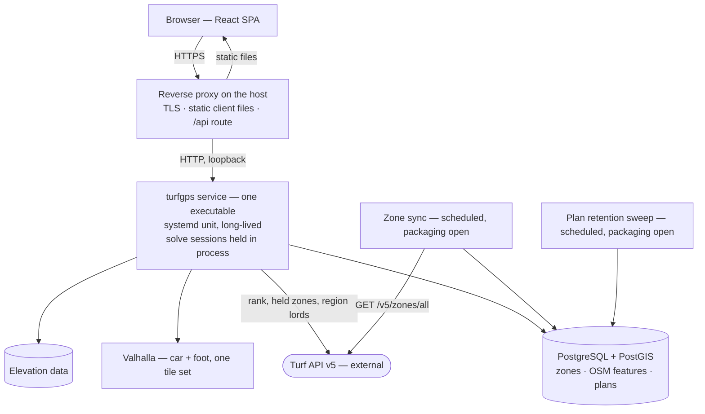

# Deployment

How TurfGPS should operate with as little complexity as possible.

This document owns *how the system is run* — the runtime target, the host it runs on, where its deployment configuration lives, and the operational duties that follow from the architecture. It does not restate an architectural decision or a model: those are stated once, in `Architecture.md` and `CalculationSpecification.md`, and copying one breaks the anti-duplication rule the documentation set depends on.

Citations in this file take the code span, per `docs/README.md § Conventions`, which decides the class by a property rather than by exclusion: a working document is **consulted rather than read through**, so a citation in it has to be findable by `grep`. This document is used that way, and that section's enumeration names it.

**The deployment model is written; the rest of this document is not.** The model was authored on 14 August 2026, and it discharges the item `Architecture.md § Still owed by this document` handed here, and nothing more. Hosting options with price and complexity comparisons, pipeline and CI detail, and the wider operational direction that `docs/README.md § The documents` asks of this file are listed under `§ Still owed by this document`.

**Nothing described here has been deployed, and none of the configuration named below exists on disk.** The repository holds `service/`; it holds no `web/` and no `deploy/` as this is written, 22 August 2026. This document is a design, in the same sense `Architecture.md` is one — it is read as *what the deployment will be*, not as a record of a running system. **That date is this document's only as-of date**: everything it states about what is true now rather than what it specifies is measured then, and no other paragraph carries one.

---

## The deployment model

### The runtime target

**The TurfGPS service is deployed onto a single Linux host, where it runs as one long-lived process supervised by systemd.**

The process is started once, at boot or on deploy, and serves every request for the lifetime of that process. It is not started per request, per connection, or per invocation.

**This is forced rather than preferred, and three separate places force it.** `Architecture.md § D1` rules out any serverless deployment target regardless of language, because the candidate set, access classifications and computed costs must survive the initial solve. `docs/Requirements/runtime-and-deployment-shape.md § NFR-004` states the same exclusion as a `MUST`, admitting no target that ends the process between requests. And `Architecture.md § Runtime topology` records that the service is stateful and long-lived, that solve sessions live inside it, and that this document must account for that.

**The model accounts for it by not scaling out at all.** `Architecture.md § Runtime topology` states the constraint precisely: this is not a scale-out-behind-a-load-balancer design *without deliberate session affinity*. The first release therefore runs **one instance of the service on one host**, which is the only arrangement under which the constraint cannot be violated, and it is also the least complex. Two instances behind a round-robin proxy would send a user's second request to a process holding none of their solve state — a failure that returns a plausible answer computed from scratch, so it surfaces as latency rather than as an error. Session affinity is the price of a second instance, and nothing in the first release requires one.

**Supervision is systemd, and the choice is nearly forced too.** The unit is what makes the process long-lived across a crash and across a reboot, and it is the artefact an inspector reads to confirm that. No orchestrator is introduced: a single stateful process with no scale-out story has nothing for one to schedule.

**The choice is reversible, and what a substitute must provide is the test.** Another supervisor, or a container runtime with a restart policy, is admissible if it gives the same three properties — surviving the request, surviving a crash, surviving a reboot — and the same single-instance story. Nothing above depends on a feature peculiar to systemd.

**The three properties are not the whole test, and a container runtime is where the remainder bites.** The controls this model carries are written against a host that `deploy/provisioning/` constrains and a proxy that fronts it: the exposure invariant of `§ What is deployed` and the plan-code log constraint of `§ Where the deployment configuration lives`, both below. **A container runtime inherits neither for free.** Publishing a port hands the service the network directly, and `§ What is deployed` records why that is worse here than it looks — the runtime's port mapping would be the only thing standing between the service and the internet. Container logging likewise collects the process's standard streams by default, which is where the service's log goes, so the service half of that log constraint lands on the runtime's collector rather than on anything a proxy directive can reach. **A substitute is admissible only if it enforces both controls itself**, and nothing in this model enforces them on its behalf.

**What the host must carry for the service to start is deliberately not decided here.** `§ What this document does not decide` says why, and `deploy/provisioning/` below is the seam it will be written into.

### Where the deployment configuration lives

**`deploy/`, at the repository root, as a peer of `service/`, `web/`, `docs/` and `.claude/`.**

This follows the reasoning of `Architecture.md § D8` rather than inventing a second layout convention: that decision put each deployable in its own directory and declined a module at the root, on the argument that the repository's structure is what a reader infers first. The configuration that *arranges the host* is not part of the service's Go module and not part of the client's build; it is a third thing, and it takes a peer directory for the same reason the other two do.

**Two deployment files already sit inside `service/`, and they locate that boundary rather than breach it.** `service/Dockerfile` and `service/.dockerignore` exist on disk and are deployment configuration on any ordinary reading. They stay where they are because they describe **how the service is built into an image** — its build context is `service/` precisely so the image needs nothing from outside the module — and a deployable's build inputs are its own business. What `deploy/` owns is the other half: **what runs on the host and how it is arranged there.** The line is between building a deployable and placing one, not between directories, and the two files above fall on the build side of it. **`deploy/` is still where the host arrangement lives.**

**The directory does not exist yet, this document does not create it, and no item on the board authors it.** `docs/Requirements/DECISIONS.md § RD-009` ruled that #25 inspects the deployment configuration and authors none of it, and recorded the authoring node as a debt with its home named rather than filing one — read there what that debt waits on. What this model specifies for the directory is:

| Artefact | What it establishes |
|---|---|
| `deploy/turfgps.service` | The service's systemd unit — a long-lived process, restarted on failure, never per request. **This is the file `docs/Requirements/runtime-and-deployment-shape.md § NFR-004`'s second criterion is satisfied against.** |
| `deploy/proxy/` | The reverse proxy configuration — TLS termination, the static client, the route to the service, and the proxy's share of the two plan-code constraints below: the caller-address constraint whole, and the proxy half of the log constraint |
| `deploy/provisioning/` | What must be true of the host before the first apply — the seam `§ What this document does not decide` leaves open, and the exposure invariant of `§ What is deployed` |
| `deploy/README.md` | Apply order |

The zone sync and the plan retention sweep under `§ Operational duties` need units of their own **only if they are packaged separately from the service**, which `§ Open questions owned by this document` records as undecided for both. Neither bears on the criterion above.

**The unit file is the artefact and the target is what it names.** `docs/Requirements/runtime-and-deployment-shape.md § NFR-004`'s criterion asks that the deployment configuration name a target keeping the process running between requests; a systemd service unit answers that on its face, in a form a reviewer can inspect without running anything. That is the whole reason the criterion was written against an artefact rather than against a claim.

**No secret material of any kind lives under `deploy/`, or anywhere else in this repository.** A database URL, a provider key, or the proxy's TLS private key written into an `Environment=` line is a credential committed to version control, and the unit above is precisely the file that invites one. **The unit therefore references an out-of-repo source** — systemd offers `EnvironmentFile=` and `LoadCredential=` for exactly this — and `deploy/` carries the reference and never the value. Which of those mechanisms is used, and where the material comes from, is still owed and is listed under `§ Still owed by this document`; the boundary above is not, and it binds whatever answer that work gives.

**Two constraints exist because of the plan code, and `deploy/proxy/` carries the caller-address one whole and only the proxy's half of the other.** `Architecture.md § Personal data` records that the code is a plan's only credential and that the object behind it holds a coordinate that is frequently the user's home.

**No host log may record a plan code — not the proxy's, not the service's.** The code travels in the request line, and stock nginx, Caddy and Apache all log the full request target by default. An access log is not something a deployment adds; it is something a deployment must deliberately constrain, so deferring observability to `Architecture.md § Still owed by this document` does not defer this. The proxy configuration must satisfy the proxy's half on its face.

**The other half has a different home, and `deploy/` is not it.** The service writes its own log through `log/slog` from its own source and installs no handler, so it goes to standard error — which the systemd unit above collects into the journal, a host log in exactly the sense the constraint above means. No file under `deploy/` can constrain what it records: a proxy directive reaches the proxy's access log and nothing else. The service's half of this constraint therefore binds whoever writes those log statements in `service/`, and it is stated here because this is where the constraint is derived rather than where it is discharged. One control, two enforcement points; a deployment that satisfies only the proxy's has satisfied half of it.

**The proxy must preserve the caller's address.** It forwards over loopback, so unless it passes the caller through, every request reaches the service from the local interface and no per-caller distinction survives the hop. `Architecture.md § Personal data` names rate limiting on the plan lookup as part of the answer to a short code being an enumeration target, and no throttle can be written against a single indistinguishable caller. That makes the proxy a **candidate enforcement point** for that throttle — it is the one component that still knows who is asking — though where it is enforced is not settled here.

### What is deployed

Five units, deployed independently, on one host:

| Unit | Built from | Deployed as |
|---|---|---|
| The service | `service/` | One executable plus one systemd unit |
| The client | `web/` | A directory of static files, served by the reverse proxy |
| The reverse proxy | — | The host's proxy package, configured from `deploy/proxy/` |
| The data plane | — | PostgreSQL with PostGIS, and Valhalla with its tiles, per `Architecture.md § D4` and `Architecture.md § D3` |
| The elevation surface | — | Elevation data, held wherever `Architecture.md § D6` settles it — that decision is open, and this document does not anticipate it |

**The proxy is counted even though nothing in this repository builds it**, because three of the five rows share that property and deploying it is a deliberate act with configuration of its own. What decides a row is whether the unit has to be put on the host and kept correct there, not whether a build produces it.

**The tile set and the elevation data are built once for the first release and are not refreshed on a schedule.** The tile set derives from the extract of `Architecture.md § D5`. **The elevation data does not derive from it** — the extract decides only which footprint of the elevation surface is held, and where that surface comes from is what `Architecture.md § D6` is still open on. Rebuilding either is a deliberate act — new extract, rebuild, swap — rather than a timer. OSM data ages, so a tile refresh eventually becomes a recurring duty with a cadence and a swap procedure; **that argument reaches the tile set alone**, because the elevation surface is not OSM-derived and does not age with OSM — what would trigger a re-sample there is a new release of that surface or a change of footprint. **This document names both duties and invents neither cadence**, for the same reason `§ Sizing` states no figure.

**The client is deployed independently of the service, and that independence is a requirement rather than a convenience.** `docs/Requirements/runtime-and-deployment-shape.md § NFR-005` obliges the client to be built to files a static file host can serve with no application code executing on the server, and its `Rationale` names this document as what would otherwise have to reconstruct that separation. The reverse proxy serves the built files directly and executes no application code to do so. Publishing a new client is replacing a directory; it needs no service restart, and a service deploy needs no client rebuild.

**The reverse proxy is the only component that may face the network, and that is an obligation rather than an observation.** It terminates TLS, serves the client's static files, and forwards the service's HTTP API over the loopback interface. **The service, PostgreSQL and Valhalla must therefore bind loopback only, so that nothing but the proxy is reachable from outside the host — and the service as it is built does not.** This is written as an obligation the deployment owes rather than as a property it has, because the gap below is real today and a reader who took it for a description would provision against a host that is not the one they have.

**`deploy/provisioning/` owns enforcing that invariant**, because no component enforces it on the others' behalf and two of the three violate it if left alone. Valhalla's HTTP daemon does not bind loopback on its own, so an unconstrained host publishes a routing engine — and through it the tile set — to the internet.

**The service is the second violator, and it is the one no host configuration can correct.** `service/cmd/turfgps/main.go` listens on `:8080` — every interface — from a constant compiled into the binary, and the module offers no environment variable, no flag and no argument that changes it. `deploy/provisioning/` can therefore firewall around the service but cannot make it bind loopback, which is a materially weaker guarantee than the one the other two admit: a packet filter is a second thing to keep correct, and it fails open when it is merely incomplete as readily as when it is misapplied. A wildcard bind answers on **both address families and on every provider-internal or VPC network the host sits on**, so the filter obligation covers all of them — an operator who writes a correct IPv4 rule and never its IPv6 counterpart has misapplied nothing, and the service still answers. **Issue #125 carries the code change**, against `Architecture.md § Runtime topology`; this document states the obligation and does not implement it. Until that lands, the invariant above is owed rather than held, and `deploy/provisioning/` is enforcing it against a component actively working the other way.

The invariant is therefore checked against the host's listening sockets, which is a fact about the host, rather than inferred from the proxy's configuration, which is a fact about only one component.

---

## Deployment architecture

Everything above the external Turf API sits on **one host**. That is the deployment model's whole shape, and the sections below are what it costs to operate.

---

## The host

### Operating system

**Linux on x86-64, on a distribution carrying systemd and current PostGIS and Valhalla packages.** A recent Debian or Ubuntu LTS release satisfies both and is the proposed default, per the convention in `docs/README.md § Conventions` that a numeric or concrete default is a position to argue against rather than a measured result.

**The operating system is chosen for what the *data plane* needs** — PostGIS versions, Valhalla builds, and the tooling that produces the tiles — because those are what actually constrain the choice. `Architecture.md § What is unproven` records that the PostGIS version is not chosen anywhere and that one of its queries is silently wrong below the version its own item 3 names; **choosing the host distribution is one of the two places that version actually gets decided**, and this document should not be read as having decided it.

### Sizing

**No sizing figure is stated here, because none has been measured and an invented one would be worse than the gap.**

What is known is bounded and small on one surface and unknown on the others. `Architecture.md § Volume` measures the zone table, states its figures there, and establishes that it needs no partitioning for years; it also names stored plans as the surface where volume could actually hurt, over a range it says is wide because the per-candidate size is invented rather than measured. **Nothing anywhere measures what the extract of `Architecture.md § D5` costs as Valhalla tiles, nor what elevation data its footprint requires**, and those are likely to be the largest things on the disk. Sizing the host is owed work, listed below.

---

## Operational duties

Four things must run on a schedule. Three exist because a section elsewhere requires them; the fourth exists because this document put TLS on the proxy.

**The zone sync, and its rate limit is the binding constraint.** `Architecture.md § Runtime topology` records the zone endpoint as rate-limited — that section states the interval and this one does not restate it — and requires the sync to be a scheduled worker that is never on a request path. The deployment consequence is a timer rather than anything in the service's request handling.

**A restart must not breach that limit, and this is the operational trap worth naming.** If the sync ever runs on start-up, then a host rebooting, or a service crash-looping under a systemd `Restart=` policy, issues that request far more often than the interval allows — against an external API, from a single-tenant deployment that is easy to identify. The schedule must therefore be held by the timer and by the last-successful-sync time in the database, never by process lifetime.

**The plan retention sweep.** `Architecture.md § Persistence and cross-device transfer` obliges stored plans to expire, and `Architecture.md § The plan table` states the single predicate the sweep runs and the `CHECK` constraint that makes the ceiling unforgettable. The schema makes the bound unbypassable; **it does not delete anything by itself**, so a scheduled task is what actually discharges the retention obligation. That task holds personal data in its blast radius — `Architecture.md § Personal data` records that a plan carries a coordinate that is frequently the user's home — so a sweep that silently stops running is a privacy failure rather than a housekeeping one, and it is the first thing observability should cover when observability is written.

**Daily is the proposed sweep cadence**, per the convention in `docs/README.md § Conventions` that a concrete default is a position to argue against rather than a measured result. The period is what decides how long an expired plan outlives its own expiry, and it is judged against the two clocks `Architecture.md § The plan table` states — which this document cites rather than repeats, and which a reader checking this judgement reads there. A day of overhang is immaterial to either guarantee and cheap to run. Hourly buys nothing anyone could observe; weekly is long enough to be worth arguing about, which is the argument this default exists to invite.

**TLS certificate renewal, and it is the one duty this document creates rather than inherits.** `§ What is deployed` obliges the reverse proxy to be the sole ingress and gives it TLS termination, so an expired certificate is a total outage of the only component that **may** face the network — arriving roughly ninety days after the first deploy on the automated issuers a single host would use, which is late enough that nobody is expecting it. Renewal must be automatic and monitored, and **the renewal hook must reload the proxy**: a renewed certificate sitting on disk that the running proxy has not re-read fails in exactly the way an expired one does. `deploy/proxy/` owns it.

**Backup and restore are owed and are not designed here.** `Architecture.md § What this section does not cover` explicitly leaves backup, restore and retention of the database itself outside the schema design, and this document does not close it by assertion. What it does state, because the sweep above is void without it, is the obligation that design inherits — see `§ Still owed by this document`.

---

## What a restart costs

**Restarting the service may discard every in-flight solve session, and whether it does is not yet decided.**

`Architecture.md § Open questions owned by this document` carries solve-session lifetime and residency as an open question — whether sessions are in-memory only, and therefore lost on restart, or persisted — and ties it to the product question about the lifetime of an unconfirmed route in `SPECIFICATION.md`. **This document does not answer it**, because the answer is architectural and product-facing rather than operational.

What this document can state is the consequence, and it is the reason the question matters to whoever deploys. If sessions are in-memory, then every deploy of the service is a user-visible event: anyone mid-plan loses their unconfirmed work and pays the expensive half of the pipeline again to get it back. That makes deploy timing an operational concern and it makes zero-downtime deployment genuinely hard, because a second instance cannot take over state the first one holds in memory. If sessions are persisted, a deploy is unremarkable. **The difference between those two futures is a deployment property, and it is decided somewhere else.**

Stored plans are unaffected either way. `Architecture.md § Runtime topology` establishes that nothing in a stored plan depends on the Turf API, and plans live in PostgreSQL rather than in the process.

---

## What this document does not decide

Naming these is the point: a reader who expects one of them here should learn it from this list rather than from its absence.

* **What the host must carry for the service to start, beyond the kernel.** `Architecture.md § D6` is an open proposal whose resolution changes that answer, and closing it from the deployment side would be the same error, in the opposite direction, that `docs/Requirements/runtime-and-deployment-shape.md § NFR-003` refuses to commit from the build side — that record is deliberately silent on the point and says why. **The model above holds either way**, which is what makes leaving it open cost nothing here: host provisioning is a named seam, `deploy/provisioning/` is where it is written, and nothing above describes the executable as anything other than the file the build produces. Whoever settles D6 writes that seam; a deployment document that pre-empted it would be settling a measurement by prose.
* **Failure handling, observability, and the security architecture.** All three are owed by `Architecture.md § Still owed by this document`, and a deployment document that invented them would be writing architecture sections in the wrong file.
* **The OSM-derived feature tables**, owed by the same section, and deliberately a safety surface with its own design and its own review.
* **Solve-session residency**, and with it the true cost of a restart, per `§ What a restart costs` above.

---

## Still owed by this document

The deployment model above is written. These are not, and each is owed by `docs/README.md § The documents`, which defines this document's scope:

- **Hosting options with price and complexity comparisons.** The model names a shape — one Linux host — and does not name a provider, a tier, or a cost. This is the section `Architecture.md § The cost consequence` will need when the self-hosting-versus-metered question is answered, and it cannot be written before the sizing below.
- **Host sizing**, which needs the two measurements nothing in the repository has taken: the on-disk size of the Valhalla tile set built over the extract of `Architecture.md § D5` together with the elevation data held for that footprint, and the memory Valhalla needs to serve that tile set.
- **Pipeline and CI detail.** Two checks are already specified elsewhere and must be run by whatever pipeline is built — the set-equality test over the live catalogue in `Architecture.md § The two absences, and the test that keeps them absent`, and the three-assertion coordinate guard in `Architecture.md § Geometry, SRID, and the coordinate guard`, both against a migrated copy. `local-gates § When these activate` records the root `Makefile` as the canonical gate runner, and that `Makefile` now exists, so whatever pipeline is built invokes its targets rather than composing command lines of its own. `Architecture.md § D8` binds every CI job reaching the Go toolchain to set its working directory explicitly; **that section is where the obligation is argued, and `local-gates § Backend (Go)` is where what each gate actually reports from the wrong directory was measured.** This document restates neither, and the two are not interchangeable: the obligation would bind even if every gate were loud about a missing module. **The pipeline that runs all of this is not designed here.**
- **Backup, restore, and database retention**, left open by `Architecture.md § What this section does not cover`. **That design carries the plan-retention obligation with it, and this is the constraint it must be written against**: a backup is a second copy of the plan table, so a backup set held longer than the plans themselves voids the retention guarantees `Architecture.md § The plan table` states. Deleting a row while a restorable copy of it survives is not deletion. Either backup retention is bounded by those same two clocks, or the restore path re-applies the sweep before the restored data is reachable.
- **Secrets handling** — the database credential, any provider key, and the reverse proxy's TLS private key. Nothing in the repository states where these come from, and the model above deliberately does not invent an answer. What it does settle is the boundary: `§ Where the deployment configuration lives` puts none of them in this repository, and that binds whatever mechanism this work chooses.
- **The upgrade and rollback procedure**, which cannot be finished before the restart question above is settled.

---

## Open questions owned by this document

* **How the zone sync is packaged.** `Architecture.md § Runtime topology` shows the sync as a component distinct from the service, and `Architecture.md § D1` writes both in Go, but nothing states whether it ships as a second executable driven by a timer or as a scheduled goroutine inside the service process. Both satisfy the topology; they differ in what `deploy/` contains and in whether the sync survives the service being stopped. The rate-limit trap above applies to either.
* **How the plan retention sweep is packaged**, which is the same question with a consequence the zone sync's does not carry. The two options are the same — an independent timer, or a scheduled goroutine inside the service — but `§ Operational duties` records that a sweep which silently stops running is a privacy failure rather than a housekeeping one. **As a goroutine the sweep does not survive the service dying**, so a service crash-looping under its `Restart=` policy stops enforcing retention while every signal a reader would check reports a process being restarted as designed. As an independent timer it keeps running against the database, and fails where it can be seen. That asymmetry is the argument that should decide it. **It is registered rather than decided here because the asymmetry's whole force is contingent on a design this document does not own.** What makes the goroutine option bad is that it fails *invisibly*, and `§ Operational duties` above already records this sweep as the first thing observability should cover. Observability is owed by `Architecture.md § Still owed by this document`; an answer there that alarms on a sweep which has not run removes the invisibility, and with it most of the gap between the two options. So the asymmetry decides this question only once that design is known, and until then it is what a decider must weigh rather than a decision available here. What is settled, and does not wait on observability: **the two need not be packaged alike, and symmetry with the sync must not decide this one.**
* **Whether the first release is single-host permanently or provisionally.** The model above is single-host because the service holds session state and nothing requires a second instance. What would change that is load nobody has measured, and the answer is coupled to the residency question `Architecture.md § Open questions owned by this document` owns.
* **The target host distribution and its PostGIS version.** Proposed above as a recent Debian or Ubuntu LTS; the PostGIS version this implies is one that `Architecture.md § What is unproven` says Q2's correctness depends on, and it should be confirmed against that requirement rather than inherited from a package default.
