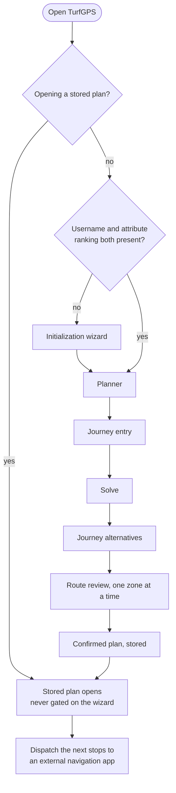
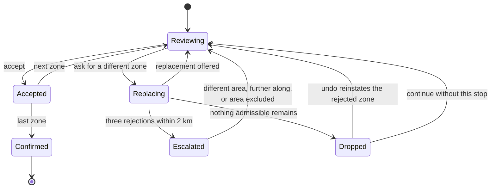

# Design

What using TurfGPS is like, from the first visit to the last stop of a journey.

This document owns *the interaction*: what the user is shown, what they are asked, what each action does, and what happens when something has no good answer. It does not restate why a behaviour exists — `SPECIFICATION.md` owns that — and it does not carry a formula or a constant, even one that surfaces in the interface. Those live in `CalculationSpecification.md`, because they are numbers the optimizer tests rather than layout.

Where a section of another document is referenced, the document is named. An unqualified italic name refers to a section of this one.

**Status: the interaction flow was moved out of `Concept.md` on 31 July 2026 and is complete. The visual layer is not written.** Graphic profile, typography, colour, page layouts, and the qualities the design should express are listed under *Still owed by this document*.

---

## The shape of a session

Two properties of this shape are requirements rather than conveniences. The wizard sits **in front of the planner and nowhere else**, so an outage can never withhold work the user has already done. And the product stays open on the phone at the right-hand end of the diagram: it holds the plan and dispatches it in portions, per *Dispatching stop by stop*.

---

## First-run initialization

The planner is not reachable until the system knows two things about the user. On a first visit, or whenever either is missing, an **initialization wizard** runs before anything else.

**Step one: Turf username.** This is **mandatory**, not optional. It is what makes takeover time personal — see *Takeover time* in `CalculationSpecification.md` — and it also determines the Region Lord bonus and drives the ownership indicator during review. A route computed without it would be a worse route, silently.

The username is validated against `POST /v5/users` so a typo is caught immediately rather than degrading every later estimate. Validation is debounced and runs when the field is left rather than on every keystroke, to stay within the one-request-per-second limit described under *Data sources and constraints* in `Architecture.md`.

**Two failure modes must be distinguished, because they are not the same event.**

A name the API answers for and does not recognise is a **rejection**: the user has mistyped, and the message should say so plainly.

A validation call that cannot complete — a timeout, a server error, a rate-limit response — is **not** a rejection. The system does not know whether the name is good. After a retry, the user may proceed provisionally: the name is stored unvalidated, the default takeover time under *Default when rank is unknown* in `CalculationSpecification.md` applies, and validation is retried on the first search. Treating an outage as a bad username would lock out a correct user because a third party is down.

**Step two: attribute ranking.** The user orders all eleven attributes from 1 to 11 by dragging them, per *Attribute preference* in `SPECIFICATION.md`.

The list is **pre-ordered by rarity** — `Summit` first through `Holy` last, following the *Attribute rarity* table in `SPECIFICATION.md` — so an untouched list is already a valid ranking. Nobody is required to make eleven decisions before their first search; the ordering is there to be adjusted, not constructed from nothing. This also answers the cold-start problem noted under *Why attributes matter: unique zones and medals* in `SPECIFICATION.md`, without waiting for the medal-derived feature.

**Only when both steps are complete does the planner open.**

Both values are stored locally, in a cookie or local storage, and persist across visits. There are no accounts — see *No accounts* in `SPECIFICATION.md` — so this is per-device, and a user on a new device repeats the wizard. Both must remain editable afterwards; preferences change, and a ranking set once should not be permanent.

### Never gate stored plans on the wizard

A returning user with stored values **must be able to open existing plans while the Turf API is unavailable.**

This follows directly from the persistence requirement under *Route persistence* in `SPECIFICATION.md`. The failure that requirement exists to prevent is a user arriving on the morning of departure and finding their planning gone — and an outage-triggered wizard lockout produces exactly that outcome, on exactly that morning, for a plan that is entirely intact.

Nothing about a stored route depends on the Turf API. The roads and zones are geography and remain valid, as established under *Stored routes go stale* in `SPECIFICATION.md`. Only the volatile overlay — ownership indicators, refreshed points — is unavailable, and its absence is a degraded display, not a reason to withhold the plan.

The gate exists to stop someone *planning* without the data that makes a plan good. It must not stop someone *reading* a plan they already made.

---

## Entering a journey

Once initialization is complete, the user describes the journey.

### Locations

Origin, destination, and any intermediate waypoints may each be given in three ways:

* **By search** — a street name and number, a place name, or an address, in the manner of an ordinary map search.
* **By dropping a pin** on the map, for places without a useful address or where the user knows the spot but not its name.
* **By Turf zone**, naming a zone as the start or finish. Turf players think in zones, they know zone names, and a journey that begins or ends at one is a natural way to express it. Zone names are already in the local synced copy, so this needs no external lookup.

Geocoding for the first two must cover every country the product operates in. Since the routing stack already requires map data at that scope, geocoding should run against the same self-hosted data rather than adding a metered external dependency, per *The call budget* in `Architecture.md`.

Offering the device's **current position** as an origin is a natural addition on a mobile-first product, and is proposed although not yet decided.

### Required and optional inputs

Required before a search can run:

* Origin and destination.
* The additional-time budget, per *User time constraints* in `SPECIFICATION.md`.

Optional:

* Intermediate waypoints.
* Departure time. Where it is omitted, the assumption used must be stated in the recommendation, per *Time of day and traffic* in `SPECIFICATION.md`.
* Objective selection, which defaults to Attributes and Zones together.

The Turf username is not listed here because it is collected during initialization and always present by the time the planner opens.

---

## Reviewing the recommended route

A recommended route is a proposal, not a plan, and no route is final until the user has confirmed the zones in it. The reason that step exists at all — the one piece of data the API withholds — is set out under *Route review and zone confirmation* in `SPECIFICATION.md`. What follows is how the review behaves.

### Reviewing zones one at a time

Once the user selects a route alternative, its zones are presented **sequentially and interactively on the map**, one at a time rather than as a list to be accepted wholesale.

For each zone the user should see enough to judge it:

* The zone name.
* Its points — both `takeoverPoints` and `pointsPerHour`.
* Its location, shown on the map.
* Its attribute, where it has one.
* Whether it is directly road-accessible or requires parking and walking.
* The walking distance, where applicable.
* The additional time this zone contributes.

In the first release the user may need to check their own Turf history outside the tool to establish whether they have taken the zone before. The interface should make that lookup easy by presenting the name and location clearly, rather than obscuring the fact that the information is not available internally.

Each zone offers two actions: **accept it**, or **ask for a different zone**.

This is a map-and-single-card interaction and must be built mobile-first, per *Platform and mobile-first design* in `SPECIFICATION.md`. A wide table is a specification violation, not a styling choice.

### Zones the user already owns

Current ownership *is* available, and where a zone's `currentOwner` matches the user, the review must say so plainly: **"You already own this zone."** The fetch behind it costs one call for the whole route, per *The user's held zones are already known* in `Architecture.md`.

Retaking a zone you hold is a revisit. It has value, but less than taking a new one, and the user needs to know which they are being offered so they can judge it themselves.

This carries a specific risk that must be designed around rather than ignored. **Ownership data goes stale.** A zone shown as owned may have been taken by someone else minutes later, and a plan stored for weeks will be badly out of date — all ownership resets at a round boundary, as described under *Rounds* in `SPECIFICATION.md`. Displaying a stale "you own this" is worse than displaying nothing, because it causes the user to skip a zone they could have taken.

The indicator must therefore be shown with its age, refreshed when a stored plan is reopened, and treated as a hint rather than a fact. Where ownership data is older than a round boundary it must not be shown at all.

#### Scope: a visual indicator only

In the first release ownership is **purely informational**. It marks a zone during review and nothing more. It does not enter the scoring function, does not influence which zones are recommended, and does not change any ranking. The optimizer is unaware of it.

This is what *Deferred by choice* in `SPECIFICATION.md` means when it excludes ownership: ownership as a **value input** is deferred. The indicator itself ships.

### Replacement and escalating scope

Rejecting a zone adds a constraint to the problem; it does not restart it. The optimizer re-solves with that zone excluded and the rest of the route preserved as far as possible.

Rejections in the same area tend to come in runs, because the usual reason for them — the user has already taken the zones around there — applies to the whole neighbourhood rather than to one zone. Replacing zones one at a time in a dense urban cluster could take many iterations to escape it.

The interface should therefore escalate. Once several nearby zones have been rejected, offer coarser controls alongside the per-zone one:

* Suggest a zone in a different area.
* Suggest a zone further along the journey.
* Exclude this area from the route entirely.

The two thresholds governing this — when the coarser controls appear, and how much further along "further along" is — are stated under *Review-interaction thresholds* in `CalculationSpecification.md`.

Uncertain zones are the reserve the replacement draws on once the confident candidates in an area are exhausted, and accepting one visibly widens the route's time estimate. That behaviour is defined under *Handling the uncertain bucket* in `SPECIFICATION.md`.

### When replacement runs out

Because exclusions accumulate through a session, it is entirely possible to reach a state where no admissible replacement exists — no confident candidate and no reserve candidate that satisfies the accumulated exclusions and stays inside the time ceiling. The review must define what happens then rather than looping.

**The stop is dropped and the route continues without it.** The plan simply gets shorter, which is always valid: it stays inside the budget and inside the ceiling. The user is told plainly that nothing else fits at that point in the journey, and offered a single **undo** that reinstates the zone they rejected, in case a known zone is preferable to none.

### When nothing fits at all

A stronger failure is possible: the user's constraints and the actual distribution of zones may admit no useful route whatsoever. A short time budget on a rural motorway corridor with strict terrain tolerances can genuinely have no answer.

The system must say so honestly, in plain language, without pretending it found something:

> We tried to fit your criteria to the zones that actually exist along this route, and could not find a good match this time.

The message should name the constraints that bound hardest — the time budget, the walking limit, the attribute ranking — so the user can see which one to relax, and offer to adjust them directly. It must not silently return an empty route, and it must not quietly relax a constraint on the user's behalf to manufacture a result.

This is a legitimate outcome rather than an error. The reality of zone placement does not accommodate every combination of preferences, and saying so is more useful than a route the user will reject.

---

## Driving the plan

### Dispatching stop by stop

Handing off a complete multi-stop route is not generally possible; the published waypoint limits are set out under *The waypoint limit problem* in `SPECIFICATION.md`. The workable model follows from those limits: **this product holds the plan, and dispatches a selection of it at a time.**

The confirmed route lives here. When the user is ready to drive, they send the next portion — as many consecutive stops as the target application accepts, a three-waypoint allowance on a mobile browser — to Google Maps. On arrival at the end of that portion they return and dispatch the next.

Dispatching a *selection* rather than a single stop matters. The waypoint allowance counts intermediate stops only, so a dispatch whose destination slot holds a zone rather than the journey's true endpoint carries **four** Turf stops, not three, per *The waypoint limit problem* in `SPECIFICATION.md`. Four is restrictive but it is not one, and sending a usable chunk of the journey is a materially better experience than returning to the app after every zone. The interface should make the next portion obvious and sending it a single action.

The product therefore remains open on the phone during the journey as the holder of the plan. This is a different shape from exporting once and getting out of the way: still not navigation — no guidance, no tracking, no live position — but a companion rather than a one-shot planner, and the interface must be built for that.

The exact capabilities of each target application must be verified during implementation. These limits are set by third parties and change without reference to this product.

They must therefore be held as **configuration rather than as constants in code**, so that a change on Google's side is a configuration update rather than a release. The dispatch path must also degrade gracefully: if a hand-off is rejected or truncated, the system falls back to sending fewer stops rather than failing outright, and the plan itself is never at risk since it lives here.

---

## Returning to a stored plan

Stored plans are listed, most recent first, each identified by its origin and destination and the date it was planned — the two things a user actually remembers about a route. The retrieval code is available from each entry, so a plan can be moved to another device individually.

A code that has expired or is not recognised must produce a plain, unalarming explanation and an obvious way to start a new plan, rather than an error. Reopening a plan restarts its expiry clock, so a plan in ordinary use is not lost to the idle timer between one journey and the next. That reset is bounded rather than unlimited: a second clock runs from the day the plan was created, reopening does not touch it, and when it runs out the plan is deleted however actively it was being used — per *Architecture.md § Persistence and cross-device transfer*. A plan that reaches that point meets the expired-code path above, so what the user finds is the same plain explanation and the same way back to a new plan, rather than a route that has silently disappeared.

The plan itself is shown exactly as the user approved it. Volatile data refreshes in the background after the plan is already on screen, and anything material is surfaced as information rather than as an automatic edit, per *Stored routes go stale* in `SPECIFICATION.md`.

### Communicating a round rollover

A round boundary is the largest change that can occur between planning and departure, and the system can detect it — the round's start date is derivable from the data, per *Volatile and optional fields* in `Architecture.md`.

The proposed treatment is a **non-blocking banner** on opening the plan, offering one optional action, *Re-check zones*, which refreshes volatile data without touching the route:

> A new round has started since you planned this. All zone ownership has reset, so the zones previously marked as yours are now unowned. Your route is unchanged.

Two points of tone matter here. A rollover must not be presented as a problem: **every zone in the plan is now unclaimed**, which is straightforwardly good for the user. And the message must state plainly that the route itself has not changed, because a user returning to weeks-old planning work needs reassurance that it survived before anything else.

Stale ownership markers must be cleared rather than shown, per *Zones the user already owns*.

---

## Still owed by this document

The interaction is specified; the visual layer is not. Outstanding, per the description of this document in `docs/README.md`:

* **Graphic profile** — typography, colour, spacing, iconography.
* **The qualities the design should express**, and the simplicity bar it is held to.
* **Page layouts**, at both mobile and desktop widths.
* **Progressive-result presentation** — what the interface shows while the solve is still running, and how it communicates what remains outstanding, per *Response time and progressive results* in `Architecture.md`.
* **Use-case detail** beyond the flow above.

---

## Open questions owned by this document

* **Round-rollover messaging** — a non-blocking banner, per *Communicating a round rollover*. Proposed, and open to revision.
* **The device's current position as an origin**, per *Locations*. Proposed, not decided.
* **Third-party hand-off limits** are a standing obligation rather than a question: they are owned by Google, held as configuration rather than code, and change without notice.
