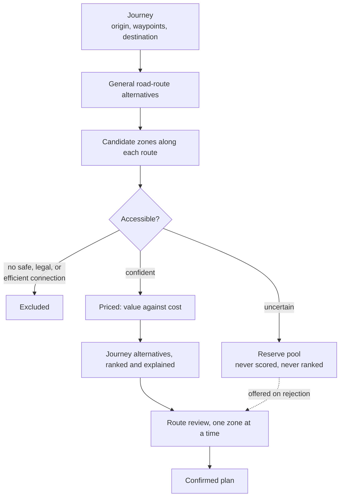

# Specification — the Turf Journey Optimization Engine

What this system is, and how it must behave.

This document owns *the product*: its purpose, the behaviour it promises, the arguments behind that behaviour, its safety rules, and its boundaries. It does not carry a formula, a constant, or a threshold — those are stated once, in `CalculationSpecification.md`. It does not describe how the system is built, which is `Architecture.md`, nor what the interface does, which is `DESIGN.md`.

Where a section of another document is referenced, the document is named. An unqualified italic name refers to a section of this one.

It should be readable front to back in one sitting. That is the point of it.

---

## Product concept and foundation

The Turf Journey Optimization Engine is a route-planning and decision-support system for Turf players travelling longer distances by car. Its purpose is to answer one central question:

> **Given my preferences and constraints, what is the best Turf journey from A to B?**

The system is not intended to function merely as a map of nearby Turf zones, nor as a conventional navigation service that always prioritizes the fastest possible route. Instead, it combines ordinary road-route planning with Turf-specific optimization. It evaluates different ways of travelling between one or more destinations and determines which routes and individual zones provide the greatest value to the user relative to the additional time required.

A typical journey might begin in Örebro and end in Jönköping. Several reasonable main routes may exist between those locations, using different major roads or passing through different towns. A conventional navigation service would primarily compare those routes by travel time, distance, traffic, and road conditions. This system adds another dimension: the Turf opportunities available along each route.

The system must therefore evaluate both the general road chosen for the journey and the smaller deviations required to capture individual zones. It may determine that the fastest road remains the best choice, but it may also identify an alternative main route that takes slightly longer while passing a significantly better selection of zones. The user should be able to compare these alternatives and decide which overall journey best matches their available time and personal Turf priorities.

The optimization problem is consequently broader than finding zones close to a predetermined road. The system must consider the complete journey from origin to destination, generate several viable road-route alternatives, identify accessible zones along each alternative, estimate the real additional cost of capturing those zones, and construct a set of recommended Turf-enhanced routes.

The result should not simply be a list of nearby zones. It should be an explainable journey recommendation.

## Primary use case

The primary user is a Turf player already planning to travel a longer distance by car. The journey has a required destination and is not created solely for the purpose of playing Turf.

The simplest journey contains an origin and a destination:

> A → B

The system should also support journeys with one or more required intermediate destinations:

> A → B → C
> A → B → C → D

These intermediate destinations are the journey's mandatory waypoints. Together with the origin and destination they form the journey's required locations, which must be visited in the order entered by the user. The optimizer may choose different roads and Turf stops between consecutive required locations, but it may not remove, reorder, or replace any of them.

A destination is always required. The system is not intended, at least initially, to answer open-ended requests such as "create the best two-hour Turf trip from my current position." Its purpose is to optimize Turf opportunities within a journey the user already needs or intends to make.

The single-destination journey, A → B, is the dominant case in practice and should be treated as the design centre. Intermediate waypoints are supported, but they are the exception rather than the norm.

### The planning player

The characteristic user is not improvising. Players pursuing a specific attribute — Holy, Monument, National Park — plan deliberately and at length, working out in advance how many such zones a journey can be made to yield.

This shapes the product in three ways. The tool is used in a **planning session** rather than while driving, which relaxes how quickly the first answer must appear. The user is willing to engage with detail, review individual zones, and adjust their preferences and try again. And the goal is frequently not a balanced route at all but a maximal one: *as many zones of this particular attribute as this journey can be made to yield.* The attribute-priority alternative described later is therefore a central case, not a variant offered for completeness.

The primary mode of transportation is a car. This distinction is important because the system is not designed to generate extensive local walking or cycling routes. Passing through a town does not automatically mean that all zones in that town should be recommended. A collection of urban zones that would require several hours of cycling is outside the intended scope, even when the town lies directly on the journey.

Individual zones inside towns may still be considered when they are easy to reach by car, require little additional time, or possess attributes that the user values highly enough to justify a larger deviation.

## The journey as an optimization problem

The system should treat each journey as an optimization problem with four primary components:

1. The user-specified origin, destination, and intermediate waypoints.
2. The viable general road routes between those points.
3. The Turf zones that may reasonably be captured along each route.
4. The user's personal preferences and travel constraints.

The objective is to find journey alternatives that maximize Turf value while minimizing additional travel time.



Conceptually, the system is trying to maximize:

> **Turf value gained relative to additional journey cost**

The value of a journey is determined by the zones it captures and, initially, by the attributes assigned to those zones. The cost is measured as additional time compared with the corresponding journey without Turf stops.

Expressed as a principle: a journey's worth is the value of the zones it captures, set against the additional driving time and the time spent stopping to reach them.

That is the idea, not the formula. The scoring model that implements it is defined once, under *Proposed form: value per minute* in `CalculationSpecification.md`.

The optimizer should not blindly maximize the number of zones. Ten ordinary zones may not be more valuable than one highly desirable attribute zone. Conversely, a valuable zone may still be a poor recommendation if reaching it adds an unreasonable amount of time.

The system must therefore balance value and cost according to the individual user's preferences.

## General route alternatives

When a user enters a journey, the system should generate multiple viable general road routes. These alternatives represent meaningfully different ways of travelling between the required locations, such as taking different highways, major roads, or regional roads.

A route alternative is not merely a variation caused by visiting one additional zone. It represents a different general path between the origin and destination.

For example, the system might produce:

* The fastest conventional route.
* An alternative using a different major road.
* A route that passes through another town or region.
* A slightly slower route with stronger Turf opportunities.

Each general route becomes a baseline against which Turf-enhanced variants can be evaluated.

The system must distinguish between two types of route deviation:

**General route selection** determines which main roads are used to travel between the journey's required locations.

**Zone-level detours** are smaller deviations from a selected general route for the purpose of capturing one or more individual zones.

This distinction allows the user to compare both fundamentally different journeys and different Turf strategies within the same journey.

The optimizer should score the usability of each general route based on ordinary travel characteristics and Turf potential. The fastest route should remain an important reference, but it should not automatically be treated as the only valid foundation for recommendations.

## Candidate zone identification

After generating the general routes, the system identifies Turf zones that may be relevant to each route.

A zone becomes a candidate when it can be reached from the route within reasonable spatial and temporal limits. However, geographical proximity alone is not sufficient. A zone may appear close to a road on a map while being inaccessible by car, separated by difficult terrain, located beside a highway where stopping is impossible, or requiring a long walk from the nearest legal stopping point.

Candidate generation must therefore consider practical accessibility.

Those spatial limits must be numbers, or the requirement that per-journey call volume be bounded has nothing bounding it. How far from the route a zone may lie, and how many candidates proceed from cheap filtering to full evaluation, are stated under *Bounding the candidate set* in `CalculationSpecification.md`.

The system should initially classify candidate zones into at least two broad access types:

### Directly road-accessible zones

A directly road-accessible zone is one the player can capture **without leaving the vehicle**. The car stops legally and safely, the takeover completes from inside it, and the journey resumes.

This covers two situations. Some zones sit directly **on** a drivable road. Others sit **beside** one, close enough that a stopped car is already within the zone.

The second case needs a stated tolerance, since the system models no capture area at all. That tolerance, and the reasoning that fixes it, are under *Direct-access tolerance* in `CalculationSpecification.md`. Beyond that distance the zone becomes a park-and-walk stop with a short priced walk, rather than being lost: the classification decides which cost model applies, not whether the zone survives.

For these zones, the system does not need to add walking time or the time required to leave and lock the car. The estimated cost should instead include the time required to slow down, stop safely, complete the Turf takeover, and return to normal driving.

A zone must not be classified as directly road-accessible simply because it is geographically close to a road. The route data must indicate that the road is actually drivable and that the zone can be reached from it.

Two further conditions apply, each defined in full elsewhere and not restated here: the road-class and speed-limit exclusions under *Enforceable exclusions*, and the level-compatibility requirement under *Direct road-access validation*.

### Park-and-walk zones

A park-and-walk zone requires the user to stop at a road, parking area, or other suitable access point, leave the car, walk to the zone, complete the takeover, return to the car, and rejoin the route.

These zones can be included when the walking distance and total additional time remain within the user's constraints. Those constraints, including the option of different limits per zone attribute, are defined under *User-configurable terrain tolerance*.

The principle behind them is that physical effort is another form of cost the user can consciously exchange for Turf value — a longer walk for a more valuable attribute.

## Terrain, elevation, and topographical accessibility

Geographical proximity does not necessarily imply practical accessibility.

A Turf zone may appear to be only a few metres from a road when viewed on a two-dimensional map, while in reality it may be located above a cliff, below a steep embankment, on the opposite side of a railway cutting, or at the top of terrain that cannot be reached quickly from the apparent stopping point.

For example, a zone may be horizontally located 20 metres from a road but positioned 30 metres above it. Unless there is a mapped and reasonably direct path connecting the road to the zone, recommending that stop would produce a severely inaccurate time estimate and potentially direct the user toward an unsafe or impossible route.

The optimizer must therefore distinguish between:

* Horizontal proximity.
* Actual traversable distance.
* Vertical elevation difference.
* Terrain gradient.
* The presence of a connected walking path.
* Physical and legal barriers between the stopping point and the zone.

A zone must not be classified as accessible solely because its centre lies within a configured radius of a road or parking location.

### Access-path validation

For every park-and-walk candidate, the system should attempt to identify a walkable route from the proposed stopping location to the zone's coordinate.

The access route should be based on mapped pedestrian paths, roads, trails, footways, steps, or other traversable connections where such data is available. The route must connect the stopping point to a position inside the zone rather than merely ending at the geographically closest map coordinate.

The optimizer should evaluate:

* Whether a connected path exists.
* The length of the path.
* The total ascent and descent.
* The steepest relevant sections.
* The average gradient.
* The mapped surface or path type.
* The presence of stairs, crossings, gates, tunnels, bridges, or similar access features.
* Whether the path appears legally and physically usable by a pedestrian.

A straight-line measurement may be used as an early candidate filter, but it must not be treated as the final walking distance when topographical or path data is available. Walking time is then calculated from that path and its elevation profile, per *Elevation-aware walking time* in `CalculationSpecification.md`, and the access cost reflects vertical effort as well as horizontal movement.

### Stops serving several zones

Serving several zones from one stop is common rather than exceptional, and it is why the park-and-walk stop-time model is expressed over a set of zones rather than a single one.

A walk of three hundred metres towards a highly valued zone may pass another zone on the way, which is then taken at almost no additional cost. A large parking area may have a zone at either end. In both cases the driver stops once, walks a route visiting several zone coordinates, and returns.

Two consequences follow.

First, the **marginal cost of an additional zone on an existing walk is often very small** — the extra walking needed to include it, plus one takeover. A zone that lies almost on the path to another may cost only its takeover time. These are the most efficient additions available anywhere in the system, and the optimizer should be structured to find them. Pricing every zone as its own out-and-back walk would hide them completely.

Second, the walking route becomes a small ordering problem. With the handful of zones a single stop can plausibly serve, the best order is cheap to determine by inspection of the alternatives, and no sophisticated method is warranted.

### Proximity between zones does not imply cheap chaining

Two zones being close together does not mean one walk can serve both. The barrier reasoning that governs access from a road applies equally between zones.

Two zones a hundred metres apart may be separated by a fenced railway, a river, a canal, a motorway, or a walled cutting. Reaching the second from the first may require walking a long way to a legal crossing, or may be impossible on foot altogether. The horizontal distance between them says nothing about this.

Every leg of a multi-zone walking route must therefore be validated with the same rules used for the approach from the car, as set out under *Access-path validation* and *Elevation and feasibility rules*. A pair of zones that fails validation between them is simply not a chain: each zone is then evaluated separately, from its own stop, and may well be reached from opposite sides of the barrier on different parts of the drive.

This case is easy to get wrong, because a straight-line measurement makes such pairs look like the cheapest combinations in the entire candidate set. They are among the most expensive.

### Elevation and feasibility rules

Elevation should influence the recommendation process in two different ways.

First, it affects the estimated time and physical effort required to reach the zone. A moderate climb on a mapped path may remain feasible but should receive a higher access cost than a flat walk of the same distance.

Second, elevation may reveal that the apparent access route is not feasible at all. A large vertical difference over a very short horizontal distance may indicate a cliff, retaining wall, steep embankment, quarry edge, cutting, or similar obstacle.

The system should exclude or strongly penalize a candidate when:

* No connected walking route can be identified.
* The road and zone are separated by an implausibly steep elevation change.
* The only apparent approach crosses unmapped or inaccessible terrain.
* The path requires an unsafe ascent or descent.
* The available data suggests a cliff, wall, restricted area, or other impassable barrier.
* The access estimate has insufficient confidence to support a recommendation.

A highly valued attribute may justify additional walking time or elevation gain, but it must not override an access route classified as unsafe, illegal, or physically infeasible.

### Direct road-access validation

Elevation must also be considered when classifying zones as directly accessible from a car.

A zone should not be classified as directly road-accessible merely because its geometry overlaps or comes close to a drivable road in a two-dimensional coordinate system. The road surface and the zone's capturable area must be at a compatible elevation and connected without an intervening barrier.

This prevents situations such as:

* A road passing through a tunnel beneath a zone.
* A bridge passing above a zone.
* A zone positioned on a cliff above the road.
* A zone lying beside a deep road cutting.
* A zone separated from the road by a retaining wall or steep embankment.

Direct road access should require evidence that the vehicle can stop at a valid location from which the zone can actually be captured without leaving the car.

Where elevation or structural data is ambiguous, the zone should be downgraded to uncertain access rather than classified as directly accessible.

### User-configurable terrain tolerance

The user should be able to configure their general tolerance for physical access effort.

Potential settings include:

* Maximum walking distance.
* Maximum total elevation gain.
* Maximum estimated walking time.
* Maximum acceptable path gradient.
* Whether stairs are acceptable.
* Whether unpaved paths are acceptable.

Maximum walking distance is configured in metres and is the setting most users will adjust. It is the primary limit on park-and-walk candidates.

Advanced settings may allow any of these limits to vary by zone attribute, so that effort can be traded against value per attribute rather than globally.

For example, a user might configure:

* A maximum walking distance of 100 metres for ordinary zones, but 800 metres for a Summit or World Heritage zone.
* Maximum elevation gain of 10 metres for ordinary zones.
* Maximum elevation gain of 40 metres for Monument zones.
* Maximum elevation gain of 100 metres for Summit zones.

These settings should influence which feasible zones are recommended, but they must not permit the optimizer to recommend routes that are classified as unsafe or inaccessible.

### Walking distance is priced, not filtered

Acceptable walking distance is **not** a fixed default that the system applies before considering a zone. It emerges from the value-and-cost comparison described under *Proposed form: value per minute* in `CalculationSpecification.md`.

Walking time is a cost like any other. A longer walk costs more, competes against everything else the time budget could buy, and wins only when the value on the other side justifies it. No threshold decides this in advance.

The behaviour this produces is the behaviour a player would choose. Suppose the user ranks `Monument` highly:

* If exactly one `Monument` zone lies near the route and reaching it requires a **1,000-metre** walk, that walk may well be worth it. The attribute weight is large, there is no alternative, and the cost is affordable within the budget.
* If four `Monument` zones lie near the route and two of them need only **200 metres** each, the optimizer takes those two first. They deliver the same attribute twice over for a fraction of the time, leaving budget for more zones after.

Nothing special is needed to produce this. It falls out of ranking candidates by value per minute: two cheap instances of a valued attribute beat one expensive instance, and one expensive instance beats none at all. The result maximizes attribute coverage *and* zone count together, which is what the combined objective asks for.

The user's configured maximum walking distance, under *User-configurable terrain tolerance*, remains as an **outer bound** — a statement of what they are physically willing to do at all. It is a constraint on the search space, not the mechanism that chooses between candidates. Set generously, it rarely binds; the cost model does the real work.

The same reasoning applies to elevation gain and every other terrain cost. They are priced, and they compete.

### Terrain confidence

Elevation and pedestrian-path data may be incomplete or inaccurate. The system should therefore assign a confidence level to each access estimate.

A high-confidence estimate may include:

* A mapped parking or stopping location.
* A connected pedestrian path.
* A complete elevation profile.
* Known road and path levels.
* No identified physical barriers.

A lower-confidence estimate may rely on:

* Straight-line distance.
* Incomplete elevation samples.
* Unmapped terrain.
* Uncertain path connectivity.
* Ambiguous bridge or tunnel relationships.
* Missing surface or barrier information.

The recommendation should communicate material uncertainty. For example:

> The zone is approximately 90 metres from the parking location, but the final approach is not mapped and includes an estimated 18-metre elevation gain.

Zones with low-confidence access should be excluded from time-sensitive recommendations or presented separately as uncertain opportunities. What that separate presentation means in practice is defined under *Handling the uncertain bucket*.

## Accessibility principle

A zone is considered accessible only when the optimizer can identify a plausible, safe, and sufficiently efficient connection between a legal stopping location and the zone's coordinate.

This principle governs the whole of this section and takes precedence over any narrower statement above it.

Accessibility must therefore be determined using:

```text
zone accessibility =
    road and parking suitability
    + path connectivity
    + walking distance
    + elevation profile
    + terrain and barrier conditions
    + access confidence
```

This ensures that route recommendations reflect the real-world effort of reaching a zone rather than its apparent proximity on a flat map.

## Individual zones rather than local collection routes

The recommendation model should remain focused on individual zones along a longer car journey.

The system must not assume that entering a town means the user wants to stop and complete a local Turf route. A town may contain dozens or hundreds of zones, many of which are intended to be reached on foot or by bicycle. Collecting them could take several hours and would conflict with the purpose of optimizing a longer-distance journey.

A zone inside a town should only be considered when at least one of the following is true:

* It lies directly along the selected driving route.
* It can be reached with a small and accurately calculated driving deviation.
* It is easily accessible by car.
* It requires only a short park-and-walk stop.
* It has an attribute that the user values sufficiently highly to justify the additional time.

Although recommendations are expressed as individual zones, the optimizer should still consider interactions between nearby candidate zones. Two zones may share most of the same detour. The cost of visiting both may therefore be considerably lower than the sum of evaluating each zone independently.

The engine should calculate the marginal cost of adding each zone to a route sequence rather than always assigning every zone an isolated round-trip detour. This prevents double-counting and allows the optimizer to recognize efficient combinations without turning them into multi-hour local Turf routes.

Sharing occurs at two levels, and both must be modelled:

* **A shared driving deviation**, where two zones lie along the same departure from the main road but require separate stops.
* **A shared stop**, where one parking place and one walk serve several zones. This is defined under *Stops serving several zones* and is frequently the cheaper of the two.

Neither may be inferred from proximity alone. A shared driving deviation must be established by routing, per *Detour cost must always be routed, never inferred*; a shared walk must be established by validating each leg of it, per *Proximity between zones does not imply cheap chaining*.

## What a zone is

The Turf API is the sole source of zone and player data, and its behaviour is recorded under *Data sources and constraints* in `Architecture.md`. Two of its properties are product facts rather than integration details, because they decide what the system is able to promise.

### The coordinate is the target

The system does **not** model a capture area, and carries no capture-radius constant.

Instead, **the zone's coordinate is treated as the position that must be reached.** Walking routes end there, and direct road access requires the road to reach it. This is the one assumption that holds for every zone regardless of its shape: whatever area the zone actually covers, its own coordinate is inside it.

This is deliberately the most conservative possible model, and it removes an unknowable constant from the system entirely rather than replacing it with a guess.

The real capture area is some unknown amount larger, so in practice a zone will often be takeable slightly before the user reaches the coordinate. That error is always in the user's favour: the stop is shorter than estimated, never longer, and a zone judged reachable always is. A model built on an assumed radius would have failed in the opposite direction — classifying zones as reachable from roads that never actually touch them.

Zone-coordinate precision remains a source of error and is listed under *Confidence and uncertainty*. Where a classification turns on a margin of a few metres, that is itself grounds for treating the access as uncertain rather than confirmed.

### Rounds

Turf is played in rounds of roughly a month. At the start of each round, **all zone ownership resets** and each player's round points reset. Total accumulated points and rank persist across rounds.

Two consequences matter here. Ownership data is round-scoped, so `currentOwner` and the user's own `zones` list are not long-lived facts and become wholesale invalid at a round boundary — any cache must not survive one. And "have I taken this zone" has two distinct meanings, *this round* and *ever*, which are not interchangeable. Round-scoped ownership is retrievable; lifetime history is not, which is why *Route review and zone confirmation* exists.

## Zone attributes and user-defined value

The initial version of the system will base Turf value primarily on zone attributes.

An attribute is returned as a `type` object holding an id and a name. A zone carries **at most one** attribute. Ordinary zones **omit the field entirely** rather than returning an empty value, so consuming code must treat its absence as the normal case. Attributes are uncommon: depending on the area sampled, between roughly 10% and 16% of zones carry one. See *Attribute rarity*.

The following id and name pairs were observed directly and are the authoritative values to match against:

| Id | Name |
|----|------|
| 3  | `Water Zone` |
| 6  | `Winner Zone` |
| 8  | `Bridge` |
| 9  | `Holy` |
| 13 | `Train Station` |
| 14 | `Castle/Fort` |
| 15 | `World Heritage` |
| 16 | `Ruins/Ancient Remains` |
| 21 | `Monument` |
| 22 | `National Park` |
| 23 | `Summit` |

Ids are sparse and must not be assumed contiguous. Names must be matched as the API spells them — `Holy`, not "Holy Zone".

### Attribute rarity

Attributes are far rarer than the list suggests, and their rarity differs by two orders of magnitude. Across roughly 82,000 zones from a partial sync about 16% carried an attribute, while a smaller geographically-spread sample of a thousand zones gave 9.5%. The true figure varies by region and the two samples bracket it; treat roughly one zone in eight as the planning assumption:

| Attribute | Share of all zones |
|-----------|--------------------|
| `Holy` | 5.1% |
| `Bridge` | 4.4% |
| `Train Station` | 1.5% |
| `World Heritage` | 1.3% |
| `Monument` | 1.3% |
| `Ruins/Ancient Remains` | 0.9% |
| `Winner Zone` | 0.6% |
| `Water Zone` | 0.5% |
| `Castle/Fort` | 0.5% |
| `National Park` | 0.3% |
| `Summit` | 0.06% |

`Summit` is the rarest by a wide margin — one per region, placed at the region's highest point.

These proportions have a direct consequence for route planning. A corridor yielding five hundred candidate zones would be expected to contain only two or three `Castle/Fort` zones and perhaps half a dozen `Monument` zones. **An attribute-hunting journey is therefore working from a very small candidate pool**, which is why a highly ranked attribute must be able to justify a large detour: there may be only one reachable instance on the entire route. The optimizer should expect scarcity rather than abundance in exactly the cases users care most about.

The figures should be treated as approximate. The sample was drawn from a partial sync and is not evenly distributed across countries.

### Point-based value

`takeoverPoints`, `pointsPerHour`, and `totalTakeovers` accompany every zone at no additional cost, and many players optimize on points rather than on attribute collection.

The initial release deliberately bases value on attributes alone, because attribute preference is what the user can express directly and what the explanation layer can articulate. Point-based value is a known, cheap extension rather than a data limitation, and the decision to defer it should be revisited once the attribute model is calibrated.

### Zone activity as a difficulty and hold-time signal

Every zone reports `totalTakeovers` and `dateCreated`. Together these give a **takeover rate**, defined under *Takeover rate* in `CalculationSpecification.md`. It is one of the most informative signals available, and it costs nothing to compute.

A zone taken a hundred times a month is demonstrably easy to reach — thousands of players have proved it. A zone taken a tenth of that may be genuinely awkward: on an island, across water, up a slope, behind a fence, or simply somewhere unpleasant to stop. This is real-world evidence of accessibility of a kind no map data provides, contributed by every player who has ever tried.

Sampling supports it. Across roughly a thousand zones the median was about 26 takes per month, with the tenth percentile near 4 and the ninetieth above 100. **Water zones had a median around 1.8 — roughly fourteen times lower than untyped zones.** The lowest-activity zones in the sample were small islands, bathing places, and bridges: precisely the zones a driver should not be sent to.

The same figure estimates how long a zone is likely to be **held** once taken. A zone contested a hundred times a month will be lost quickly; a quiet one may be held for the rest of the round.

#### The signal points in opposite directions depending on the objective

This must not be collapsed into a single "zone quality" score, because its sign depends on what the user asked for:

* When judging **access difficulty**, high activity is good. It is evidence the zone is easy to reach.
* When optimizing for **points**, low activity is good. An uncontested zone is held longer and accrues `pointsPerHour` for longer.

A zone can therefore be simultaneously the worst choice for a quick roadside stop and the best choice for round score. Implementations must keep the two uses separate and apply the signal with the correct sign for the selected objective, per *Optimization objectives*.

#### Activity clusters

Takeover rate conflates access difficulty with **population density**. A zone in rural Norrland may be quiet because few people live there, not because it is hard to reach — and rural corridors are exactly where this product operates. A global threshold would systematically penalise every rural zone on the journey, which is precisely the wrong outcome.

Activity must therefore be judged **relative to its neighbourhood, never against a global figure** — each zone scored against a local baseline rather than against an absolute number. How that baseline is constructed, the ratio it feeds, the size of the neighbourhood, and the guards that suppress the adjustment where it would be meaningless are all defined under *The activity baseline* in `CalculationSpecification.md`.

A zone at a fifth of its neighbours' rate is interesting wherever it is, because the surrounding zones establish what "normal" looks like for that area's population and traffic. A quiet zone among quiet zones is unremarkable; a quiet zone among busy ones is a signal that something about it is awkward.

The measure is weak for young zones, where a short `dateCreated` history makes the rate unstable. Recently created zones should be treated as unknown rather than as low-activity.

Used this way, activity belongs as a **partial weight in the cost model** — raising the estimated difficulty and lowering the confidence of a stop at a zone unusually quiet for its area — rather than as a hard filter.

### Why attributes matter: unique zones and medals

Attribute preference is not an arbitrary taste setting. **Serving unique-zone collection and medal progression is the purpose of this system.**

Medals are earned by visiting a given number of zones of a particular kind, and they count **unique** zones — zones the player has never taken before. This is why attributes carry the weight they do: a `Monument` zone is valuable because it advances a Monument medal, and a `Castle/Fort` zone because it advances that one.

Two consequences follow, and they run through the whole design.

First, **a zone the user has already taken contributes nothing to the goal they are pursuing.** An attribute zone they captured last year is worth no more than an ordinary zone for medal purposes. A route full of such zones is, for this user, a wasted journey — even though it would score well on every metric the optimizer can compute.

Second, this is precisely the data the API withholds. `uniqueZonesTaken` is a count, not a list. The system can rank attributes but cannot tell whether any given instance is new to the user, which is the single fact that determines its real value.

This is why *Route review and zone confirmation* is a core mechanism rather than a convenience. It is the only point at which the information the product most depends on enters the system, and it comes from the user.

The user's `medals` array is available from `POST /v5/users`. Comparing it against the medals that exist would reveal which collections they are still working on, and therefore which attributes they most need. That would let the system *suggest* a ranking rather than asking the user to supply one cold — a materially better first experience, since ranking eleven attributes from nothing is a poor way to begin.

The feature is not in the first release, because it requires a maintained table of medal definitions and carries the same manual synchronization burden as the takeover-time table described under *Rank-to-takeover-time table* in `CalculationSpecification.md`.

**The data should nonetheless be captured from the outset**, stored inside the plan object alongside everything else. The `medals` array arrives free in a call the system already makes for rank, and storing it costs nothing.

What this buys is schema readiness, and only that. Because there are no accounts, medal data expires with the plan that holds it and cannot be linked across plans or over time — see *No accounts*. Capturing it now means the later feature is an addition rather than a migration; it does not mean early users will have accumulated history when it arrives.

### Attribute preference

These attributes do not possess a universal value that applies equally to all players. Their desirability depends on personal goals, collection interests, medals, rarity, and previous experience.

Summit zones are especially rare because they are limited to one per region. National Park and World Heritage zones are also relatively rare. Monument zones may remain highly valuable despite being more common because players can pursue medals connected to the number of Monument zones they have visited.

The system should not impose a fixed global ranking that assumes every player values these attributes in the same way. Instead, each user should be able to define their own preference order.

The interface presents this as a **complete ranking from 1 to 11**, where 1 is the most valuable attribute and 11 the least. Tier lists were considered and rejected: a strict ranking is simpler to interpret, simpler to convert into weights, and forces the user to make distinctions the optimizer needs anyway.

The engine needs numerical weights, and an ordinal ranking states only that one attribute beats another, not by how much. The ranking must therefore be translated into internal weights, and the shape of that translation is decided by how strong real preferences turn out to be.

### The weighting is extreme

Preferences here are not mild. A player who values `Castle/Fort` and `Monument` would rather take **one** such zone than three hundred ordinary ones.

That is the design target, and it has consequences the implementation must respect:

* The weight ratio between a top-ranked attribute and an ordinary zone is on the order of **several hundred to one**, not two or three to one.
* At that ratio, a weighted sum behaves in practice as a **priority ordering**. No realistic number of ordinary zones outweighs a single top-ranked attribute zone, because no route contains three hundred stops.
* The system may therefore be implemented either as a steeply-weighted sum or as an explicit priority ordering. These are equivalent at this scale, and the choice should be made on whichever is easier to explain to the user.
* The **time budget is the only real constraint** on this behaviour. With weights this steep, the optimizer will spend the entire available time reaching one high-ranked zone if that is what it takes. That is the intended behaviour, not a defect, and it is why the target and ceiling under *User time constraints* must be enforced strictly.

The curve that converts a rank into a weight, and the properties that make its shape defensible, are under *Proposed rank-to-weight curve* in `CalculationSpecification.md`.

### What the value model deliberately leaves out

The initial release keeps the value model narrow, but for two different reasons that should not be confused.

Current zone ownership, medal progress, rank, and the *count* of unique zones taken are all retrievable today from a single call, as described under *Player data* in `Architecture.md`. Excluding them from the first release is a scoping decision taken to keep the value model explainable, not a consequence of missing data. Each is a cheap extension.

A player's complete Turf history — specifically *which* zones they have previously taken — is genuinely unavailable. The API exposes a count and nothing more. Anything requiring that list, such as prioritizing zones the user has never captured, cannot be built until the data becomes accessible and must not be assumed by the initial architecture.

## User time constraints

The user specifies how much additional time may be spent on Turf activities during the journey. This is always a user-supplied parameter. The system must not assume a typical value, and must not infer one from journey length.

The realistic range is **wide** — from ten minutes for someone squeezing zones into a trip they need to make, to several hours for a dedicated player whose day is built around the journey. Both are ordinary users of this product. The interface must accept the whole range without treating either end as unusual, and the optimizer must behave sensibly across all of it: a ten-minute budget should still produce a useful answer, and a three-hour budget must not degenerate into an urban collection route, which remains out of scope.

The limit is a **soft target with a hard ceiling**. The stated limit is the target: the optimizer prioritizes alternatives that respect it and must always produce at least one that does. 115% of the stated limit is the ceiling, and it is absolute — no recommendation may exceed it for any reason, however valuable the zone. Between target and ceiling the optimizer may offer a small number of clearly-labelled stretch alternatives.

This is the single definition of the allowance. Later sections refer to it but do not restate it.

The rules should be:

* At least one recommended Turf alternative must remain within the user's stated additional-time limit.
* The system may suggest alternatives above that limit only when the additional Turf value provides a clear justification.
* No recommendation may exceed 115% of the user's stated additional-time limit.
* Alternatives above the limit must be clearly identified as stretch alternatives.
* The explanation must state which highly valued zone or attribute caused the optimizer to exceed the preferred limit.

For example, if the user allows 20 minutes of additional travel, the system must include at least one recommendation that adds no more than 20 minutes. It may also include a stretch recommendation adding up to 23 minutes, but only when a highly valued zone makes the additional three minutes worthwhile.

The 15% allowance applies to the user's permitted additional time, not to the complete duration of the journey.

The optimizer should never quietly exceed the limit. The distinction between compliant and stretch alternatives must be visible in the user interface.

### Journeys with several legs

The time limit applies to the journey as a whole, but a journey with intermediate waypoints is naturally optimized one leg at a time. Without an explicit rule, each leg would consume the full budget and the completed journey would exceed it several times over.

The budget must therefore be allocated across legs before per-leg optimization begins. The allocation should be proportional to each leg's baseline driving time, so that a long leg receives a larger share of the available Turf time than a short one.

Allocation should not be rigid. Where a leg cannot use its share — because too few accessible zones exist along it — the unused remainder should be returned to a common pool and offered to the remaining legs. What must hold in every case is that the sum across all legs respects the journey-level target, and never exceeds the journey-level ceiling.

The user should see the additional time for the journey as a whole. A per-leg breakdown is useful detail, but the figure that matters is the total.

## Entering towns and leaving the main road

The system does not require a special rule that prohibits entering towns. Instead, town deviations should be judged by their calculated time cost.

Entering a town often adds time even before any zone is captured because the driver may encounter slower roads, intersections, traffic, and a more indirect route. These effects should be reflected in the route duration returned by the routing provider.

The user's detour tolerance determines whether such a deviation is acceptable. A strict user may receive only zones immediately beside the main road. A more flexible user may receive recommendations that pass through a town centre when the additional time remains within the configured budget.

A highly valued attribute may justify entering a town, but its benefit must be evaluated against the complete additional cost, including rerouting, local driving, stopping, walking, takeover time, and returning to the main journey.

## Optimization objectives

Turf players do not all want the same thing from a journey, and the difference is not a matter of degree. Maximizing the number of Monument zones, maximizing round points, and maximizing raw zone count are **different problems**, not different weightings of one problem.

The user must therefore state what they are optimizing for. The interface should present this as a small multi-select — a pill or toggle group — over three objectives:

* **Attributes** — collect zones carrying particular attributes, weighted by the ranking established during initialization.
* **Zones** — maximize the raw number of zones taken, irrespective of what they are.
* **Points** — maximize round score. **Not in the first release.**

### Points is deferred

The Points objective is **out of scope for the first release** and the pill should not be offered until it ships.

Its exclusion is consistent with *Point-based value* and *Deferred by choice*, and it removes a dependency the first release cannot satisfy: ranking on points requires estimating how long a zone will be held, which is explicitly out of reach under *Genuinely out of reach or out of scope*.

Two consequences follow for the first release. `takeoverPoints` and `pointsPerHour` remain **visible** on the review card, because a player judging a zone wants to see them — they are simply not ranked on. And the activity signal is used only with its **difficulty sign**, per *Zone activity as a difficulty and hold-time signal*; its hold-time reading has no consumer until Points ships.

### Combinations are the normal case

Selecting one objective is the simple case. Selecting several is expected to be the common one: a road trip where the user wants a few specific attributes *and* as many zones as possible alongside them.

The interface must therefore support any combination, and the engine must produce a coherent answer for each. A combination is not a mode switch — it is a statement that several things matter at once.

### Attributes and Zones: the primary combination

The expected default combination is attributes together with zone count, and its resolution is a **priority order rather than a balance**:

> **Attributes are the dominant criterion. Subject to that, take as many zones as possible along the route.**

The optimizer secures the attribute zones the user ranked highly, then fills the remaining time budget with as many additional zones as the route allows. Zone count never displaces an attribute zone; it decides what happens with the time left over.

This resolves what would otherwise be a hard multi-objective problem. Because attribute weights are extreme — see *The weighting is extreme* — attributes and zone count do not need to be normalized against one another. The first simply outranks the second, and zone count operates as the tiebreak among everything the attribute criterion is indifferent to. Given that the large majority of zones carry no attribute at all, that tiebreak governs most of the route in practice.

### Scoring within the objectives

Ordering the objectives does not reduce the scoring to a single number. Every zone considered for inclusion is judged on the full set of factors available:

* The additional time it costs.
* Its points — `takeoverPoints` and `pointsPerHour`.
* Its activity level, per *Zone activity as a difficulty and hold-time signal*.
* Its estimated access difficulty, including elevation and terrain.
* Its access confidence.

These are not alternatives to one another. They belong together in the core scoring function, which is defined under *Proposed form: value per minute* in `CalculationSpecification.md`.

### Explaining combined objectives

The explanation layer must state which objective drove each recommendation. With objectives combined, the user can no longer infer it from the result, and an unexplained route is exactly what this product exists to replace.

### Interaction with the time budget

The objectives determine what a journey is worth. The time budget determines what may be spent obtaining it. They are independent settings and must remain so — selecting an ambitious objective must never silently relax the target or the ceiling defined under *User time constraints*.

## Route construction and optimization behaviour

The optimizer should begin with a set of general route alternatives. For each route, it should create a collection of feasible candidate zones and calculate the cost and value of adding them.

It should then search for combinations and visit orders that produce strong journey alternatives.

The optimization process should account for:

* The baseline travel time of the general route.
* The changed driving time caused by visiting zones.
* Stop-specific service time.
* User-defined attribute rankings.
* Maximum walking distance.
* Optional per-attribute walking-distance limits.
* Rank-based takeover time.
* Road accessibility.
* Road speed and stopping suitability.
* The user's preferred additional-time limit.
* The maximum 15% stretch allowance.
* Shared detours between multiple zones.
* The order in which zones are visited.
* All required journey locations, including origin and destination.

The objective should not be reduced to a single unexplained score shown to the user. An internal numerical score is useful for comparing candidate solutions, but the user-facing recommendation should translate that score into understandable trade-offs.

The scoring model is defined once, in `CalculationSpecification.md`, and is not restated here. It must be designed so that a high-value attribute can justify a longer detour without allowing a single preference to produce unreasonable or unsafe routes.

### Detour cost must always be routed, never inferred

Detour cost must be obtained by routing the journey through the proposed stopping location and comparing it against the baseline. It must never be estimated from geometry — not from the zone's distance to the route line, not from a radius, not from any straight-line measure.

Geometric estimates fail in the cases that matter most. A zone lying a few metres from a dual carriageway may be reachable only by continuing to an exit several kilometres ahead, turning, and returning; the true cost can be twenty minutes where the map suggests seconds. The same zone may be cheap in one direction of travel and expensive in the other, because the exits are not symmetric. One-way systems, central reservations, and restricted turns produce the same effect at town scale.

Routing through the stop point captures all of this without special handling, and it is the reason detour cost is direction-dependent. A candidate's cost is only meaningful for a specific journey travelled in a specific direction, and must not be cached or reused across journeys as though it were a property of the zone.

Straight-line proximity remains useful for one purpose only: cheaply reducing the corridor to a candidate set worth routing.

## Optimizer and advisor

The product should act as both an optimizer and an advisor.

As an optimizer, it calculates feasible routes, estimates their costs, evaluates their Turf value, and ranks the alternatives.

As an advisor, it explains the result in terms the user can understand and use when deciding how to travel.

A recommendation should therefore contain both quantitative information and a natural-language explanation.

For example:

> This route uses Road X rather than the fastest route and adds approximately 12 minutes. It includes four accessible zones, including one Summit zone and one Monument zone. Summit is your highest-ranked attribute, which is why this route is ranked above the eight-minute alternative containing only ordinary zones.

The user should be able to see:

* The general roads used.
* The baseline driving time.
* The estimated total journey time.
* The additional Turf time.
* The number of recommended zones.
* The attributes represented.
* The approximate walking distance.
* Which stops require leaving the car.
* Which zones are directly road-accessible.
* Whether the route is within the preferred time limit.
* Whether it is a stretch alternative.
* Why it was recommended.
* Which preference had the greatest influence on its ranking.

The explanation layer is not merely decorative. It is necessary for user trust because route optimization involves uncertain estimates and subjective preferences. Users need to understand why a route was selected and determine whether the recommendation matches their real-world expectations.

## Recommended journey alternatives

The system should return several meaningfully different alternatives rather than one supposedly perfect answer.

A typical result set may contain:

### Time-efficient Turf route

A route that remains comfortably within the user's preferred time budget and captures zones requiring minimal deviation.

### Balanced route

A route that uses more of the available time budget and offers a stronger mix of zone quantity and preferred attributes.

### Attribute-priority route

A route optimized around one or more highly ranked attributes, potentially using most of the available time.

### Stretch route

An exceptional recommendation that exceeds the preferred additional-time limit but remains within the 15% allowance. It must contain a clear value-based justification.

Not every search must return all four categories. The system should avoid presenting alternatives that are effectively duplicates or that do not provide a meaningful trade-off.

There must always be at least one route within the user's stated time limit. If no attributed zone can be reached within that limit, the system should present the best compliant route available, even if it contains fewer or only ordinary zones.

## Route review and zone confirmation

A recommended route is a proposal, not a plan. **No route is final until the user has confirmed the zones in it.**

This is not a courtesy step. It exists because of a specific, unavoidable gap in what the system can know.

The optimizer cannot tell which zones the user has already taken; the API exposes only a count, as set out under *Player data* in `Architecture.md`. For the large majority of candidates that carry no attribute, that history is the main thing distinguishing one zone from another in a player's own judgement. The optimizer therefore cannot rank ordinary zones the way the user would, and must not pretend otherwise.

Confirmation is where the user's own knowledge enters the process. It is the product's answer to the one genuinely unavailable piece of data, and it is a better answer than guessing.

How the review behaves — what is shown for each zone, what rejecting one does, how replacement escalates, and what happens when nothing else fits — is specified under *Reviewing the recommended route* in `DESIGN.md`.

### Consequences for the optimizer

Confirmation turns the optimizer from a batch process into an interactive one, which the architecture must accommodate directly:

* **State must be retained after the initial solve.** The candidate set, access classifications, and computed costs are what replacement draws on. Recomputing them per rejection would make the loop unusable.
* **A re-solve must feel immediate.** This is a stricter latency requirement than the initial solve, and it is met by reusing retained state rather than by working faster.
* **Exclusions accumulate for the session** — zone-level, area-level, and distance-based constraints together.
* **The route must stay stable.** Replacing one zone must not reshuffle the others. The user is progressively approving a plan, and accepted parts need to stay put or the review never converges.
* **The time budget is re-checked after every change.** A replacement may cost more than what it replaced, and the target and ceiling continue to apply throughout.

### A note on rejection history

Over time, a record of which zones a user rejected would approximate the zone history the API withholds. This is worth noting as a possible future extension, with the caveat that a rejection is ambiguous — it may mean *already taken*, but it may equally mean *inconvenient today* — so it is a weak signal that should not be treated as fact. It is not part of the first release.

## Handing off the confirmed route

This product plans journeys. It does not drive them.

Once a route is confirmed, the user takes it to a navigation application of their choice. The system deliberately does **not** provide turn-by-turn guidance, live position tracking, or zone-arrival prompts. That work is done well by existing applications, and duplicating it would enlarge the build enormously for no advantage.

The intended options at confirmation are to save the route to the device, or to send it to an external navigation application.

**Google Maps is the only target for the first release.** Waze is documented below because its constraint is instructive, but supporting it is not in scope. Other applications, and file-based export, are deferred.

### The waypoint limit problem

Handing off a complete multi-stop route is **not generally possible**, and the design must account for this rather than assume it away.

The limits below were checked against Google's published documentation on **1 August 2026**. They are set by third parties and change without reference to this product, so they carry the date they were checked rather than being reasoned about, and they are re-checked rather than assumed.

The published limits are restrictive:

* **Google Maps URL scheme** — Google names two platform classes rather than a general figure with exceptions: **up to three waypoints on mobile browsers, and up to nine otherwise.** Both figures count **intermediate stops only**. The origin and the destination are separate URL parameters and do not consume the allowance.
* **Waze deep links** — a **single destination**. Waypoints are not supported at all.

**Three remains the design figure, as the worst case rather than as a fact about phones.** The three-waypoint condition binds *mobile browsers*, not mobile devices. A Google Maps link opened on a phone that has the Maps app installed normally opens the app, which is not a mobile browser, and Google does not document the app's own cap. The product cannot know which of the two a user's tap will reach, and one of the two is undocumented, so the design is built against the smaller published figure. That is a deliberately conservative choice, not a measured one.

The intermediates-only reading is an inference and is recorded as one. No Google sentence states that the cap sits on top of the origin and destination. The conclusion rests on the cap being stated inside the description of the `waypoints` parameter, which Google defines as intermediary places to route through *between* the origin and the destination — the same convention its paid Routes API states outright, as a set of waypoints excluding terminal points. That scoping is strong, but it is not quotable as a guarantee.

A conflicting convention exists upstream: Google's consumer help page for adding stops counts the final destination inside its total of nine, which is **eight** intermediates, and nothing findable documents whether the consumer interface clamps a link built with the URL scheme — so eight is the safe intermediate ceiling should any design ever lean on the upper figure.

A Turf-enhanced journey routinely contains more stops than either will accept. The offload to expert systems therefore cannot be total, and a design premised on exporting the whole route in one action will fail on the primary platform.

#### Waypoints may be dropped without warning

The numeric cap is the smaller problem. Google states that waypoints are not supported on all of its Maps products, and that where they are unsupported **the parameter is ignored** — not rejected.

A hand-off can therefore appear to succeed while delivering the user a plain drive to their destination with every Turf stop removed, discovered by arriving. For a product whose entire value is the stops, this is the more dangerous of the two constraints. It is accepted as a **first-release constraint**: the system cannot detect it, and Google does not document which products it affects.

What follows is an obligation on the hand-off rather than a defect to be engineered away. **The user is told what the dispatch may drop, before they hand off.** This is the stance already settled under *Confidence and uncertainty*, applied to a hand-off instead of an estimate: where something material is not known, the system communicates it rather than presenting a result as more complete than it can vouch for. How that is worded and where it appears is an interface question and is not settled here.

The model that follows from those limits — this product holding the plan and dispatching a portion of it at a time — is specified under *Dispatching stop by stop* in `DESIGN.md`.

## Route persistence

Confirmed routes **persist**. A journey planned weeks ahead must still be there on the morning of departure.

The failure this prevents is concrete and severe: a user plans a road trip in advance, closes the browser, returns on the day of travel, and finds the work gone. That user does not redo the planning — they abandon the product.

Persistence covers reopening on the same device after an arbitrary interval. It also spares the system a full recomputation for every revisit, which matters given the cost of the pipeline.

A user may hold **several plans at once**. Planning a summer road trip does not discard the route planned for next weekend, and starting a new journey never overwrites an existing one. How stored plans are listed and reopened is specified under *Returning to a stored plan* in `DESIGN.md`.

A stored route keeps **everything** — not only the confirmed plan, but the candidate set, the access classifications, and the computed costs behind it. This is deliberately the larger option. It means a reopened route can be re-solved, and zones swapped during a later review, without rerunning the pipeline from the beginning.

### No accounts

The first release has **no user accounts**. There is no login, no stored identity, and no server-side user record.

This is a deliberate simplification with a real and specific consequence that must be stated rather than discovered: **a route planned on a computer cannot appear on a phone.** Browser storage is per-device and per-browser. Without an account, the two have nothing in common.

That leaves a genuine gap, because planning at a desk and driving with a phone is a natural way to use this product. The options for closing it without introducing accounts, and the proposed resolution — anonymous server-side storage keyed by a short code, with an expiry policy and an obligation about personal data — are analysed under *Persistence and cross-device transfer* in `Architecture.md`.

### Stored routes go stale

A stored route is a snapshot of a world that keeps moving. Between planning and departure, zone ownership changes, points change, region lordship changes, zones are added or deactivated, and — most significantly — a **round boundary may pass**, resetting all ownership at once.

A stored route must therefore record when it was computed, and the system must decide what to do about the gap rather than silently presenting stale data as current.

The route itself — the roads, the chosen zones, the confirmed sequence — remains valid regardless, because geography does not change. What decays is the volatile data attached to it: ownership, current points, and any activity-derived estimate.

**The stored plan does not change.** It is shown exactly as the user approved it, however long ago that was and whatever has happened since. The roads and zones they chose remain the plan.

What refreshes is the volatile data attached to it: ownership, current points, and anything derived from them. That refresh happens in the background after the plan is already on screen, and anything material — a zone deactivated, a round having rolled over — is surfaced as information, never as an automatic edit. How a rollover is communicated is specified under *Communicating a round rollover* in `DESIGN.md`.

The system must never silently recompute a stored plan into something different. The user confirmed those zones deliberately, and replacing them without asking discards exactly the judgement the confirmation step exists to capture. If a change genuinely warrants attention, tell the user and let them decide whether to review the route again.

## Confidence and uncertainty

Travel-time estimates for Turf stops will never be perfectly exact. The system should therefore track the confidence of its calculations.

Uncertainty may arise from:

* Incomplete parking data.
* Unverified roadside stopping suitability.
* Straight-line rather than routed walking distance.
* Traffic variation.
* Temporary road restrictions.
* Inaccurate speed-limit data.
* Zone-centre precision.
* Zone shape and size, which vary and are not reported, so the coordinate is used as the target.
* GPS acquisition time.
* Rank or takeover-time lookup failures.

Walking speed is deliberately not on this list. An average adult walking speed is accepted as good enough, so individual variation around it is not treated as a driver of confidence.

A recommendation based on a confirmed parking location, a mapped walking path, and a known player rank should have greater confidence than one based on approximate roadside access and default values.

The advisor should communicate material uncertainty without overwhelming the user. For example:

> Estimated additional time: 7–9 minutes. Parking access is mapped, but the final 120-metre walking route is approximate.

This is preferable to presenting an unrealistically precise value such as 7 minutes and 14 seconds.

## Safety and legality

All recommendations must assume legal and safe driving behaviour.

These requirements are divided by what the available data can actually establish. A requirement the system cannot enforce is not a safeguard — it is a rule that will be silently violated. The distinction below is deliberate.

### Enforceable exclusions

These follow from road and map attributes and must be applied as hard rules. A zone failing any of them is excluded regardless of its Turf value.

* No stop may be proposed on a motorway, motorway link, or any road whose recorded speed limit exceeds 90 km/h. A nearby rest area, service road, parking area, or exit may still make the zone accessible; the high-speed carriageway itself never is.
* No stop may be proposed on a road not marked as drivable by the map data.
* No zone may be classified as directly road-accessible where the road and the zone are at incompatible levels, or where bridge, tunnel, or layer data indicates they do not meet. This is covered under *Direct road-access validation*.
* No zone may be classified as accessible across an access path that is absent, disconnected, or implausibly steep, per *Elevation and feasibility rules*.
* No recommendation may assume the zone is captured while the vehicle is moving. Every stop is a stop.
* No route may be constructed through areas the map data marks as private or access-restricted.

### Requirements the data cannot verify

Whether stopping or standing is *legally permitted* at a given roadside position is, in general, not present in map data at usable coverage. The same is true of whether a specific manoeuvre would be locally unsafe.

The system must not claim to have verified these. Instead:

* Local stopping restrictions must be honoured where the data records them, and treated as unknown where it does not.
* A proposed roadside stop whose legality cannot be established must be labelled as such in the recommendation, so the decision rests with the driver who can see the location.
* The system must never present an unverified roadside stop with the same confidence as a mapped parking area.
* The product must carry a clear statement that recommendations are estimates, that the driver is responsible for judging whether a stop is legal and safe at the moment of arrival, and that the system cannot see temporary restrictions, road works, or local conditions.

The optimizer must never treat a lower time cost as grounds for relaxing anything in either list. Time is the quantity being optimized; safety is a constraint on the search space, not a term in the objective function.

A zone being geographically reachable does not make it a valid recommendation. Accessibility classification must incorporate road type, speed limit, mapped access, and stopping suitability.

Where the available data is insufficient to establish safe access, the system should either exclude the zone or clearly classify it as uncertain rather than treating it as a normal recommendation.

## Initial product boundaries

The first version of the product should focus on the core problem:

> Selecting the best general route and individual Turf zones for a required long-distance car journey, based on attribute preferences and additional-time constraints.

The initial scope includes:

* One origin and one required destination.
* Optional ordered intermediate destinations.
* Multiple general road-route alternatives.
* Car-based travel.
* Individual zone recommendations.
* Zone attribute preferences.
* Global and potentially per-attribute walking limits.
* Rank-based or default takeover time.
* Direct road-access and park-and-walk access models.
* An additional-time target, with a hard ceiling at 115% of it.
* Stretch recommendations between the target and that ceiling.
* Explainable route comparisons.

### Accessibility scope for the first release

Access classification is the hardest part of this system and the part least supported by available data. **It is nonetheless core functionality and ships in full in the first release.** A narrower first version was considered and rejected: deciding whether a zone beside a road can actually be reached is the product's central question, and a release that could not answer it would not be the product.

In scope for the first release:

* **Zones on a drivable road**, capturable from the vehicle without the driver leaving it.
* **Zones beside a drivable road** — the principal target of the whole system.
* **Park-and-walk zones**, including where no mapped pedestrian path exists.
* **Terrain, elevation, and obstacle analysis** between the stopping place and the zone: the distance from road to zone, the gradient and elevation profile, and physical barriers such as rivers, water, railways, fences, and cuttings.

Everything specified under *Terrain, elevation, and topographical accessibility* is therefore first-release work, not a later addition.

This is a deliberate acceptance of the largest risk in the project, taken with the reasons understood. The data is incomplete, pedestrian paths are sparse outside towns, and a meaningful share of rural candidates will fall short of confident classification. Three mechanisms already in this document exist to absorb that, and their importance rises accordingly: the confidence levels under *Terrain confidence*, the exclusion rules under *Elevation and feasibility rules*, and the treatment of everything that cannot be classified under *Handling the uncertain bucket*.

The measure of success is not that every zone is classified, but that no zone is classified confidently and wrongly.

### Handling the uncertain bucket

Classifying a zone as *uncertain* is not by itself a decision about what to do with it. Given that access analysis ships in full against incomplete data, a substantial share of rural candidates will land there, and the product needs a defined behaviour rather than a label.

Uncertain zones must never enter the optimizer's cost model or contribute to a recommended journey's value, because a time estimate the system does not trust cannot be balanced against one it does.

They may instead be surfaced separately, alongside a recommended route, as opportunities the driver might judge for themselves on arrival — presented with the reason for the uncertainty and no time estimate. They carry no score, they never influence ranking, and they never appear inside a route's stated additional time.

The review step described under *Route review and zone confirmation* is where they earn their place. Uncertain zones form a **reserve pool drawn on when the user rejects a zone.** Having declined the system's confident suggestion, the user is already exercising judgement one zone at a time, and an uncertain candidate is a reasonable thing to offer next — particularly when the confident candidates in that area are exhausted.

One consequence must be made visible when this happens. Accepting an uncertain zone means accepting a stop the system could not price reliably, so **the route's time estimate degrades** the moment one enters the plan. The affected stop should be shown without a firm time, and the journey total should widen to reflect it. Substituting an unpriced zone into a route while continuing to display a precise total would misrepresent the plan.

#### Reconciling this with the absolute ceiling

The 115% ceiling is absolute and is re-checked after every change during review, per *Consequences for the optimizer*. An accepted zone carrying no time estimate would leave that check with nothing to evaluate.

The resolution is a **conservative upper bound** on the uncertain stop's cost, defined under *A conservative upper bound for an uncertain stop* in `CalculationSpecification.md`. It serves the ceiling check and the upper end of the widened range shown to the user, and nothing else: it never enters scoring, never affects ranking, and never makes an uncertain zone comparable to a priced one.

Where that bound would breach 115%, **the acceptance is refused**, with a plain statement of why. The ceiling is not negotiable, and a stop that might breach it must be treated as one that does.

Reserve candidates are still never scored and never influence the ranking of alternatives. They are offered only in response to a rejection, and only as something for the user to judge.

#### This should be measured, not assumed

Whether users find unpriced suggestions helpful or merely confusing cannot be settled by reasoning about it. The feature should ship **behind a flag, enabled by default, with the acceptance rate recorded**: how often an offered reserve zone is accepted rather than passed over.

A low rate — below roughly one in ten — means the reserve pool is noise, and the correct response is to remove it rather than to refine its presentation. This is the one part of the design explicitly earmarked for removal if the evidence does not support it.

If this separate presentation proves more confusing than useful in practice, the correct response is to drop uncertain zones from the interface entirely rather than to promote them into the cost model.

### Deferred by choice

The following are available or achievable, and excluded to keep the first release focused:

* **Ownership as a scoring input.** The ownership *indicator* ships — see *Scope: a visual indicator only* in `DESIGN.md`. What is deferred is letting ownership influence which zones are recommended.
* **Point-based zone value**, and with it the Points objective — see *Points is deferred*.
* **Personalized medal progress**, including medal-derived attribute ranking.
* **Municipality or region completion data.**

Access classification is deliberately **not** on this list. It is the hardest work in the project and it ships in full, per *Accessibility scope for the first release*.

### Genuinely out of reach or out of scope

* Knowledge of *which* zones the user has previously taken — the API exposes only a count. This is not merely accepted: *Route review and zone confirmation* exists to let the user supply that judgement themselves.
* Prediction of how long a zone will remain owned.
* Monthly score optimization.
* Open-ended trip generation from an origin and a time budget alone, with no destination named — a round trip whose named destination is its origin is in scope, provided it names at least one intermediate destination.
* Full urban cycling or walking Turf routes.
* Real-time multiplayer competition modelling.

These limitations should be treated as deliberate product boundaries, not deficiencies. They allow the first version to solve a clearly defined and useful problem.

## Non-functional requirements

The requirements in this section constrain the architecture at least as much as the functional behaviour described above, and they are decisions rather than derivations. They are recorded so that the architecture is designed against stated targets instead of inferred ones.

Those that constrain the build directly are stated in `Architecture.md` instead, under the sections that act on them: *Response time and progressive results*, *Global data first, local data as enhancement*, *Ports and adapters*, *The call budget*, and *The cost consequence*.

### Platform and mobile-first design

The product must work on desktop computers and on mobile phones, both iOS and Android.

**Mobile is the priority.** Planning may well happen at a desk, but the route is used on a phone — dispatching stops, checking the next zone, referring back to the plan during the journey. A design that works on a large screen and is then compressed for a small one will fail at the moment the product matters most.

This is not only a layout concern. Two requirements in this document follow from it: the hand-off is designed against three waypoints — the mobile-browser worst case, rather than the nine that applies otherwise — per *The waypoint limit problem*; and the zone-by-zone review is a map-and-single-card interaction that suits a phone well and must not be designed as a wide table.

The first release targets the mobile web rather than native applications, which keeps a single implementation across both platforms and avoids app-store distribution for a product whose core is a server-side pipeline.

### Geographic scope

**The product must not be a system that "only works in certain countries."** Wherever Turf has zones, the planner should return something useful. Geography is a matter of data quality, not of permission.

The **primary markets** — where quality is actively targeted and results are expected to be good — are **Sweden, the United Kingdom, Germany, Norway, Denmark, and Finland**. Sampling supports the ranking: of roughly 82,000 zones, Sweden held about 33,000 and the United Kingdom about 25,000, with Denmark, Finland, Norway, and Germany following. The United Kingdom is a far closer second than its absence from most Turf discussion suggests.

Being primary means these countries drive the choice of data sources and set the bar for accuracy. It does not mean the system refuses to plan elsewhere.

### Languages

The interface supports **English, Swedish, and German**. The repository already carries English and Swedish; German is additional.

Note that this does not align with the geographic scope — the United Kingdom, Norway, Denmark, and Finland are all target markets, with English serving the first and standing in for the others. Adding a language should not require structural change.

### Estimate accuracy and calibration

One constant genuinely requires measurement: the **slowdown and rejoin times** for each road and stopping context. No dataset records the real cost of a roadside Turf stop, and no published source substitutes for driving the manoeuvres and timing them.

Two constants are settled and should not be treated as calibration work:

* **Takeover duration** follows a published game rule, as set out under *Rank-to-takeover-time table* in `CalculationSpecification.md`. It needs synchronization against its source, not measurement.
* **Walking speed** is an average adult walking speed, which is good enough for this purpose. It is a documented default, configurable, and overridable by the user in advanced settings. Gradient adjustment on top of it is part of the walking model rather than a calibration question.

One is an **irreducible unknown** rather than a calibration target. The nominal zone size is documented, but actual sizes vary per zone and the API reports none of them, so no amount of measurement produces a correct per-zone value.

The response is not to calibrate it but to avoid depending on it: treat the coordinate as the target, per *The coordinate is the target*, apply the bounded tolerance under *Direct-access tolerance* in `CalculationSpecification.md` only where the question is whether a stopped car is already inside a zone, and treat marginal cases as uncertain. No capture-extent constant exists to calibrate.

The distinction matters for planning. The measurement effort is narrower than the length of the time model suggests: it is the manoeuvre timings, and nothing else.

Accordingly:

* Every constant in the time model must be configurable and carry a documented origin, never embedded as an unexplained literal. For the two uncalibrated constants that origin is the assumption made and why; for the settled ones it is the source and the date it was checked.
* Estimates must be presented to the user as ranges, not as precise values. The system should say seven to nine minutes; it must not say seven minutes and fourteen seconds.
* The width of a presented range should reflect the confidence of its inputs, so that a well-mapped stop reads as more certain than an approximate one.
* Calibration against real journeys is expected future work, and the model should be structured so that new measurements adjust configuration rather than requiring changes to logic.

### Time of day and traffic

Both baseline journey duration and the cost of leaving the main road depend heavily on when the journey is made. Entering a town at rush hour is not the same deviation as entering it at midday, and a recommendation computed under one assumption may be poor advice under the other.

The system should therefore accept an intended departure time and pass it to the routing provider so that duration estimates reflect the expected conditions.

**Where no departure time is given, the assumption is departure at the moment the search is run.** That assumption must be stated in the recommendation rather than left implicit, because a journey planned at midnight for a morning drive would otherwise be costed against empty roads.

Traffic conditions are a further source of uncertainty and belong among the factors listed under *Confidence and uncertainty*.

## Open questions owned by this document

The following are known gaps. They are recorded rather than resolved, so that they are decided deliberately instead of being settled by accident during implementation.

Questions about a formula or constant belong to `CalculationSpecification.md`, questions about how the system is built to `Architecture.md`, and questions about the interface to `DESIGN.md`. Each carries its own *Open questions* section. What follows is the product's own list.

### Awaiting a decision

* **The lifetime of an unconfirmed route.** Persistence is specified for confirmed plans. A route that has been solved and partly reviewed — carrying accepted zones and accumulated exclusions, and representing the most expensive computation in the product — has no defined lifetime. Either it becomes a draft plan listed alongside confirmed ones, or unconfirmed work is discarded at session end and the session length is defined. The architectural half of this question is *Solve-session lifetime and residency* in `Architecture.md`, and the two must be answered together.

### Requiring evidence from real use

* **Whether the uncertain-zone reserve pool is useful.** Shipped behind a flag with its acceptance rate recorded, and earmarked for removal if the rate is low, per *This should be measured, not assumed*.

### Deferred features

* **Medal-derived attribute ranking.** Not in the first release, though the underlying data is captured from the outset — see *Why attributes matter: unique zones and medals*.
* **Point-based zone value**, ownership as a scoring input, and region completion, per *Deferred by choice*.

### Ongoing external dependencies

* The **medal definition table**, should medal-derived ranking be built. Like the takeover-time table it would be a manual synchronization point against data owned by someone else.

## Product vision

The long-term vision is a personalized Turf-aware navigation and journey-planning system.

A user should be able to enter where they are travelling, how much additional time they can spend, how far they are prepared to walk, and which zone attributes they value. The system should then compare reasonable roads between the destinations and produce several explainable alternatives.

Instead of manually inspecting a Turf map, estimating whether zones are close to roads, checking attributes, comparing road alternatives, and guessing how much time each stop will add, the user receives a structured answer:

> This is the fastest Turf-compatible route.
> This is the best balanced route.
> This route contains your most valued attribute.
> This stretch route adds slightly more time but offers substantially greater personal value.

The defining characteristic of the product is that it does not ask only:

> Which Turf zones are near the road?

It asks:

> Which combination of roads, deviations, stops, and individual zones creates the best journey for this particular user?

That is what makes the system an optimization engine rather than a zone-search tool.

The product succeeds when it enables the user to make an informed choice between journey alternatives, with a clear understanding of the expected time, effort, Turf opportunities, and reasons behind every recommendation.
